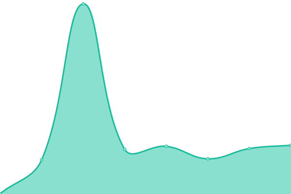
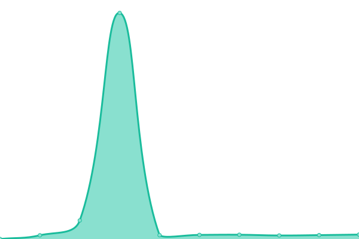
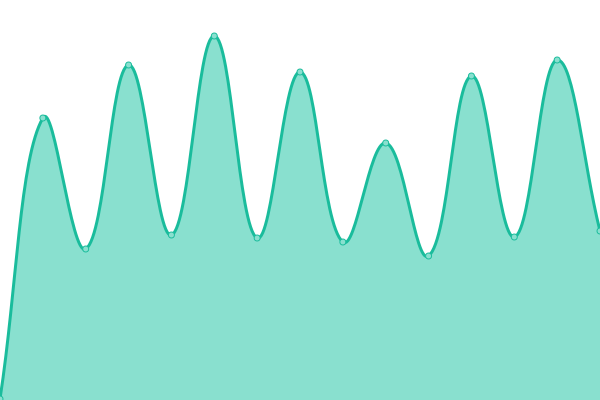
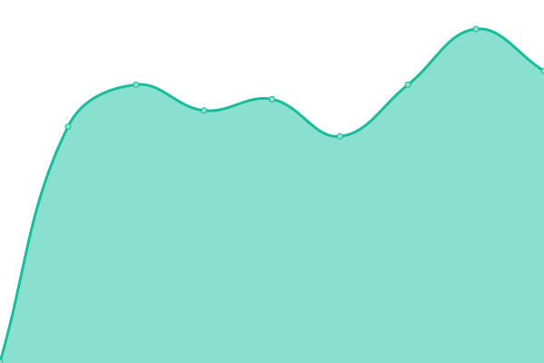
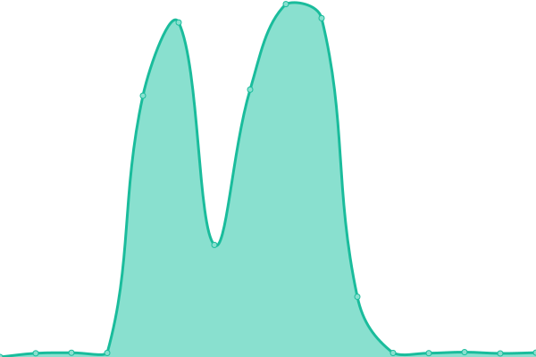

# [📈 Live Status](https://isolucionco.github.io/EstadoIsolucionHosting): <!--live status--> **🟧 Partial outage**

This repository contains the open-source uptime monitor and status page for [isolucionco](https://isolucionco.github.io/EstadoIsolucionHosting), powered by [Upptime](https://github.com/upptime/upptime).

With [Upptime](https://upptime.js.org), you can get your own unlimited and free uptime monitor and status page, powered entirely by a GitHub repository. We use [Issues](https://github.com/isolucionco/EstadoIsolucionHosting/issues) as incident reports, [Actions](https://github.com/isolucionco/EstadoIsolucionHosting/actions) as uptime monitors, and [Pages](https://isolucionco.github.io/EstadoIsolucionHosting) for the status page.

<!--start: status pages-->
<!-- This summary is generated by Upptime (https://github.com/upptime/upptime) -->
<!-- Do not edit this manually, your changes will be overwritten -->
<!-- prettier-ignore -->
| URL | Status | History | Response Time | Uptime |
| --- | ------ | ------- | ------------- | ------ |
|  [IsolucionProcesos](http://23.102.174.233/IsolucionProcesos/) | 🟩 Up | [isolucion-procesos.yml](https://github.com/isolucionco/EstadoIsolucionHosting/commits/HEAD/history/isolucion-procesos.yml) | 

 61ms
     
 | 

<a href="https://isolucionco.github.io/EstadoIsolucionHosting/history/isolucion-procesos">100.00%</a>
    

|  [Adiquim.isolucion.co](https://Adiquim.isolucion.co) | 🟩 Up | [adiquim-isolucion-co.yml](https://github.com/isolucionco/EstadoIsolucionHosting/commits/HEAD/history/adiquim-isolucion-co.yml) | 

 257ms
     
 | 

<a href="https://isolucionco.github.io/EstadoIsolucionHosting/history/adiquim-isolucion-co">99.75%</a>
    

|  [Adn.isolucion.co](https://Adn.isolucion.co) | 🟩 Up | [adn-isolucion-co.yml](https://github.com/isolucionco/EstadoIsolucionHosting/commits/HEAD/history/adn-isolucion-co.yml) | 

 261ms
     
 | 

<a href="https://isolucionco.github.io/EstadoIsolucionHosting/history/adn-isolucion-co">99.77%</a>
    

|  [AgrocomercialCagir.isolucion.co](https://AgrocomercialCagir.isolucion.co) | 🟩 Up | [agrocomercial-cagir-isolucion-co.yml](https://github.com/isolucionco/EstadoIsolucionHosting/commits/HEAD/history/agrocomercial-cagir-isolucion-co.yml) | 

 253ms
     
 | 

<a href="https://isolucionco.github.io/EstadoIsolucionHosting/history/agrocomercial-cagir-isolucion-co">99.78%</a>
    

|  [AIRTEMP.isolucion.co](https://AIRTEMP.isolucion.co) | 🟩 Up | [airtemp-isolucion-co.yml](https://github.com/isolucionco/EstadoIsolucionHosting/commits/HEAD/history/airtemp-isolucion-co.yml) | 

 257ms
     
 | 

<a href="https://isolucionco.github.io/EstadoIsolucionHosting/history/airtemp-isolucion-co">100.00%</a>
    

|  [ALBATEQ.isolucion.co](https://ALBATEQ.isolucion.co) | 🟩 Up | [albateq-isolucion-co.yml](https://github.com/isolucionco/EstadoIsolucionHosting/commits/HEAD/history/albateq-isolucion-co.yml) | 

 262ms
     
 | 

<a href="https://isolucionco.github.io/EstadoIsolucionHosting/history/albateq-isolucion-co">100.00%</a>
    

|  [AlcaldiaBarranquilla.isolucion.co](https://AlcaldiaBarranquilla.isolucion.co) | 🟩 Up | [alcaldia-barranquilla-isolucion-co.yml](https://github.com/isolucionco/EstadoIsolucionHosting/commits/HEAD/history/alcaldia-barranquilla-isolucion-co.yml) | 

 252ms
     
 | 

<a href="https://isolucionco.github.io/EstadoIsolucionHosting/history/alcaldia-barranquilla-isolucion-co">0.00%</a>
    

|  [AlcaldiaDeManizales.isolucion.co](https://AlcaldiaDeManizales.isolucion.co) | 🟩 Up | [alcaldia-de-manizales-isolucion-co.yml](https://github.com/isolucionco/EstadoIsolucionHosting/commits/HEAD/history/alcaldia-de-manizales-isolucion-co.yml) | 

 255ms
     
 | 

<a href="https://isolucionco.github.io/EstadoIsolucionHosting/history/alcaldia-de-manizales-isolucion-co">0.00%</a>
    

|  [AlcaldiaTocancipa.Isolucion.co](https://AlcaldiaTocancipa.Isolucion.co) | 🟩 Up | [alcaldia-tocancipa-isolucion-co.yml](https://github.com/isolucionco/EstadoIsolucionHosting/commits/HEAD/history/alcaldia-tocancipa-isolucion-co.yml) | 

 268ms
     
 | 

<a href="https://isolucionco.github.io/EstadoIsolucionHosting/history/alcaldia-tocancipa-isolucion-co">100.00%</a>
    

|  [AlcCajica.isolucion.co](https://AlcCajica.isolucion.co) | 🟩 Up | [alc-cajica-isolucion-co.yml](https://github.com/isolucionco/EstadoIsolucionHosting/commits/HEAD/history/alc-cajica-isolucion-co.yml) | 

 262ms
     
 | 

<a href="https://isolucionco.github.io/EstadoIsolucionHosting/history/alc-cajica-isolucion-co">100.00%</a>
    

|  [ALFANET.isolucion.co](https://ALFANET.isolucion.co) | 🟩 Up | [alfanet-isolucion-co.yml](https://github.com/isolucionco/EstadoIsolucionHosting/commits/HEAD/history/alfanet-isolucion-co.yml) | 

 252ms
     
 | 

<a href="https://isolucionco.github.io/EstadoIsolucionHosting/history/alfanet-isolucion-co">0.00%</a>
    

|  [alianzatemporales.isolucion.co](https://alianzatemporales.isolucion.co) | 🟩 Up | [alianzatemporales-isolucion-co.yml](https://github.com/isolucionco/EstadoIsolucionHosting/commits/HEAD/history/alianzatemporales-isolucion-co.yml) | 

 250ms
     
 | 

<a href="https://isolucionco.github.io/EstadoIsolucionHosting/history/alianzatemporales-isolucion-co">100.00%</a>
    

|  [Alura.isolucion.co](https://Alura.isolucion.co) | 🟩 Up | [alura-isolucion-co.yml](https://github.com/isolucionco/EstadoIsolucionHosting/commits/HEAD/history/alura-isolucion-co.yml) | 

 256ms
     
 | 

<a href="https://isolucionco.github.io/EstadoIsolucionHosting/history/alura-isolucion-co">0.00%</a>
    

|  [AMVSA.isolucion.co](https://AMVSA.isolucion.co) | 🟩 Up | [amvsa-isolucion-co.yml](https://github.com/isolucionco/EstadoIsolucionHosting/commits/HEAD/history/amvsa-isolucion-co.yml) | 

 254ms
     
 | 

<a href="https://isolucionco.github.io/EstadoIsolucionHosting/history/amvsa-isolucion-co">0.00%</a>
    

|  [angiografia.isolucion.co](https://angiografia.isolucion.co) | 🟩 Up | [angiografia-isolucion-co.yml](https://github.com/isolucionco/EstadoIsolucionHosting/commits/HEAD/history/angiografia-isolucion-co.yml) | 

 268ms
     
 | 

<a href="https://isolucionco.github.io/EstadoIsolucionHosting/history/angiografia-isolucion-co">100.00%</a>
    

|  [AON.isolucion.co](https://AON.isolucion.co) | 🟩 Up | [aon-isolucion-co.yml](https://github.com/isolucionco/EstadoIsolucionHosting/commits/HEAD/history/aon-isolucion-co.yml) | 

 257ms
     
 | 

<a href="https://isolucionco.github.io/EstadoIsolucionHosting/history/aon-isolucion-co">0.00%</a>
    

|  [ApiIso01.isolucion.co](https://ApiIso01.isolucion.co) | 🟩 Up | [api-iso01-isolucion-co.yml](https://github.com/isolucionco/EstadoIsolucionHosting/commits/HEAD/history/api-iso01-isolucion-co.yml) | 

 207ms
     
 | 

<a href="https://isolucionco.github.io/EstadoIsolucionHosting/history/api-iso01-isolucion-co">100.00%</a>
    

|  [apiiso01com.isolucion.com](https://apiiso01com.isolucion.com) | 🟩 Up | [apiiso01com-isolucion-com.yml](https://github.com/isolucionco/EstadoIsolucionHosting/commits/HEAD/history/apiiso01com-isolucion-com.yml) | 

 250ms
     
 | 

<a href="https://isolucionco.github.io/EstadoIsolucionHosting/history/apiiso01com-isolucion-com">100.00%</a>
    

|  [ApiIso02.isolucion.co](https://ApiIso02.isolucion.co) | 🟩 Up | [api-iso02-isolucion-co.yml](https://github.com/isolucionco/EstadoIsolucionHosting/commits/HEAD/history/api-iso02-isolucion-co.yml) | 

 210ms
     
 | 

<a href="https://isolucionco.github.io/EstadoIsolucionHosting/history/api-iso02-isolucion-co">100.00%</a>
    

|  [ApiIso03.isolucion.co](https://ApiIso03.isolucion.co) | 🟩 Up | [api-iso03-isolucion-co.yml](https://github.com/isolucionco/EstadoIsolucionHosting/commits/HEAD/history/api-iso03-isolucion-co.yml) | 

 205ms
     
 | 

<a href="https://isolucionco.github.io/EstadoIsolucionHosting/history/api-iso03-isolucion-co">0.00%</a>
    

|  [ApiIso04.isolucion.co](https://ApiIso04.isolucion.co) | 🟩 Up | [api-iso04-isolucion-co.yml](https://github.com/isolucionco/EstadoIsolucionHosting/commits/HEAD/history/api-iso04-isolucion-co.yml) | 

 202ms
     
 | 

<a href="https://isolucionco.github.io/EstadoIsolucionHosting/history/api-iso04-isolucion-co">0.00%</a>
    

|  [apiiso05.isolucion.co](https://apiiso05.isolucion.co) | 🟩 Up | [apiiso05-isolucion-co.yml](https://github.com/isolucionco/EstadoIsolucionHosting/commits/HEAD/history/apiiso05-isolucion-co.yml) | 

 209ms
     
 | 

<a href="https://isolucionco.github.io/EstadoIsolucionHosting/history/apiiso05-isolucion-co">0.00%</a>
    

|  [ApiIsoSura.isolucion.co](https://ApiIsoSura.isolucion.co) | 🟥 Down | [api-iso-sura-isolucion-co.yml](https://github.com/isolucionco/EstadoIsolucionHosting/commits/HEAD/history/api-iso-sura-isolucion-co.yml) | 

 0ms
     
 | 

<a href="https://isolucionco.github.io/EstadoIsolucionHosting/history/api-iso-sura-isolucion-co">0.00%</a>
    

|  [ApiRiesgosDafpApp01.isolucion.co](https://ApiRiesgosDafpApp01.isolucion.co/swagger/index.html) | 🟩 Up | [api-riesgos-dafp-app01-isolucion-co.yml](https://github.com/isolucionco/EstadoIsolucionHosting/commits/HEAD/history/api-riesgos-dafp-app01-isolucion-co.yml) | 

 145ms
     
 | 

<a href="https://isolucionco.github.io/EstadoIsolucionHosting/history/api-riesgos-dafp-app01-isolucion-co">100.00%</a>
    

|  [ApiRiesgosDafpApp01Com.isolucion.com](https://ApiRiesgosDafpApp01Com.isolucion.com/swagger/index.html) | 🟩 Up | [api-riesgos-dafp-app01-com-isolucion-com.yml](https://github.com/isolucionco/EstadoIsolucionHosting/commits/HEAD/history/api-riesgos-dafp-app01-com-isolucion-com.yml) | 

 190ms
     
 | 

<a href="https://isolucionco.github.io/EstadoIsolucionHosting/history/api-riesgos-dafp-app01-com-isolucion-com">100.00%</a>
    

|  [ApiRiesgosDafpApp02.isolucion.co](https://ApiRiesgosDafpApp02.isolucion.co/swagger/index.html) | 🟩 Up | [api-riesgos-dafp-app02-isolucion-co.yml](https://github.com/isolucionco/EstadoIsolucionHosting/commits/HEAD/history/api-riesgos-dafp-app02-isolucion-co.yml) | 

 145ms
     
 | 

<a href="https://isolucionco.github.io/EstadoIsolucionHosting/history/api-riesgos-dafp-app02-isolucion-co">0.00%</a>
    

|  [ApiRiesgosDafpApp03.isolucion.co](https://ApiRiesgosDafpApp03.isolucion.co/swagger/index.html) | 🟩 Up | [api-riesgos-dafp-app03-isolucion-co.yml](https://github.com/isolucionco/EstadoIsolucionHosting/commits/HEAD/history/api-riesgos-dafp-app03-isolucion-co.yml) | 

 142ms
     
 | 

<a href="https://isolucionco.github.io/EstadoIsolucionHosting/history/api-riesgos-dafp-app03-isolucion-co">100.00%</a>
    

|  [ApiRiesgosDafpApp04.isolucion.co](https://ApiRiesgosDafpApp04.isolucion.co/swagger/index.html) | 🟩 Up | [api-riesgos-dafp-app04-isolucion-co.yml](https://github.com/isolucionco/EstadoIsolucionHosting/commits/HEAD/history/api-riesgos-dafp-app04-isolucion-co.yml) | 

 140ms
     
 | 

<a href="https://isolucionco.github.io/EstadoIsolucionHosting/history/api-riesgos-dafp-app04-isolucion-co">100.00%</a>
    

|  [ApiRiesgosDafpApp05.isolucion.co](https://ApiRiesgosDafpApp05.isolucion.co/swagger/index.html) | 🟩 Up | [api-riesgos-dafp-app05-isolucion-co.yml](https://github.com/isolucionco/EstadoIsolucionHosting/commits/HEAD/history/api-riesgos-dafp-app05-isolucion-co.yml) | 

 142ms
     
 | 

<a href="https://isolucionco.github.io/EstadoIsolucionHosting/history/api-riesgos-dafp-app05-isolucion-co">0.00%</a>
    

|  [ApiRiesgosDafpAppdane.isolucion.co](https://ApiRiesgosDafpAppdane.isolucion.co/swagger/index.html) | 🟩 Up | [api-riesgos-dafp-appdane-isolucion-co.yml](https://github.com/isolucionco/EstadoIsolucionHosting/commits/HEAD/history/api-riesgos-dafp-appdane-isolucion-co.yml) | 

 146ms
     
 | 

<a href="https://isolucionco.github.io/EstadoIsolucionHosting/history/api-riesgos-dafp-appdane-isolucion-co">0.00%</a>
    

|  [ApiRiesgosDafpAppIcontec.isolucion.co](http://apiriesgosdafpappicontec.isolucion.co/swagger/index.html) | 🟩 Up | [api-riesgos-dafp-app-icontec-isolucion-co.yml](https://github.com/isolucionco/EstadoIsolucionHosting/commits/HEAD/history/api-riesgos-dafp-app-icontec-isolucion-co.yml) | 

 69ms
     
 | 

<a href="https://isolucionco.github.io/EstadoIsolucionHosting/history/api-riesgos-dafp-app-icontec-isolucion-co">0.00%</a>
    

|  [ApiRiesgosDafpAppSura.isolucion.co](https://ApiRiesgosDafpAppSura.isolucion.co/swagger/index.html) | 🟥 Down | [api-riesgos-dafp-app-sura-isolucion-co.yml](https://github.com/isolucionco/EstadoIsolucionHosting/commits/HEAD/history/api-riesgos-dafp-app-sura-isolucion-co.yml) | 

 0ms
     
 | 

<a href="https://isolucionco.github.io/EstadoIsolucionHosting/history/api-riesgos-dafp-app-sura-isolucion-co">0.00%</a>
    

|  [Aserfinc.isolucion.co](https://Aserfinc.isolucion.co) | 🟩 Up | [aserfinc-isolucion-co.yml](https://github.com/isolucionco/EstadoIsolucionHosting/commits/HEAD/history/aserfinc-isolucion-co.yml) | 

 255ms
     
 | 

<a href="https://isolucionco.github.io/EstadoIsolucionHosting/history/aserfinc-isolucion-co">100.00%</a>
    

|  [Asobancaria.isolucion.co](https://Asobancaria.isolucion.co) | 🟩 Up | [asobancaria-isolucion-co.yml](https://github.com/isolucionco/EstadoIsolucionHosting/commits/HEAD/history/asobancaria-isolucion-co.yml) | 

 505ms
     
 | 

<a href="https://isolucionco.github.io/EstadoIsolucionHosting/history/asobancaria-isolucion-co">100.00%</a>
    

|  [atinaenergy.isolucion.co](https://atinaenergy.isolucion.co) | 🟩 Up | [atinaenergy-isolucion-co.yml](https://github.com/isolucionco/EstadoIsolucionHosting/commits/HEAD/history/atinaenergy-isolucion-co.yml) | 

 251ms
     
 | 

<a href="https://isolucionco.github.io/EstadoIsolucionHosting/history/atinaenergy-isolucion-co">0.00%</a>
    

|  [AUDIFARMA.isolucion.co](https://AUDIFARMA.isolucion.co) | 🟩 Up | [audifarma-isolucion-co.yml](https://github.com/isolucionco/EstadoIsolucionHosting/commits/HEAD/history/audifarma-isolucion-co.yml) | 

 256ms
     
 | 

<a href="https://isolucionco.github.io/EstadoIsolucionHosting/history/audifarma-isolucion-co">0.00%</a>
    

|  [BAGGRIT.isolucion.co](https://BAGGRIT.isolucion.co) | 🟩 Up | [baggrit-isolucion-co.yml](https://github.com/isolucionco/EstadoIsolucionHosting/commits/HEAD/history/baggrit-isolucion-co.yml) | 

 259ms
     
 | 

<a href="https://isolucionco.github.io/EstadoIsolucionHosting/history/baggrit-isolucion-co">0.00%</a>
    

|  [BAINCOL.isolucion.co](https://BAINCOL.isolucion.co) | 🟥 Down | [baincol-isolucion-co.yml](https://github.com/isolucionco/EstadoIsolucionHosting/commits/HEAD/history/baincol-isolucion-co.yml) | 

 0ms
     
 | 

<a href="https://isolucionco.github.io/EstadoIsolucionHosting/history/baincol-isolucion-co">0.00%</a>
    

|  [BASC.isolucion.co](https://BASC.isolucion.co) | 🟩 Up | [basc-isolucion-co.yml](https://github.com/isolucionco/EstadoIsolucionHosting/commits/HEAD/history/basc-isolucion-co.yml) | 

 249ms
     
 | 

<a href="https://isolucionco.github.io/EstadoIsolucionHosting/history/basc-isolucion-co">100.00%</a>
    

|  [bgcol.isolucion.co](https://bgcol.isolucion.co) | 🟥 Down | [bgcol-isolucion-co.yml](https://github.com/isolucionco/EstadoIsolucionHosting/commits/HEAD/history/bgcol-isolucion-co.yml) | 

 0ms
     
 | 

<a href="https://isolucionco.github.io/EstadoIsolucionHosting/history/bgcol-isolucion-co">0.00%</a>
    

|  [Bimbo.isolucion.co](https://Bimbo.isolucion.co) | 🟩 Up | [bimbo-isolucion-co.yml](https://github.com/isolucionco/EstadoIsolucionHosting/commits/HEAD/history/bimbo-isolucion-co.yml) | 

 255ms
     
 | 

<a href="https://isolucionco.github.io/EstadoIsolucionHosting/history/bimbo-isolucion-co">0.00%</a>
    

|  [Biotronitech.isolucion.co](https://Biotronitech.isolucion.co) | 🟩 Up | [biotronitech-isolucion-co.yml](https://github.com/isolucionco/EstadoIsolucionHosting/commits/HEAD/history/biotronitech-isolucion-co.yml) | 

 257ms
     
 | 

<a href="https://isolucionco.github.io/EstadoIsolucionHosting/history/biotronitech-isolucion-co">100.00%</a>
    

|  [Blaskov.Isolucion.co](https://Blaskov.Isolucion.co) | 🟩 Up | [blaskov-isolucion-co.yml](https://github.com/isolucionco/EstadoIsolucionHosting/commits/HEAD/history/blaskov-isolucion-co.yml) | 

 254ms
     
 | 

<a href="https://isolucionco.github.io/EstadoIsolucionHosting/history/blaskov-isolucion-co">0.00%</a>
    

|  [bmiseguros.isolucion.co](https://bmiseguros.isolucion.co) | 🟥 Down | [bmiseguros-isolucion-co.yml](https://github.com/isolucionco/EstadoIsolucionHosting/commits/HEAD/history/bmiseguros-isolucion-co.yml) | 

 0ms
     
 | 

<a href="https://isolucionco.github.io/EstadoIsolucionHosting/history/bmiseguros-isolucion-co">0.00%</a>
    

|  [bomberofloridablanca.isolucion.co](https://bomberofloridablanca.isolucion.co) | 🟩 Up | [bomberofloridablanca-isolucion-co.yml](https://github.com/isolucionco/EstadoIsolucionHosting/commits/HEAD/history/bomberofloridablanca-isolucion-co.yml) | 

 253ms
     
 | 

<a href="https://isolucionco.github.io/EstadoIsolucionHosting/history/bomberofloridablanca-isolucion-co">100.00%</a>
    

|  [bonsetlatinamerica.isolucion.co](https://bonsetlatinamerica.isolucion.co) | 🟩 Up | [bonsetlatinamerica-isolucion-co.yml](https://github.com/isolucionco/EstadoIsolucionHosting/commits/HEAD/history/bonsetlatinamerica-isolucion-co.yml) | 

 253ms
     
 | 

<a href="https://isolucionco.github.io/EstadoIsolucionHosting/history/bonsetlatinamerica-isolucion-co">100.00%</a>
    

|  [BRASERV.isolucion.co](https://BRASERV.isolucion.co) | 🟥 Down | [braserv-isolucion-co.yml](https://github.com/isolucionco/EstadoIsolucionHosting/commits/HEAD/history/braserv-isolucion-co.yml) | 

 0ms
     
 | 

<a href="https://isolucionco.github.io/EstadoIsolucionHosting/history/braserv-isolucion-co">0.00%</a>
    

|  [BUGORG.isolucion.co](https://BUGORG.isolucion.co) | 🟥 Down | [bugorg-isolucion-co.yml](https://github.com/isolucionco/EstadoIsolucionHosting/commits/HEAD/history/bugorg-isolucion-co.yml) | 

 0ms
     
 | 

<a href="https://isolucionco.github.io/EstadoIsolucionHosting/history/bugorg-isolucion-co">0.00%</a>
    

|  [Calima.isolucion.co](https://Calima.isolucion.co) | 🟩 Up | [calima-isolucion-co.yml](https://github.com/isolucionco/EstadoIsolucionHosting/commits/HEAD/history/calima-isolucion-co.yml) | 

 253ms
     
 | 

<a href="https://isolucionco.github.io/EstadoIsolucionHosting/history/calima-isolucion-co">93.32%</a>
    

|  [Carex.isolucion.co](https://Carex.isolucion.co) | 🟩 Up | [carex-isolucion-co.yml](https://github.com/isolucionco/EstadoIsolucionHosting/commits/HEAD/history/carex-isolucion-co.yml) | 

 248ms
     
 | 

<a href="https://isolucionco.github.io/EstadoIsolucionHosting/history/carex-isolucion-co">0.00%</a>
    

|  [Cartama.isolucion.co](https://Cartama.isolucion.co) | 🟩 Up | [cartama-isolucion-co.yml](https://github.com/isolucionco/EstadoIsolucionHosting/commits/HEAD/history/cartama-isolucion-co.yml) | 

 252ms
     
 | 

<a href="https://isolucionco.github.io/EstadoIsolucionHosting/history/cartama-isolucion-co">100.00%</a>
    

|  [CelestinFreinet.isolucion.co](https://CelestinFreinet.isolucion.co) | 🟩 Up | [celestin-freinet-isolucion-co.yml](https://github.com/isolucionco/EstadoIsolucionHosting/commits/HEAD/history/celestin-freinet-isolucion-co.yml) | 

 141ms
     
 | 

<a href="https://isolucionco.github.io/EstadoIsolucionHosting/history/celestin-freinet-isolucion-co">0.00%</a>
    

|  [CentralCervecera.isolucion.co](https://CentralCervecera.isolucion.co) | 🟩 Up | [central-cervecera-isolucion-co.yml](https://github.com/isolucionco/EstadoIsolucionHosting/commits/HEAD/history/central-cervecera-isolucion-co.yml) | 

 405ms
     
 | 

<a href="https://isolucionco.github.io/EstadoIsolucionHosting/history/central-cervecera-isolucion-co">0.00%</a>
    

|  [CentralCervecera.isolucion.co](https://CentralCervecera.isolucion.co) | 🟩 Up | [central-cervecera-isolucion-co.yml](https://github.com/isolucionco/EstadoIsolucionHosting/commits/HEAD/history/central-cervecera-isolucion-co.yml) | 

 405ms
     
 | 

<a href="https://isolucionco.github.io/EstadoIsolucionHosting/history/central-cervecera-isolucion-co">0.00%</a>
    

|  [centromayorcc.isolucion.co](https://centromayorcc.isolucion.co) | 🟩 Up | [centromayorcc-isolucion-co.yml](https://github.com/isolucionco/EstadoIsolucionHosting/commits/HEAD/history/centromayorcc-isolucion-co.yml) | 

 247ms
     
 | 

<a href="https://isolucionco.github.io/EstadoIsolucionHosting/history/centromayorcc-isolucion-co">0.00%</a>
    

|  [Cerescos.isolucion.co](https://Cerescos.isolucion.co) | 🟩 Up | [cerescos-isolucion-co.yml](https://github.com/isolucionco/EstadoIsolucionHosting/commits/HEAD/history/cerescos-isolucion-co.yml) | 

 257ms
     
 | 

<a href="https://isolucionco.github.io/EstadoIsolucionHosting/history/cerescos-isolucion-co">0.00%</a>
    

|  [Cesmag.isolucion.co](https://Cesmag.isolucion.co) | 🟩 Up | [cesmag-isolucion-co.yml](https://github.com/isolucionco/EstadoIsolucionHosting/commits/HEAD/history/cesmag-isolucion-co.yml) | 

 249ms
     
 | 

<a href="https://isolucionco.github.io/EstadoIsolucionHosting/history/cesmag-isolucion-co">100.00%</a>
    

|  [CIFOODCOLOMBIA.isolucion.co](https://CIFOODCOLOMBIA.isolucion.co) | 🟩 Up | [cifoodcolombia-isolucion-co.yml](https://github.com/isolucionco/EstadoIsolucionHosting/commits/HEAD/history/cifoodcolombia-isolucion-co.yml) | 

 247ms
     
 | 

<a href="https://isolucionco.github.io/EstadoIsolucionHosting/history/cifoodcolombia-isolucion-co">100.00%</a>
    

|  [clcgas.isolucion.co](https://clcgas.isolucion.co) | 🟥 Down | [clcgas-isolucion-co.yml](https://github.com/isolucionco/EstadoIsolucionHosting/commits/HEAD/history/clcgas-isolucion-co.yml) | 

 0ms
     
 | 

<a href="https://isolucionco.github.io/EstadoIsolucionHosting/history/clcgas-isolucion-co">0.00%</a>
    

|  [COBELEN.isolucion.co](https://COBELEN.isolucion.co) | 🟩 Up | [cobelen-isolucion-co.yml](https://github.com/isolucionco/EstadoIsolucionHosting/commits/HEAD/history/cobelen-isolucion-co.yml) | 

 254ms
     
 | 

<a href="https://isolucionco.github.io/EstadoIsolucionHosting/history/cobelen-isolucion-co">100.00%</a>
    

|  [COCESNA.isolucion.co](https://COCESNA.isolucion.co) | 🟩 Up | [cocesna-isolucion-co.yml](https://github.com/isolucionco/EstadoIsolucionHosting/commits/HEAD/history/cocesna-isolucion-co.yml) | 

 521ms
     
 | 

<a href="https://isolucionco.github.io/EstadoIsolucionHosting/history/cocesna-isolucion-co">0.00%</a>
    

|  [colegiobennett.isolucion.co](https://colegiobennett.isolucion.co) | 🟩 Up | [colegiobennett-isolucion-co.yml](https://github.com/isolucionco/EstadoIsolucionHosting/commits/HEAD/history/colegiobennett-isolucion-co.yml) | 

 257ms
     
 | 

<a href="https://isolucionco.github.io/EstadoIsolucionHosting/history/colegiobennett-isolucion-co">0.00%</a>
    

|  [Colegiojesusmaria.isolucion.co](https://Colegiojesusmaria.isolucion.co) | 🟩 Up | [colegiojesusmaria-isolucion-co.yml](https://github.com/isolucionco/EstadoIsolucionHosting/commits/HEAD/history/colegiojesusmaria-isolucion-co.yml) | 

 251ms
     
 | 

<a href="https://isolucionco.github.io/EstadoIsolucionHosting/history/colegiojesusmaria-isolucion-co">100.00%</a>
    

|  [Colegionuevagranada.isolucion.co](https://Colegionuevagranada.isolucion.co) | 🟩 Up | [colegionuevagranada-isolucion-co.yml](https://github.com/isolucionco/EstadoIsolucionHosting/commits/HEAD/history/colegionuevagranada-isolucion-co.yml) | 

 256ms
     
 | 

<a href="https://isolucionco.github.io/EstadoIsolucionHosting/history/colegionuevagranada-isolucion-co">100.00%</a>
    

|  [collectcenter.isolucion.co](https://collectcenter.isolucion.co) | 🟥 Down | [collectcenter-isolucion-co.yml](https://github.com/isolucionco/EstadoIsolucionHosting/commits/HEAD/history/collectcenter-isolucion-co.yml) | 

 0ms
     
 | 

<a href="https://isolucionco.github.io/EstadoIsolucionHosting/history/collectcenter-isolucion-co">0.00%</a>
    

|  [Combarranquilla.isolucion.co](https://Combarranquilla.isolucion.co) | 🟩 Up | [combarranquilla-isolucion-co.yml](https://github.com/isolucionco/EstadoIsolucionHosting/commits/HEAD/history/combarranquilla-isolucion-co.yml) | 

 248ms
     
 | 

<a href="https://isolucionco.github.io/EstadoIsolucionHosting/history/combarranquilla-isolucion-co">100.00%</a>
    

|  [comdatagroup.isolucion.co](https://comdatagroup.isolucion.co) | 🟥 Down | [comdatagroup-isolucion-co.yml](https://github.com/isolucionco/EstadoIsolucionHosting/commits/HEAD/history/comdatagroup-isolucion-co.yml) | 

 0ms
     
 | 

<a href="https://isolucionco.github.io/EstadoIsolucionHosting/history/comdatagroup-isolucion-co">0.00%</a>
    

|  [Comercializadora3c.isolucion.co](https://Comercializadora3c.isolucion.co) | 🟥 Down | [comercializadora3c-isolucion-co.yml](https://github.com/isolucionco/EstadoIsolucionHosting/commits/HEAD/history/comercializadora3c-isolucion-co.yml) | 

 0ms
     
 | 

<a href="https://isolucionco.github.io/EstadoIsolucionHosting/history/comercializadora3c-isolucion-co">0.00%</a>
    

|  [ComfamiliarRisaralda.isolucion.co](https://ComfamiliarRisaralda.isolucion.co) | 🟩 Up | [comfamiliar-risaralda-isolucion-co.yml](https://github.com/isolucionco/EstadoIsolucionHosting/commits/HEAD/history/comfamiliar-risaralda-isolucion-co.yml) | 

 257ms
     
 | 

<a href="https://isolucionco.github.io/EstadoIsolucionHosting/history/comfamiliar-risaralda-isolucion-co">100.00%</a>
    

|  [Comfandi.isolucion.co](https://Comfandi.isolucion.co) | 🟩 Up | [comfandi-isolucion-co.yml](https://github.com/isolucionco/EstadoIsolucionHosting/commits/HEAD/history/comfandi-isolucion-co.yml) | 

 258ms
     
 | 

<a href="https://isolucionco.github.io/EstadoIsolucionHosting/history/comfandi-isolucion-co">100.00%</a>
    

|  [Consuerte.isolucion.co](https://Consuerte.isolucion.co) | 🟩 Up | [consuerte-isolucion-co.yml](https://github.com/isolucionco/EstadoIsolucionHosting/commits/HEAD/history/consuerte-isolucion-co.yml) | 

 259ms
     
 | 

<a href="https://isolucionco.github.io/EstadoIsolucionHosting/history/consuerte-isolucion-co">100.00%</a>
    

|  [Contactar.isolucion.co](https://Contactar.isolucion.co) | 🟩 Up | [contactar-isolucion-co.yml](https://github.com/isolucionco/EstadoIsolucionHosting/commits/HEAD/history/contactar-isolucion-co.yml) | 

 561ms
     
 | 

<a href="https://isolucionco.github.io/EstadoIsolucionHosting/history/contactar-isolucion-co">100.00%</a>
    

|  [COOPEDAC.isolucion.co](https://COOPEDAC.isolucion.co) | 🟩 Up | [coopedac-isolucion-co.yml](https://github.com/isolucionco/EstadoIsolucionHosting/commits/HEAD/history/coopedac-isolucion-co.yml) | 

 247ms
     
 | 

<a href="https://isolucionco.github.io/EstadoIsolucionHosting/history/coopedac-isolucion-co">100.00%</a>
    

|  [coopminutodedios.isolucion.co](https://coopminutodedios.isolucion.co) | 🟩 Up | [coopminutodedios-isolucion-co.yml](https://github.com/isolucionco/EstadoIsolucionHosting/commits/HEAD/history/coopminutodedios-isolucion-co.yml) | 

 254ms
     
 | 

<a href="https://isolucionco.github.io/EstadoIsolucionHosting/history/coopminutodedios-isolucion-co">100.00%</a>
    

|  [Cooptenjo.isolucion.co](https://Cooptenjo.isolucion.co) | 🟩 Up | [cooptenjo-isolucion-co.yml](https://github.com/isolucionco/EstadoIsolucionHosting/commits/HEAD/history/cooptenjo-isolucion-co.yml) | 

 254ms
     
 | 

<a href="https://isolucionco.github.io/EstadoIsolucionHosting/history/cooptenjo-isolucion-co">100.00%</a>
    

|  [Coordinadora.isolucion.co](https://Coordinadora.isolucion.co) | 🟩 Up | [coordinadora-isolucion-co.yml](https://github.com/isolucionco/EstadoIsolucionHosting/commits/HEAD/history/coordinadora-isolucion-co.yml) | 

 246ms
     
 | 

<a href="https://isolucionco.github.io/EstadoIsolucionHosting/history/coordinadora-isolucion-co">100.00%</a>
    

|  [CorpAmericana.isolucion.co](https://CorpAmericana.isolucion.co) | 🟩 Up | [corp-americana-isolucion-co.yml](https://github.com/isolucionco/EstadoIsolucionHosting/commits/HEAD/history/corp-americana-isolucion-co.yml) | 

 145ms
     
 | 

<a href="https://isolucionco.github.io/EstadoIsolucionHosting/history/corp-americana-isolucion-co">100.00%</a>
    

|  [CORSALUD.isolucion.co](https://CORSALUD.isolucion.co) | 🟩 Up | [corsalud-isolucion-co.yml](https://github.com/isolucionco/EstadoIsolucionHosting/commits/HEAD/history/corsalud-isolucion-co.yml) | 

 249ms
     
 | 

<a href="https://isolucionco.github.io/EstadoIsolucionHosting/history/corsalud-isolucion-co">100.00%</a>
    

|  [cruzrojaantioquia.isolucion.co](https://cruzrojaantioquia.isolucion.co) | 🟩 Up | [cruzrojaantioquia-isolucion-co.yml](https://github.com/isolucionco/EstadoIsolucionHosting/commits/HEAD/history/cruzrojaantioquia-isolucion-co.yml) | 

 897ms
     
 | 

<a href="https://isolucionco.github.io/EstadoIsolucionHosting/history/cruzrojaantioquia-isolucion-co">100.00%</a>
    

|  [CYPDELR.isolucion.co](https://CYPDELR.isolucion.co) | 🟩 Up | [cypdelr-isolucion-co.yml](https://github.com/isolucionco/EstadoIsolucionHosting/commits/HEAD/history/cypdelr-isolucion-co.yml) | 

 256ms
     
 | 

<a href="https://isolucionco.github.io/EstadoIsolucionHosting/history/cypdelr-isolucion-co">100.00%</a>
    

|  [dane.isolucion.co](https://dane.isolucion.co) | 🟩 Up | [dane-isolucion-co.yml](https://github.com/isolucionco/EstadoIsolucionHosting/commits/HEAD/history/dane-isolucion-co.yml) | 

 265ms
     
 | 

<a href="https://isolucionco.github.io/EstadoIsolucionHosting/history/dane-isolucion-co">0.00%</a>
    

|  [deliveranceship.isolucion.co](https://deliveranceship.isolucion.co) | 🟩 Up | [deliveranceship-isolucion-co.yml](https://github.com/isolucionco/EstadoIsolucionHosting/commits/HEAD/history/deliveranceship-isolucion-co.yml) | 

 247ms
     
 | 

<a href="https://isolucionco.github.io/EstadoIsolucionHosting/history/deliveranceship-isolucion-co">0.00%</a>
    

|  [DemoComercial.isolucion.com](https://DemoComercial.isolucion.com) | 🟩 Up | [demo-comercial-isolucion-com.yml](https://github.com/isolucionco/EstadoIsolucionHosting/commits/HEAD/history/demo-comercial-isolucion-com.yml) | 

 314ms
     
 | 

<a href="https://isolucionco.github.io/EstadoIsolucionHosting/history/demo-comercial-isolucion-com">99.80%</a>
    

|  [Domotes.isolucion.co](https://Domotes.isolucion.co) | 🟥 Down | [domotes-isolucion-co.yml](https://github.com/isolucionco/EstadoIsolucionHosting/commits/HEAD/history/domotes-isolucion-co.yml) | 

 0ms
     
 | 

<a href="https://isolucionco.github.io/EstadoIsolucionHosting/history/domotes-isolucion-co">0.00%</a>
    

|  [Drypers.isolucion.coo](https://Drypers.isolucion.co) | 🟩 Up | [drypers-isolucion-coo.yml](https://github.com/isolucionco/EstadoIsolucionHosting/commits/HEAD/history/drypers-isolucion-coo.yml) | 

 256ms
     
 | 

<a href="https://isolucionco.github.io/EstadoIsolucionHosting/history/drypers-isolucion-coo">0.00%</a>
    

|  [educacionfuturo.isolucion.co](https://educacionfuturo.isolucion.co) | 🟩 Up | [educacionfuturo-isolucion-co.yml](https://github.com/isolucionco/EstadoIsolucionHosting/commits/HEAD/history/educacionfuturo-isolucion-co.yml) | 

 258ms
     
 | 

<a href="https://isolucionco.github.io/EstadoIsolucionHosting/history/educacionfuturo-isolucion-co">100.00%</a>
    

|  [ElectroquimicaWest.isolucion.co](https://ElectroquimicaWest.isolucion.co) | 🟩 Up | [electroquimica-west-isolucion-co.yml](https://github.com/isolucionco/EstadoIsolucionHosting/commits/HEAD/history/electroquimica-west-isolucion-co.yml) | 

 239ms
     
 | 

<a href="https://isolucionco.github.io/EstadoIsolucionHosting/history/electroquimica-west-isolucion-co">0.00%</a>
    

|  [emcocables.isolucion.co](https://emcocables.isolucion.co) | 🟩 Up | [emcocables-isolucion-co.yml](https://github.com/isolucionco/EstadoIsolucionHosting/commits/HEAD/history/emcocables-isolucion-co.yml) | 

 263ms
     
 | 

<a href="https://isolucionco.github.io/EstadoIsolucionHosting/history/emcocables-isolucion-co">100.00%</a>
    

|  [EmpaquetadosElTrece.isolucion.co](https://EmpaquetadosElTrece.isolucion.co) | 🟩 Up | [empaquetados-el-trece-isolucion-co.yml](https://github.com/isolucionco/EstadoIsolucionHosting/commits/HEAD/history/empaquetados-el-trece-isolucion-co.yml) | 

 178ms
     
 | 

<a href="https://isolucionco.github.io/EstadoIsolucionHosting/history/empaquetados-el-trece-isolucion-co">0.00%</a>
    

|  [EmpaquetadosElTrece.isolucion.co](https://EmpaquetadosElTrece.isolucion.co) | 🟩 Up | [empaquetados-el-trece-isolucion-co.yml](https://github.com/isolucionco/EstadoIsolucionHosting/commits/HEAD/history/empaquetados-el-trece-isolucion-co.yml) | 

 178ms
     
 | 

<a href="https://isolucionco.github.io/EstadoIsolucionHosting/history/empaquetados-el-trece-isolucion-co">0.00%</a>
    

|  [equinorte.isolucion.co](https://equinorte.isolucion.co) | 🟩 Up | [equinorte-isolucion-co.yml](https://github.com/isolucionco/EstadoIsolucionHosting/commits/HEAD/history/equinorte-isolucion-co.yml) | 

 248ms
     
 | 

<a href="https://isolucionco.github.io/EstadoIsolucionHosting/history/equinorte-isolucion-co">0.00%</a>
    

|  [Eterna.isolucion.co](https://Eterna.isolucion.co) | 🟩 Up | [eterna-isolucion-co.yml](https://github.com/isolucionco/EstadoIsolucionHosting/commits/HEAD/history/eterna-isolucion-co.yml) | 

 253ms
     
 | 

<a href="https://isolucionco.github.io/EstadoIsolucionHosting/history/eterna-isolucion-co">0.00%</a>
    

|  [Fenalce.isolucion.co](https://Fenalce.isolucion.co) | 🟩 Up | [fenalce-isolucion-co.yml](https://github.com/isolucionco/EstadoIsolucionHosting/commits/HEAD/history/fenalce-isolucion-co.yml) | 

 252ms
     
 | 

<a href="https://isolucionco.github.io/EstadoIsolucionHosting/history/fenalce-isolucion-co">0.00%</a>
    

|  [Fiducentral.isolucion.co](https://Fiducentral.isolucion.co) | 🟩 Up | [fiducentral-isolucion-co.yml](https://github.com/isolucionco/EstadoIsolucionHosting/commits/HEAD/history/fiducentral-isolucion-co.yml) | 

 253ms
     
 | 

<a href="https://isolucionco.github.io/EstadoIsolucionHosting/history/fiducentral-isolucion-co">100.00%</a>
    

|  [FlagSoluciones.isolucion.co](https://FlagSoluciones.isolucion.co) | 🟩 Up | [flag-soluciones-isolucion-co.yml](https://github.com/isolucionco/EstadoIsolucionHosting/commits/HEAD/history/flag-soluciones-isolucion-co.yml) | 

 256ms
     
 | 

<a href="https://isolucionco.github.io/EstadoIsolucionHosting/history/flag-soluciones-isolucion-co">100.00%</a>
    

|  [FONTUR.isolucion.co](https://FONTUR.isolucion.co) | 🟩 Up | [fontur-isolucion-co.yml](https://github.com/isolucionco/EstadoIsolucionHosting/commits/HEAD/history/fontur-isolucion-co.yml) | 

 244ms
     
 | 

<a href="https://isolucionco.github.io/EstadoIsolucionHosting/history/fontur-isolucion-co">100.00%</a>
    

|  [fundacionbatuta.isolucion.co](https://fundacionbatuta.isolucion.co) | 🟩 Up | [fundacionbatuta-isolucion-co.yml](https://github.com/isolucionco/EstadoIsolucionHosting/commits/HEAD/history/fundacionbatuta-isolucion-co.yml) | 

 255ms
     
 | 

<a href="https://isolucionco.github.io/EstadoIsolucionHosting/history/fundacionbatuta-isolucion-co">0.00%</a>
    

|  [Fundelima.isolucion.co](https://Fundelima.isolucion.co) | 🟩 Up | [fundelima-isolucion-co.yml](https://github.com/isolucionco/EstadoIsolucionHosting/commits/HEAD/history/fundelima-isolucion-co.yml) | 

 256ms
     
 | 

<a href="https://isolucionco.github.io/EstadoIsolucionHosting/history/fundelima-isolucion-co">100.00%</a>
    

|  [Gabrica.isolucion.co](https://Gabrica.isolucion.co) | 🟥 Down | [gabrica-isolucion-co.yml](https://github.com/isolucionco/EstadoIsolucionHosting/commits/HEAD/history/gabrica-isolucion-co.yml) | 

 0ms
     
 | 

<a href="https://isolucionco.github.io/EstadoIsolucionHosting/history/gabrica-isolucion-co">0.00%</a>
    

|  [GlobalOil.isolucion.co](https://GlobalOil.isolucion.co) | 🟩 Up | [global-oil-isolucion-co.yml](https://github.com/isolucionco/EstadoIsolucionHosting/commits/HEAD/history/global-oil-isolucion-co.yml) | 

 262ms
     
 | 

<a href="https://isolucionco.github.io/EstadoIsolucionHosting/history/global-oil-isolucion-co">100.00%</a>
    

|  [GloriaColombia.isolucion.co](https://GloriaColombia.isolucion.co) | 🟩 Up | [gloria-colombia-isolucion-co.yml](https://github.com/isolucionco/EstadoIsolucionHosting/commits/HEAD/history/gloria-colombia-isolucion-co.yml) | 

 256ms
     
 | 

<a href="https://isolucionco.github.io/EstadoIsolucionHosting/history/gloria-colombia-isolucion-co">0.00%</a>
    

|  [goldenbusinessclass.isolucion.co](https://goldenbusinessclass.isolucion.co) | 🟩 Up | [goldenbusinessclass-isolucion-co.yml](https://github.com/isolucionco/EstadoIsolucionHosting/commits/HEAD/history/goldenbusinessclass-isolucion-co.yml) | 

 257ms
     
 | 

<a href="https://isolucionco.github.io/EstadoIsolucionHosting/history/goldenbusinessclass-isolucion-co">100.00%</a>
    

|  [griffithfoods.isolucion.co](https://griffithfoods.isolucion.co) | 🟩 Up | [griffithfoods-isolucion-co.yml](https://github.com/isolucionco/EstadoIsolucionHosting/commits/HEAD/history/griffithfoods-isolucion-co.yml) | 

 254ms
     
 | 

<a href="https://isolucionco.github.io/EstadoIsolucionHosting/history/griffithfoods-isolucion-co">100.00%</a>
    

|  [Grupoafin.isolucion.co](https://Grupoafin.isolucion.co) | 🟩 Up | [grupoafin-isolucion-co.yml](https://github.com/isolucionco/EstadoIsolucionHosting/commits/HEAD/history/grupoafin-isolucion-co.yml) | 

 256ms
     
 | 

<a href="https://isolucionco.github.io/EstadoIsolucionHosting/history/grupoafin-isolucion-co">100.00%</a>
    

|  [GrupoAlfa.Isolucion.co](https://GrupoAlfa.Isolucion.co) | 🟩 Up | [grupo-alfa-isolucion-co.yml](https://github.com/isolucionco/EstadoIsolucionHosting/commits/HEAD/history/grupo-alfa-isolucion-co.yml) | 

 261ms
     
 | 

<a href="https://isolucionco.github.io/EstadoIsolucionHosting/history/grupo-alfa-isolucion-co">100.00%</a>
    

|  [grupoasd.isolucion.co](https://grupoasd.isolucion.co) | 🟩 Up | [grupoasd-isolucion-co.yml](https://github.com/isolucionco/EstadoIsolucionHosting/commits/HEAD/history/grupoasd-isolucion-co.yml) | 

 261ms
     
 | 

<a href="https://isolucionco.github.io/EstadoIsolucionHosting/history/grupoasd-isolucion-co">100.00%</a>
    

|  [GrupoGaleria.isolucion.com](https://GrupoGaleria.isolucion.com) | 🟩 Up | [grupo-galeria-isolucion-com.yml](https://github.com/isolucionco/EstadoIsolucionHosting/commits/HEAD/history/grupo-galeria-isolucion-com.yml) | 

 304ms
     
 | 

<a href="https://isolucionco.github.io/EstadoIsolucionHosting/history/grupo-galeria-isolucion-com">99.80%</a>
    

|  [grupohinode.isolucion.co](https://grupohinode.isolucion.co) | 🟩 Up | [grupohinode-isolucion-co.yml](https://github.com/isolucionco/EstadoIsolucionHosting/commits/HEAD/history/grupohinode-isolucion-co.yml) | 

 144ms
     
 | 

<a href="https://isolucionco.github.io/EstadoIsolucionHosting/history/grupohinode-isolucion-co">100.00%</a>
    

|  [gruposiderurgico.isolucion.co](https://gruposiderurgico.isolucion.co) | 🟩 Up | [gruposiderurgico-isolucion-co.yml](https://github.com/isolucionco/EstadoIsolucionHosting/commits/HEAD/history/gruposiderurgico-isolucion-co.yml) | 

 256ms
     
 | 

<a href="https://isolucionco.github.io/EstadoIsolucionHosting/history/gruposiderurgico-isolucion-co">0.00%</a>
    

|  [Guarne.isolucion.co](https://Guarne.isolucion.co) | 🟩 Up | [guarne-isolucion-co.yml](https://github.com/isolucionco/EstadoIsolucionHosting/commits/HEAD/history/guarne-isolucion-co.yml) | 

 250ms
     
 | 

<a href="https://isolucionco.github.io/EstadoIsolucionHosting/history/guarne-isolucion-co">0.00%</a>
    

|  [gyjintegracion.isolucion.co](https://gyjintegracion.isolucion.co) | 🟩 Up | [gyjintegracion-isolucion-co.yml](https://github.com/isolucionco/EstadoIsolucionHosting/commits/HEAD/history/gyjintegracion-isolucion-co.yml) | 

 257ms
     
 | 

<a href="https://isolucionco.github.io/EstadoIsolucionHosting/history/gyjintegracion-isolucion-co">100.00%</a>
    

|  [Haceb.isolucion.co](https://Haceb.isolucion.co) | 🟩 Up | [haceb-isolucion-co.yml](https://github.com/isolucionco/EstadoIsolucionHosting/commits/HEAD/history/haceb-isolucion-co.yml) | 

 569ms
     
 | 

<a href="https://isolucionco.github.io/EstadoIsolucionHosting/history/haceb-isolucion-co">100.00%</a>
    

|  [harinerapardo.isolucion.co](https://harinerapardo.isolucion.co) | 🟥 Down | [harinerapardo-isolucion-co.yml](https://github.com/isolucionco/EstadoIsolucionHosting/commits/HEAD/history/harinerapardo-isolucion-co.yml) | 

 0ms
     
 | 

<a href="https://isolucionco.github.io/EstadoIsolucionHosting/history/harinerapardo-isolucion-co">0.00%</a>
    

|  [Hermanasdominicas.isolucion.co](https://Hermanasdominicas.isolucion.co) | 🟥 Down | [hermanasdominicas-isolucion-co.yml](https://github.com/isolucionco/EstadoIsolucionHosting/commits/HEAD/history/hermanasdominicas-isolucion-co.yml) | 

 140ms
     
 | 

<a href="https://isolucionco.github.io/EstadoIsolucionHosting/history/hermanasdominicas-isolucion-co">0.00%</a>
    

|  [hgingenieria.isolucion.co](https://hgingenieria.isolucion.co) | 🟩 Up | [hgingenieria-isolucion-co.yml](https://github.com/isolucionco/EstadoIsolucionHosting/commits/HEAD/history/hgingenieria-isolucion-co.yml) | 

 219ms
     
 | 

<a href="https://isolucionco.github.io/EstadoIsolucionHosting/history/hgingenieria-isolucion-co">0.00%</a>
    

|  [iasociadas.isolucion.co](https://iasociadas.isolucion.co) | 🟩 Up | [iasociadas-isolucion-co.yml](https://github.com/isolucionco/EstadoIsolucionHosting/commits/HEAD/history/iasociadas-isolucion-co.yml) | 

 247ms
     
 | 

<a href="https://isolucionco.github.io/EstadoIsolucionHosting/history/iasociadas-isolucion-co">100.00%</a>
    

|  [ICCONSTRUCTORA.isolucion.co](https://ICCONSTRUCTORA.isolucion.co) | 🟩 Up | [icconstructora-isolucion-co.yml](https://github.com/isolucionco/EstadoIsolucionHosting/commits/HEAD/history/icconstructora-isolucion-co.yml) | 

 226ms
     
 | 

<a href="https://isolucionco.github.io/EstadoIsolucionHosting/history/icconstructora-isolucion-co">100.00%</a>
    

|  [ICCundinamarca.isolucion.co](https://ICCundinamarca.isolucion.co) | 🟩 Up | [ic-cundinamarca-isolucion-co.yml](https://github.com/isolucionco/EstadoIsolucionHosting/commits/HEAD/history/ic-cundinamarca-isolucion-co.yml) | 

 251ms
     
 | 

<a href="https://isolucionco.github.io/EstadoIsolucionHosting/history/ic-cundinamarca-isolucion-co">0.00%</a>
    

|  [IMPRESISTEM.isolucion.co](https://IMPRESISTEM.isolucion.co) | 🟩 Up | [impresistem-isolucion-co.yml](https://github.com/isolucionco/EstadoIsolucionHosting/commits/HEAD/history/impresistem-isolucion-co.yml) | 

 494ms
     
 | 

<a href="https://isolucionco.github.io/EstadoIsolucionHosting/history/impresistem-isolucion-co">0.00%</a>
    

|  [imsa.isolucion.co](https://imsa.isolucion.co) | 🟩 Up | [imsa-isolucion-co.yml](https://github.com/isolucionco/EstadoIsolucionHosting/commits/HEAD/history/imsa-isolucion-co.yml) | 

 247ms
     
 | 

<a href="https://isolucionco.github.io/EstadoIsolucionHosting/history/imsa-isolucion-co">100.00%</a>
    

|  [Ingevias.isolucion.co](https://Ingevias.isolucion.co) | 🟥 Down | [ingevias-isolucion-co.yml](https://github.com/isolucionco/EstadoIsolucionHosting/commits/HEAD/history/ingevias-isolucion-co.yml) | 

 0ms
     
 | 

<a href="https://isolucionco.github.io/EstadoIsolucionHosting/history/ingevias-isolucion-co">0.00%</a>
    

|  [INNINGGROUP.isolucion.co](https://INNINGGROUP.isolucion.co) | 🟩 Up | [inninggroup-isolucion-co.yml](https://github.com/isolucionco/EstadoIsolucionHosting/commits/HEAD/history/inninggroup-isolucion-co.yml) | 

 222ms
     
 | 

<a href="https://isolucionco.github.io/EstadoIsolucionHosting/history/inninggroup-isolucion-co">0.00%</a>
    

|  [IPFSAS.isolucion.co](https://IPFSAS.isolucion.co) | 🟩 Up | [ipfsas-isolucion-co.yml](https://github.com/isolucionco/EstadoIsolucionHosting/commits/HEAD/history/ipfsas-isolucion-co.yml) | 

 252ms
     
 | 

<a href="https://isolucionco.github.io/EstadoIsolucionHosting/history/ipfsas-isolucion-co">0.00%</a>
    

|  [ISIPLAST.isolucion.com](https://ISIPLAST.isolucion.com) | 🟥 Down | [isiplast-isolucion-com.yml](https://github.com/isolucionco/EstadoIsolucionHosting/commits/HEAD/history/isiplast-isolucion-com.yml) | 

 0ms
     
 | 

<a href="https://isolucionco.github.io/EstadoIsolucionHosting/history/isiplast-isolucion-com">0.00%</a>
    

|  [Isolucion.Icontec.Org](https://Isolucion.Icontec.Org) | 🟩 Up | [isolucion-icontec-org.yml](https://github.com/isolucionco/EstadoIsolucionHosting/commits/HEAD/history/isolucion-icontec-org.yml) | 

 522ms
     
 | 

<a href="https://isolucionco.github.io/EstadoIsolucionHosting/history/isolucion-icontec-org">100.00%</a>
    

|  [itsinfocom.isolucion.co](https://itsinfocom.isolucion.co) | 🟩 Up | [itsinfocom-isolucion-co.yml](https://github.com/isolucionco/EstadoIsolucionHosting/commits/HEAD/history/itsinfocom-isolucion-co.yml) | 

 251ms
     
 | 

<a href="https://isolucionco.github.io/EstadoIsolucionHosting/history/itsinfocom-isolucion-co">0.00%</a>
    

|  [jargu.isolucion.co](https://jargu.isolucion.co) | 🟩 Up | [jargu-isolucion-co.yml](https://github.com/isolucionco/EstadoIsolucionHosting/commits/HEAD/history/jargu-isolucion-co.yml) | 

 250ms
     
 | 

<a href="https://isolucionco.github.io/EstadoIsolucionHosting/history/jargu-isolucion-co">0.00%</a>
    

|  [KHIRON.isolucion.co](https://KHIRON.isolucion.co) | 🟥 Down | [khiron-isolucion-co.yml](https://github.com/isolucionco/EstadoIsolucionHosting/commits/HEAD/history/khiron-isolucion-co.yml) | 

 0ms
     
 | 

<a href="https://isolucionco.github.io/EstadoIsolucionHosting/history/khiron-isolucion-co">0.00%</a>
    

|  [KLISTO.isolucion.co](https://KLISTO.isolucion.co) | 🟩 Up | [klisto-isolucion-co.yml](https://github.com/isolucionco/EstadoIsolucionHosting/commits/HEAD/history/klisto-isolucion-co.yml) | 

 250ms
     
 | 

<a href="https://isolucionco.github.io/EstadoIsolucionHosting/history/klisto-isolucion-co">100.00%</a>
    

|  [Koneggui.isolucion.co](https://Koneggui.isolucion.co) | 🟥 Down | [koneggui-isolucion-co.yml](https://github.com/isolucionco/EstadoIsolucionHosting/commits/HEAD/history/koneggui-isolucion-co.yml) | 

 0ms
     
 | 

<a href="https://isolucionco.github.io/EstadoIsolucionHosting/history/koneggui-isolucion-co">0.00%</a>
    

|  [KYROVET.isolucion.co](https://KYROVET.isolucion.co) | 🟩 Up | [kyrovet-isolucion-co.yml](https://github.com/isolucionco/EstadoIsolucionHosting/commits/HEAD/history/kyrovet-isolucion-co.yml) | 

 255ms
     
 | 

<a href="https://isolucionco.github.io/EstadoIsolucionHosting/history/kyrovet-isolucion-co">0.00%</a>
    

|  [labechavarria.isolucion.co](https://labechavarria.isolucion.co) | 🟩 Up | [labechavarria-isolucion-co.yml](https://github.com/isolucionco/EstadoIsolucionHosting/commits/HEAD/history/labechavarria-isolucion-co.yml) | 

 249ms
     
 | 

<a href="https://isolucionco.github.io/EstadoIsolucionHosting/history/labechavarria-isolucion-co">100.00%</a>
    

|  [labmedico.isolucion.co](https://labmedico.isolucion.co) | 🟩 Up | [labmedico-isolucion-co.yml](https://github.com/isolucionco/EstadoIsolucionHosting/commits/HEAD/history/labmedico-isolucion-co.yml) | 

 274ms
     
 | 

<a href="https://isolucionco.github.io/EstadoIsolucionHosting/history/labmedico-isolucion-co">100.00%</a>
    

|  [LabQuimClinico.isolucion.co](https://LabQuimClinico.isolucion.co) | 🟥 Down | [lab-quim-clinico-isolucion-co.yml](https://github.com/isolucionco/EstadoIsolucionHosting/commits/HEAD/history/lab-quim-clinico-isolucion-co.yml) | 

 0ms
     
 | 

<a href="https://isolucionco.github.io/EstadoIsolucionHosting/history/lab-quim-clinico-isolucion-co">0.00%</a>
    

|  [Lafrancol.isolucion.co](https://Lafrancol.isolucion.co) | 🟩 Up | [lafrancol-isolucion-co.yml](https://github.com/isolucionco/EstadoIsolucionHosting/commits/HEAD/history/lafrancol-isolucion-co.yml) | 

 251ms
     
 | 

<a href="https://isolucionco.github.io/EstadoIsolucionHosting/history/lafrancol-isolucion-co">100.00%</a>
    

|  [lameseta.isolucion.co](https://lameseta.isolucion.co) | 🟩 Up | [lameseta-isolucion-co.yml](https://github.com/isolucionco/EstadoIsolucionHosting/commits/HEAD/history/lameseta-isolucion-co.yml) | 

 248ms
     
 | 

<a href="https://isolucionco.github.io/EstadoIsolucionHosting/history/lameseta-isolucion-co">100.00%</a>
    

|  [Lasmisiones.isolucion.co](https://Lasmisiones.isolucion.co) | 🟩 Up | [lasmisiones-isolucion-co.yml](https://github.com/isolucionco/EstadoIsolucionHosting/commits/HEAD/history/lasmisiones-isolucion-co.yml) | 

 255ms
     
 | 

<a href="https://isolucionco.github.io/EstadoIsolucionHosting/history/lasmisiones-isolucion-co">0.00%</a>
    

|  [LATCALINSA.isolucion.co](https://LATCALINSA.isolucion.co) | 🟩 Up | [latcalinsa-isolucion-co.yml](https://github.com/isolucionco/EstadoIsolucionHosting/commits/HEAD/history/latcalinsa-isolucion-co.yml) | 

 246ms
     
 | 

<a href="https://isolucionco.github.io/EstadoIsolucionHosting/history/latcalinsa-isolucion-co">100.00%</a>
    

|  [LCNIdiomas.isolucion.co](https://LCNIdiomas.isolucion.co) | 🟩 Up | [lcn-idiomas-isolucion-co.yml](https://github.com/isolucionco/EstadoIsolucionHosting/commits/HEAD/history/lcn-idiomas-isolucion-co.yml) | 

 260ms
     
 | 

<a href="https://isolucionco.github.io/EstadoIsolucionHosting/history/lcn-idiomas-isolucion-co">0.00%</a>
    

|  [letratiempo.isolucion.co](https://letratiempo.isolucion.co) | 🟩 Up | [letratiempo-isolucion-co.yml](https://github.com/isolucionco/EstadoIsolucionHosting/commits/HEAD/history/letratiempo-isolucion-co.yml) | 

 257ms
     
 | 

<a href="https://isolucionco.github.io/EstadoIsolucionHosting/history/letratiempo-isolucion-co">100.00%</a>
    

|  [LHA.isolucion.co](https://LHA.isolucion.co) | 🟩 Up | [lha-isolucion-co.yml](https://github.com/isolucionco/EstadoIsolucionHosting/commits/HEAD/history/lha-isolucion-co.yml) | 

 259ms
     
 | 

<a href="https://isolucionco.github.io/EstadoIsolucionHosting/history/lha-isolucion-co">100.00%</a>
    

|  [Lhoist.isolucion.co](https://Lhoist.isolucion.co) | 🟩 Up | [lhoist-isolucion-co.yml](https://github.com/isolucionco/EstadoIsolucionHosting/commits/HEAD/history/lhoist-isolucion-co.yml) | 

 256ms
     
 | 

<a href="https://isolucionco.github.io/EstadoIsolucionHosting/history/lhoist-isolucion-co">0.00%</a>
    

|  [Lmedick.isolucion.co](https://Lmedick.isolucion.co) | 🟩 Up | [lmedick-isolucion-co.yml](https://github.com/isolucionco/EstadoIsolucionHosting/commits/HEAD/history/lmedick-isolucion-co.yml) | 

 259ms
     
 | 

<a href="https://isolucionco.github.io/EstadoIsolucionHosting/history/lmedick-isolucion-co">100.00%</a>
    

|  [LUMLOGISTIC.isolucion.co](https://LUMLOGISTIC.isolucion.co) | 🟩 Up | [lumlogistic-isolucion-co.yml](https://github.com/isolucionco/EstadoIsolucionHosting/commits/HEAD/history/lumlogistic-isolucion-co.yml) | 

 248ms
     
 | 

<a href="https://isolucionco.github.io/EstadoIsolucionHosting/history/lumlogistic-isolucion-co">100.00%</a>
    

|  [MACROTICS.isolucion.co](https://MACROTICS.isolucion.co) | 🟩 Up | [macrotics-isolucion-co.yml](https://github.com/isolucionco/EstadoIsolucionHosting/commits/HEAD/history/macrotics-isolucion-co.yml) | 

 253ms
     
 | 

<a href="https://isolucionco.github.io/EstadoIsolucionHosting/history/macrotics-isolucion-co">100.00%</a>
    

|  [mercadosMadrid.isolucion.co](https://mercadosMadrid.isolucion.co) | 🟩 Up | [mercados-madrid-isolucion-co.yml](https://github.com/isolucionco/EstadoIsolucionHosting/commits/HEAD/history/mercados-madrid-isolucion-co.yml) | 

 249ms
     
 | 

<a href="https://isolucionco.github.io/EstadoIsolucionHosting/history/mercados-madrid-isolucion-co">100.00%</a>
    

|  [mesurametrologia.isolucion.co](https://mesurametrologia.isolucion.co) | 🟥 Down | [mesurametrologia-isolucion-co.yml](https://github.com/isolucionco/EstadoIsolucionHosting/commits/HEAD/history/mesurametrologia-isolucion-co.yml) | 

 0ms
     
 | 

<a href="https://isolucionco.github.io/EstadoIsolucionHosting/history/mesurametrologia-isolucion-co">0.00%</a>
    

|  [molinosyopal.isolucion.co](https://molinosyopal.isolucion.co) | 🟩 Up | [molinosyopal-isolucion-co.yml](https://github.com/isolucionco/EstadoIsolucionHosting/commits/HEAD/history/molinosyopal-isolucion-co.yml) | 

 260ms
     
 | 

<a href="https://isolucionco.github.io/EstadoIsolucionHosting/history/molinosyopal-isolucion-co">0.00%</a>
    

|  [Motomecanica.isolucion.co](https://Motomecanica.isolucion.co) | 🟥 Down | [motomecanica-isolucion-co.yml](https://github.com/isolucionco/EstadoIsolucionHosting/commits/HEAD/history/motomecanica-isolucion-co.yml) | 

 0ms
     
 | 

<a href="https://isolucionco.github.io/EstadoIsolucionHosting/history/motomecanica-isolucion-co">0.00%</a>
    

|  [municipioconcordia.isolucion.co](https://municipioconcordia.isolucion.co) | 🟥 Down | [municipioconcordia-isolucion-co.yml](https://github.com/isolucionco/EstadoIsolucionHosting/commits/HEAD/history/municipioconcordia-isolucion-co.yml) | 

 142ms
     
 | 

<a href="https://isolucionco.github.io/EstadoIsolucionHosting/history/municipioconcordia-isolucion-co">0.00%</a>
    

|  [mymmanejo.isolucion.co](https://mymmanejo.isolucion.co) | 🟩 Up | [mymmanejo-isolucion-co.yml](https://github.com/isolucionco/EstadoIsolucionHosting/commits/HEAD/history/mymmanejo-isolucion-co.yml) | 

 253ms
     
 | 

<a href="https://isolucionco.github.io/EstadoIsolucionHosting/history/mymmanejo-isolucion-co">100.00%</a>
    

|  [naturacert.isolucion.co](https://naturacert.isolucion.co) | 🟩 Up | [naturacert-isolucion-co.yml](https://github.com/isolucionco/EstadoIsolucionHosting/commits/HEAD/history/naturacert-isolucion-co.yml) | 

 253ms
     
 | 

<a href="https://isolucionco.github.io/EstadoIsolucionHosting/history/naturacert-isolucion-co">100.00%</a>
    

|  [Novabase.isolucion.co](https://Novabase.isolucion.co) | 🟩 Up | [novabase-isolucion-co.yml](https://github.com/isolucionco/EstadoIsolucionHosting/commits/HEAD/history/novabase-isolucion-co.yml) | 

 252ms
     
 | 

<a href="https://isolucionco.github.io/EstadoIsolucionHosting/history/novabase-isolucion-co">100.00%</a>
    

|  [INPROQUIM.isolucion.co](https://INPROQUIM.isolucion.co) | 🟩 Up | [inproquim-isolucion-co.yml](https://github.com/isolucionco/EstadoIsolucionHosting/commits/HEAD/history/inproquim-isolucion-co.yml) | 

 260ms
     
 | 

<a href="https://isolucionco.github.io/EstadoIsolucionHosting/history/inproquim-isolucion-co">100.00%</a>
    

|  [Nutreo.isolucion.co](https://Nutreo.isolucion.co) | 🟩 Up | [nutreo-isolucion-co.yml](https://github.com/isolucionco/EstadoIsolucionHosting/commits/HEAD/history/nutreo-isolucion-co.yml) | 

 252ms
     
 | 

<a href="https://isolucionco.github.io/EstadoIsolucionHosting/history/nutreo-isolucion-co">100.00%</a>
    

|  [Nutrium.isolucion.co](https://Nutrium.isolucion.co) | 🟩 Up | [nutrium-isolucion-co.yml](https://github.com/isolucionco/EstadoIsolucionHosting/commits/HEAD/history/nutrium-isolucion-co.yml) | 

 261ms
     
 | 

<a href="https://isolucionco.github.io/EstadoIsolucionHosting/history/nutrium-isolucion-co">100.00%</a>
    

|  [OmegaEnergy.isolucion.co](https://OmegaEnergy.isolucion.co) | 🟩 Up | [omega-energy-isolucion-co.yml](https://github.com/isolucionco/EstadoIsolucionHosting/commits/HEAD/history/omega-energy-isolucion-co.yml) | 

 257ms
     
 | 

<a href="https://isolucionco.github.io/EstadoIsolucionHosting/history/omega-energy-isolucion-co">100.00%</a>
    

|  [ONACORG.isolucion.co](https://ONACORG.isolucion.co) | 🟩 Up | [onacorg-isolucion-co.yml](https://github.com/isolucionco/EstadoIsolucionHosting/commits/HEAD/history/onacorg-isolucion-co.yml) | 

 252ms
     
 | 

<a href="https://isolucionco.github.io/EstadoIsolucionHosting/history/onacorg-isolucion-co">100.00%</a>
    

|  [ONELINK.isolucion.co](https://ONELINK.isolucion.co) | 🟩 Up | [onelink-isolucion-co.yml](https://github.com/isolucionco/EstadoIsolucionHosting/commits/HEAD/history/onelink-isolucion-co.yml) | 

 892ms
     
 | 

<a href="https://isolucionco.github.io/EstadoIsolucionHosting/history/onelink-isolucion-co">100.00%</a>
    

|  [ONGCVIDESH.isolucion.co](https://ONGCVIDESH.isolucion.co) | 🟥 Down | [ongcvidesh-isolucion-co.yml](https://github.com/isolucionco/EstadoIsolucionHosting/commits/HEAD/history/ongcvidesh-isolucion-co.yml) | 

 0ms
     
 | 

<a href="https://isolucionco.github.io/EstadoIsolucionHosting/history/ongcvidesh-isolucion-co">0.00%</a>
    

|  [Orientame.isolucion.co](https://Orientame.isolucion.co) | 🟩 Up | [orientame-isolucion-co.yml](https://github.com/isolucionco/EstadoIsolucionHosting/commits/HEAD/history/orientame-isolucion-co.yml) | 

 182ms
     
 | 

<a href="https://isolucionco.github.io/EstadoIsolucionHosting/history/orientame-isolucion-co">0.00%</a>
    

|  [Orientame.isolucion.co](https://Orientame.isolucion.co) | 🟩 Up | [orientame-isolucion-co.yml](https://github.com/isolucionco/EstadoIsolucionHosting/commits/HEAD/history/orientame-isolucion-co.yml) | 

 182ms
     
 | 

<a href="https://isolucionco.github.io/EstadoIsolucionHosting/history/orientame-isolucion-co">0.00%</a>
    

|  [Ovosur.isolucion.co](https://Ovosur.isolucion.co) | 🟩 Up | [ovosur-isolucion-co.yml](https://github.com/isolucionco/EstadoIsolucionHosting/commits/HEAD/history/ovosur-isolucion-co.yml) | 

 260ms
     
 | 

<a href="https://isolucionco.github.io/EstadoIsolucionHosting/history/ovosur-isolucion-co">100.00%</a>
    

|  [pagosgde.isolucion.co](https://pagosgde.isolucion.co) | 🟩 Up | [pagosgde-isolucion-co.yml](https://github.com/isolucionco/EstadoIsolucionHosting/commits/HEAD/history/pagosgde-isolucion-co.yml) | 

 262ms
     
 | 

<a href="https://isolucionco.github.io/EstadoIsolucionHosting/history/pagosgde-isolucion-co">100.00%</a>
    

|  [PISENDE.isolucion.co](https://PISENDE.isolucion.co) | 🟩 Up | [pisende-isolucion-co.yml](https://github.com/isolucionco/EstadoIsolucionHosting/commits/HEAD/history/pisende-isolucion-co.yml) | 

 247ms
     
 | 

<a href="https://isolucionco.github.io/EstadoIsolucionHosting/history/pisende-isolucion-co">100.00%</a>
    

|  [PLASTIPACK.isolucion.co](https://PLASTIPACK.isolucion.co) | 🟩 Up | [plastipack-isolucion-co.yml](https://github.com/isolucionco/EstadoIsolucionHosting/commits/HEAD/history/plastipack-isolucion-co.yml) | 

 250ms
     
 | 

<a href="https://isolucionco.github.io/EstadoIsolucionHosting/history/plastipack-isolucion-co">100.00%</a>
    

|  [Prebel.isolucion.co](https://Prebel.isolucion.co) | 🟩 Up | [prebel-isolucion-co.yml](https://github.com/isolucionco/EstadoIsolucionHosting/commits/HEAD/history/prebel-isolucion-co.yml) | 

 1943ms
     
 | 

<a href="https://isolucionco.github.io/EstadoIsolucionHosting/history/prebel-isolucion-co">98.82%</a>
    

|  [Premex.isolucion.co](https://Premex.isolucion.co) | 🟩 Up | [premex-isolucion-co.yml](https://github.com/isolucionco/EstadoIsolucionHosting/commits/HEAD/history/premex-isolucion-co.yml) | 

 254ms
     
 | 

<a href="https://isolucionco.github.io/EstadoIsolucionHosting/history/premex-isolucion-co">100.00%</a>
    

|  [Primax.isolucion.co](https://Primax.isolucion.co) | 🟩 Up | [primax-isolucion-co.yml](https://github.com/isolucionco/EstadoIsolucionHosting/commits/HEAD/history/primax-isolucion-co.yml) | 

 253ms
     
 | 

<a href="https://isolucionco.github.io/EstadoIsolucionHosting/history/primax-isolucion-co">100.00%</a>
    

|  [Profamilia.isolucion.co](https://Profamilia.isolucion.co) | 🟩 Up | [profamilia-isolucion-co.yml](https://github.com/isolucionco/EstadoIsolucionHosting/commits/HEAD/history/profamilia-isolucion-co.yml) | 

 251ms
     
 | 

<a href="https://isolucionco.github.io/EstadoIsolucionHosting/history/profamilia-isolucion-co">100.00%</a>
    

|  [puertodebarranquilla.isolucion.co](https://puertodebarranquilla.isolucion.co) | 🟩 Up | [puertodebarranquilla-isolucion-co.yml](https://github.com/isolucionco/EstadoIsolucionHosting/commits/HEAD/history/puertodebarranquilla-isolucion-co.yml) | 

 256ms
     
 | 

<a href="https://isolucionco.github.io/EstadoIsolucionHosting/history/puertodebarranquilla-isolucion-co">100.00%</a>
    

|  [qa.isolucion.co](https://qa.isolucion.co) | 🟩 Up | [qa-isolucion-co.yml](https://github.com/isolucionco/EstadoIsolucionHosting/commits/HEAD/history/qa-isolucion-co.yml) | 

 273ms
     
 | 

<a href="https://isolucionco.github.io/EstadoIsolucionHosting/history/qa-isolucion-co">100.00%</a>
    

|  [Radiologosasociados.isolucion.co](https://Radiologosasociados.isolucion.co) | 🟩 Up | [radiologosasociados-isolucion-co.yml](https://github.com/isolucionco/EstadoIsolucionHosting/commits/HEAD/history/radiologosasociados-isolucion-co.yml) | 

 259ms
     
 | 

<a href="https://isolucionco.github.io/EstadoIsolucionHosting/history/radiologosasociados-isolucion-co">0.00%</a>
    

|  [ramajudicial.isolucion.co](https://ramajudicial.isolucion.co) | 🟩 Up | [ramajudicial-isolucion-co.yml](https://github.com/isolucionco/EstadoIsolucionHosting/commits/HEAD/history/ramajudicial-isolucion-co.yml) | 

 255ms
     
 | 

<a href="https://isolucionco.github.io/EstadoIsolucionHosting/history/ramajudicial-isolucion-co">100.00%</a>
    

|  [roldan.isolucion.co](https://roldan.isolucion.co) | 🟩 Up | [roldan-isolucion-co.yml](https://github.com/isolucionco/EstadoIsolucionHosting/commits/HEAD/history/roldan-isolucion-co.yml) | 

 263ms
     
 | 

<a href="https://isolucionco.github.io/EstadoIsolucionHosting/history/roldan-isolucion-co">100.00%</a>
    

|  [saitugs.isolucion.co](https://saitugs.isolucion.co) | 🟩 Up | [saitugs-isolucion-co.yml](https://github.com/isolucionco/EstadoIsolucionHosting/commits/HEAD/history/saitugs-isolucion-co.yml) | 

 251ms
     
 | 

<a href="https://isolucionco.github.io/EstadoIsolucionHosting/history/saitugs-isolucion-co">100.00%</a>
    

|  [SanGabrielCajica.isolucion.co](https://SanGabrielCajica.isolucion.co) | 🟩 Up | [san-gabriel-cajica-isolucion-co.yml](https://github.com/isolucionco/EstadoIsolucionHosting/commits/HEAD/history/san-gabriel-cajica-isolucion-co.yml) | 

 252ms
     
 | 

<a href="https://isolucionco.github.io/EstadoIsolucionHosting/history/san-gabriel-cajica-isolucion-co">0.00%</a>
    

|  [SBLM.isolucion.co](https://SBLM.isolucion.co) | 🟩 Up | [sblm-isolucion-co.yml](https://github.com/isolucionco/EstadoIsolucionHosting/commits/HEAD/history/sblm-isolucion-co.yml) | 

 258ms
     
 | 

<a href="https://isolucionco.github.io/EstadoIsolucionHosting/history/sblm-isolucion-co">100.00%</a>
    

|  [SGC.isolucion.co](https://SGC.isolucion.co) | 🟩 Up | [sgc-isolucion-co.yml](https://github.com/isolucionco/EstadoIsolucionHosting/commits/HEAD/history/sgc-isolucion-co.yml) | 

 265ms
     
 | 

<a href="https://isolucionco.github.io/EstadoIsolucionHosting/history/sgc-isolucion-co">100.00%</a>
    

|  [SI18SAS.isolucion.co](https://SI18SAS.isolucion.co) | 🟥 Down | [si-18-sas-isolucion-co.yml](https://github.com/isolucionco/EstadoIsolucionHosting/commits/HEAD/history/si-18-sas-isolucion-co.yml) | 

 0ms
     
 | 

<a href="https://isolucionco.github.io/EstadoIsolucionHosting/history/si-18-sas-isolucion-co">0.00%</a>
    

|  [sigo.icontec.org/isolucionv4](https://sigo.icontec.org/isolucionv4) | 🟩 Up | [sigo-icontec-org-isolucionv4.yml](https://github.com/isolucionco/EstadoIsolucionHosting/commits/HEAD/history/sigo-icontec-org-isolucionv4.yml) | 

 929ms
     
 | 

<a href="https://isolucionco.github.io/EstadoIsolucionHosting/history/sigo-icontec-org-isolucionv4">100.00%</a>
    

|  [silaba.isolucion.com](https://silaba.isolucion.com) | 🟩 Up | [silaba-isolucion-com.yml](https://github.com/isolucionco/EstadoIsolucionHosting/commits/HEAD/history/silaba-isolucion-com.yml) | 

 314ms
     
 | 

<a href="https://isolucionco.github.io/EstadoIsolucionHosting/history/silaba-isolucion-com">99.57%</a>
    

|  [SIMED.isolucion.co](https://SIMED.isolucion.co) | 🟩 Up | [simed-isolucion-co.yml](https://github.com/isolucionco/EstadoIsolucionHosting/commits/HEAD/history/simed-isolucion-co.yml) | 

 252ms
     
 | 

<a href="https://isolucionco.github.io/EstadoIsolucionHosting/history/simed-isolucion-co">100.00%</a>
    

|  [Simex.isolucion.co](https://Simex.isolucion.co) | 🟩 Up | [simex-isolucion-co.yml](https://github.com/isolucionco/EstadoIsolucionHosting/commits/HEAD/history/simex-isolucion-co.yml) | 

 504ms
     
 | 

<a href="https://isolucionco.github.io/EstadoIsolucionHosting/history/simex-isolucion-co">100.00%</a>
    

|  [sincromotors.isolucion.co](https://sincromotors.isolucion.co) | 🟩 Up | [sincromotors-isolucion-co.yml](https://github.com/isolucionco/EstadoIsolucionHosting/commits/HEAD/history/sincromotors-isolucion-co.yml) | 

 254ms
     
 | 

<a href="https://isolucionco.github.io/EstadoIsolucionHosting/history/sincromotors-isolucion-co">100.00%</a>
    

|  [Solobus.isolucion.co](https://Solobus.isolucion.co) | 🟩 Up | [solobus-isolucion-co.yml](https://github.com/isolucionco/EstadoIsolucionHosting/commits/HEAD/history/solobus-isolucion-co.yml) | 

 258ms
     
 | 

<a href="https://isolucionco.github.io/EstadoIsolucionHosting/history/solobus-isolucion-co">100.00%</a>
    

|  [STS.isolucion.co](https://STS.isolucion.co) | 🟩 Up | [sts-isolucion-co.yml](https://github.com/isolucionco/EstadoIsolucionHosting/commits/HEAD/history/sts-isolucion-co.yml) | 

 262ms
     
 | 

<a href="https://isolucionco.github.io/EstadoIsolucionHosting/history/sts-isolucion-co">100.00%</a>
    

|  [Sulicor.isolucion.co](https://Sulicor.isolucion.co) | 🟩 Up | [sulicor-isolucion-co.yml](https://github.com/isolucionco/EstadoIsolucionHosting/commits/HEAD/history/sulicor-isolucion-co.yml) | 

 254ms
     
 | 

<a href="https://isolucionco.github.io/EstadoIsolucionHosting/history/sulicor-isolucion-co">100.00%</a>
    

|  [SupermercadoIbanez.isolucion.co](https://SupermercadoIbanez.isolucion.co) | 🟩 Up | [supermercado-ibanez-isolucion-co.yml](https://github.com/isolucionco/EstadoIsolucionHosting/commits/HEAD/history/supermercado-ibanez-isolucion-co.yml) | 

 252ms
     
 | 

<a href="https://isolucionco.github.io/EstadoIsolucionHosting/history/supermercado-ibanez-isolucion-co">100.00%</a>
    

|  [Sura.isolucion.co](https://Sura.isolucion.co) | 🟥 Down | [sura-isolucion-co.yml](https://github.com/isolucionco/EstadoIsolucionHosting/commits/HEAD/history/sura-isolucion-co.yml) | 

 0ms
     
 | 

<a href="https://isolucionco.github.io/EstadoIsolucionHosting/history/sura-isolucion-co">0.00%</a>
    

|  [SURTIZORA.isolucion.co](https://SURTIZORA.isolucion.co) | 🟩 Up | [surtizora-isolucion-co.yml](https://github.com/isolucionco/EstadoIsolucionHosting/commits/HEAD/history/surtizora-isolucion-co.yml) | 

 251ms
     
 | 

<a href="https://isolucionco.github.io/EstadoIsolucionHosting/history/surtizora-isolucion-co">100.00%</a>
    

|  [SYSTEMGROUP.isolucion.co](https://SYSTEMGROUP.isolucion.co) | 🟥 Down | [systemgroup-isolucion-co.yml](https://github.com/isolucionco/EstadoIsolucionHosting/commits/HEAD/history/systemgroup-isolucion-co.yml) | 

 0ms
     
 | 

<a href="https://isolucionco.github.io/EstadoIsolucionHosting/history/systemgroup-isolucion-co">0.00%</a>
    

|  [syz.isolucion.co](https://syz.isolucion.co) | 🟩 Up | [syz-isolucion-co.yml](https://github.com/isolucionco/EstadoIsolucionHosting/commits/HEAD/history/syz-isolucion-co.yml) | 

 257ms
     
 | 

<a href="https://isolucionco.github.io/EstadoIsolucionHosting/history/syz-isolucion-co">100.00%</a>
    

|  [TECNAS.isolucion.co](https://TECNAS.isolucion.co) | 🟩 Up | [tecnas-isolucion-co.yml](https://github.com/isolucionco/EstadoIsolucionHosting/commits/HEAD/history/tecnas-isolucion-co.yml) | 

 257ms
     
 | 

<a href="https://isolucionco.github.io/EstadoIsolucionHosting/history/tecnas-isolucion-co">100.00%</a>
    

|  [tecnoalsa.isolucion.co](https://tecnoalsa.isolucion.co) | 🟩 Up | [tecnoalsa-isolucion-co.yml](https://github.com/isolucionco/EstadoIsolucionHosting/commits/HEAD/history/tecnoalsa-isolucion-co.yml) | 

 251ms
     
 | 

<a href="https://isolucionco.github.io/EstadoIsolucionHosting/history/tecnoalsa-isolucion-co">0.00%</a>
    

|  [TERRAGENE.isolucion.co](https://TERRAGENE.isolucion.co) | 🟩 Up | [terragene-isolucion-co.yml](https://github.com/isolucionco/EstadoIsolucionHosting/commits/HEAD/history/terragene-isolucion-co.yml) | 

 259ms
     
 | 

<a href="https://isolucionco.github.io/EstadoIsolucionHosting/history/terragene-isolucion-co">100.00%</a>
    

|  [TEXCOMERCIAL.isolucion.co](https://TEXCOMERCIAL.isolucion.co) | 🟩 Up | [texcomercial-isolucion-co.yml](https://github.com/isolucionco/EstadoIsolucionHosting/commits/HEAD/history/texcomercial-isolucion-co.yml) | 

 258ms
     
 | 

<a href="https://isolucionco.github.io/EstadoIsolucionHosting/history/texcomercial-isolucion-co">100.00%</a>
    

|  [tmsyp.isolucion.co](https://tmsyp.isolucion.co) | 🟩 Up | [tmsyp-isolucion-co.yml](https://github.com/isolucionco/EstadoIsolucionHosting/commits/HEAD/history/tmsyp-isolucion-co.yml) | 

 258ms
     
 | 

<a href="https://isolucionco.github.io/EstadoIsolucionHosting/history/tmsyp-isolucion-co">100.00%</a>
    

|  [TransportesAlex.isolucion.co](https://TransportesAlex.isolucion.co) | 🟩 Up | [transportes-alex-isolucion-co.yml](https://github.com/isolucionco/EstadoIsolucionHosting/commits/HEAD/history/transportes-alex-isolucion-co.yml) | 

 261ms
     
 | 

<a href="https://isolucionco.github.io/EstadoIsolucionHosting/history/transportes-alex-isolucion-co">100.00%</a>
    

|  [Uam.isolucion.co](https://Uam.isolucion.co) | 🟩 Up | [uam-isolucion-co.yml](https://github.com/isolucionco/EstadoIsolucionHosting/commits/HEAD/history/uam-isolucion-co.yml) | 

 256ms
     
 | 

<a href="https://isolucionco.github.io/EstadoIsolucionHosting/history/uam-isolucion-co">100.00%</a>
    

|  [UCEVA.isolucion.co](https://UCEVA.isolucion.co) | 🟩 Up | [uceva-isolucion-co.yml](https://github.com/isolucionco/EstadoIsolucionHosting/commits/HEAD/history/uceva-isolucion-co.yml) | 

 255ms
     
 | 

<a href="https://isolucionco.github.io/EstadoIsolucionHosting/history/uceva-isolucion-co">100.00%</a>
    

|  [uexternado.isolucion.co](https://uexternado.isolucion.co) | 🟩 Up | [uexternado-isolucion-co.yml](https://github.com/isolucionco/EstadoIsolucionHosting/commits/HEAD/history/uexternado-isolucion-co.yml) | 

 621ms
     
 | 

<a href="https://isolucionco.github.io/EstadoIsolucionHosting/history/uexternado-isolucion-co">100.00%</a>
    

|  [UMedellin.isolucion.co](https://UMedellin.isolucion.co) | 🟥 Down | [u-medellin-isolucion-co.yml](https://github.com/isolucionco/EstadoIsolucionHosting/commits/HEAD/history/u-medellin-isolucion-co.yml) | 

 0ms
     
 | 

<a href="https://isolucionco.github.io/EstadoIsolucionHosting/history/u-medellin-isolucion-co">0.00%</a>
    

|  [UnidadBPD.isolucion.co](https://UnidadBPD.isolucion.co) | 🟩 Up | [unidad-bpd-isolucion-co.yml](https://github.com/isolucionco/EstadoIsolucionHosting/commits/HEAD/history/unidad-bpd-isolucion-co.yml) | 

 245ms
     
 | 

<a href="https://isolucionco.github.io/EstadoIsolucionHosting/history/unidad-bpd-isolucion-co">100.00%</a>
    

|  [UniversidadAmerica.isolucion.co](https://UniversidadAmerica.isolucion.co) | 🟩 Up | [universidad-america-isolucion-co.yml](https://github.com/isolucionco/EstadoIsolucionHosting/commits/HEAD/history/universidad-america-isolucion-co.yml) | 

 256ms
     
 | 

<a href="https://isolucionco.github.io/EstadoIsolucionHosting/history/universidad-america-isolucion-co">0.00%</a>
    

|  [Upedagogicanacional.isolucion.co](https://Upedagogicanacional.isolucion.co) | 🟩 Up | [upedagogicanacional-isolucion-co.yml](https://github.com/isolucionco/EstadoIsolucionHosting/commits/HEAD/history/upedagogicanacional-isolucion-co.yml) | 

 258ms
     
 | 

<a href="https://isolucionco.github.io/EstadoIsolucionHosting/history/upedagogicanacional-isolucion-co">100.00%</a>
    

|  [USABarranquilla.isolucion.co](https://USABarranquilla.isolucion.co) | 🟩 Up | [usa-barranquilla-isolucion-co.yml](https://github.com/isolucionco/EstadoIsolucionHosting/commits/HEAD/history/usa-barranquilla-isolucion-co.yml) | 

 249ms
     
 | 

<a href="https://isolucionco.github.io/EstadoIsolucionHosting/history/usa-barranquilla-isolucion-co">100.00%</a>
    

|  [USergioArboleda.isolucion.co](https://USergioArboleda.isolucion.co) | 🟩 Up | [u-sergio-arboleda-isolucion-co.yml](https://github.com/isolucionco/EstadoIsolucionHosting/commits/HEAD/history/u-sergio-arboleda-isolucion-co.yml) | 

 256ms
     
 | 

<a href="https://isolucionco.github.io/EstadoIsolucionHosting/history/u-sergio-arboleda-isolucion-co">100.00%</a>
    

|  [VelezLab.isolucion.co](https://VelezLab.isolucion.co) | 🟩 Up | [velez-lab-isolucion-co.yml](https://github.com/isolucionco/EstadoIsolucionHosting/commits/HEAD/history/velez-lab-isolucion-co.yml) | 

 263ms
     
 | 

<a href="https://isolucionco.github.io/EstadoIsolucionHosting/history/velez-lab-isolucion-co">0.00%</a>
    

|  [VIHONCO.isolucion.co](https://VIHONCO.isolucion.co) | 🟩 Up | [vihonco-isolucion-co.yml](https://github.com/isolucionco/EstadoIsolucionHosting/commits/HEAD/history/vihonco-isolucion-co.yml) | 

 259ms
     
 | 

<a href="https://isolucionco.github.io/EstadoIsolucionHosting/history/vihonco-isolucion-co">100.00%</a>
    

|  [VPCOM.isolucion.co](https://VPCOM.isolucion.co) | 🟩 Up | [vpcom-isolucion-co.yml](https://github.com/isolucionco/EstadoIsolucionHosting/commits/HEAD/history/vpcom-isolucion-co.yml) | 

 255ms
     
 | 

<a href="https://isolucionco.github.io/EstadoIsolucionHosting/history/vpcom-isolucion-co">100.00%</a>
    

|  [ZALTSAS.isolucion.co](https://ZALTSAS.isolucion.co) | 🟥 Down | [zaltsas-isolucion-co.yml](https://github.com/isolucionco/EstadoIsolucionHosting/commits/HEAD/history/zaltsas-isolucion-co.yml) | 

 0ms
     
 | 

<a href="https://isolucionco.github.io/EstadoIsolucionHosting/history/zaltsas-isolucion-co">0.00%</a>
    

<!--end: status pages-->

[**Visit our status website →**](https://isolucionco.github.io/EstadoIsolucionHosting)

## 📄 License

- Powered by: [Upptime](https://github.com/upptime/upptime)
- Code: [MIT](./LICENSE) © [isolucionco](https://isolucionco.github.io/EstadoIsolucionHosting)
- Data in the `./history` directory: [Open Database License](https://opendatacommons.org/licenses/odbl/1-0/)
