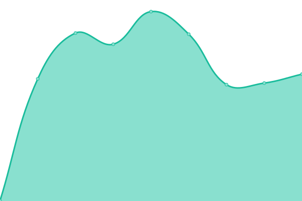
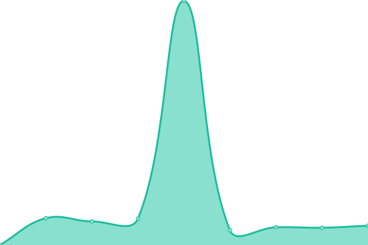

# [📈 Live Status](https://isolucionco.github.io/EstadoIsolucionHosting): <!--live status--> **🟧 Partial outage**

This repository contains the open-source uptime monitor and status page for [isolucionco](https://isolucionco.github.io/EstadoIsolucionHosting), powered by [Upptime](https://github.com/upptime/upptime).

With [Upptime](https://upptime.js.org), you can get your own unlimited and free uptime monitor and status page, powered entirely by a GitHub repository. We use [Issues](https://github.com/isolucionco/EstadoIsolucionHosting/issues) as incident reports, [Actions](https://github.com/isolucionco/EstadoIsolucionHosting/actions) as uptime monitors, and [Pages](https://isolucionco.github.io/EstadoIsolucionHosting) for the status page.

<!--start: status pages-->
<!-- This summary is generated by Upptime (https://github.com/upptime/upptime) -->
<!-- Do not edit this manually, your changes will be overwritten -->
<!-- prettier-ignore -->
| URL | Status | History | Response Time | Uptime |
| --- | ------ | ------- | ------------- | ------ |
|  [Adiquim.isolucion.co](https://Adiquim.isolucion.co) | 🟩 Up | [adiquim-isolucion-co.yml](https://github.com/isolucionco/EstadoIsolucionHosting/commits/HEAD/history/adiquim-isolucion-co.yml) | 

 1575ms
     
 | 

<a href="https://isolucionco.github.io/EstadoIsolucionHosting/history/adiquim-isolucion-co">70.14%</a>
    

|  [AdiquimTest.isolucion.co](https://AdiquimTest.isolucion.co) | 🟩 Up | [adiquim-test-isolucion-co.yml](https://github.com/isolucionco/EstadoIsolucionHosting/commits/HEAD/history/adiquim-test-isolucion-co.yml) | 

 1411ms
     
 | 

<a href="https://isolucionco.github.io/EstadoIsolucionHosting/history/adiquim-test-isolucion-co">100.00%</a>
    

|  [Adn.isolucion.co](https://Adn.isolucion.co) | 🟩 Up | [adn-isolucion-co.yml](https://github.com/isolucionco/EstadoIsolucionHosting/commits/HEAD/history/adn-isolucion-co.yml) | 

 1926ms
     
 | 

<a href="https://isolucionco.github.io/EstadoIsolucionHosting/history/adn-isolucion-co">100.00%</a>
    

|  [AgrocomercialCagir.isolucion.co](https://AgrocomercialCagir.isolucion.co) | 🟩 Up | [agrocomercial-cagir-isolucion-co.yml](https://github.com/isolucionco/EstadoIsolucionHosting/commits/HEAD/history/agrocomercial-cagir-isolucion-co.yml) | 

 1524ms
     
 | 

<a href="https://isolucionco.github.io/EstadoIsolucionHosting/history/agrocomercial-cagir-isolucion-co">71.11%</a>
    

|  [AIRTEMP.isolucion.co](https://AIRTEMP.isolucion.co) | 🟩 Up | [airtemp-isolucion-co.yml](https://github.com/isolucionco/EstadoIsolucionHosting/commits/HEAD/history/airtemp-isolucion-co.yml) | 

 1898ms
     
 | 

<a href="https://isolucionco.github.io/EstadoIsolucionHosting/history/airtemp-isolucion-co">100.00%</a>
    

|  [ALBATEQ.isolucion.co](https://ALBATEQ.isolucion.co) | 🟩 Up | [albateq-isolucion-co.yml](https://github.com/isolucionco/EstadoIsolucionHosting/commits/HEAD/history/albateq-isolucion-co.yml) | 

 1653ms
     
 | 

<a href="https://isolucionco.github.io/EstadoIsolucionHosting/history/albateq-isolucion-co">99.46%</a>
    

|  [AlcaldiaBarranquilla.isolucion.co](https://AlcaldiaBarranquilla.isolucion.co) | 🟩 Up | [alcaldia-barranquilla-isolucion-co.yml](https://github.com/isolucionco/EstadoIsolucionHosting/commits/HEAD/history/alcaldia-barranquilla-isolucion-co.yml) | 

 2681ms
     
 | 

<a href="https://isolucionco.github.io/EstadoIsolucionHosting/history/alcaldia-barranquilla-isolucion-co">71.11%</a>
    

|  [AlcaldiaBarranquillaTest.isolucion.co](https://AlcaldiaBarranquillaTest.isolucion.co) | 🟩 Up | [alcaldia-barranquilla-test-isolucion-co.yml](https://github.com/isolucionco/EstadoIsolucionHosting/commits/HEAD/history/alcaldia-barranquilla-test-isolucion-co.yml) | 

 2464ms
     
 | 

<a href="https://isolucionco.github.io/EstadoIsolucionHosting/history/alcaldia-barranquilla-test-isolucion-co">100.00%</a>
    

|  [AlcaldiaDeManizales.isolucion.co](https://AlcaldiaDeManizales.isolucion.co) | 🟩 Up | [alcaldia-de-manizales-isolucion-co.yml](https://github.com/isolucionco/EstadoIsolucionHosting/commits/HEAD/history/alcaldia-de-manizales-isolucion-co.yml) | 

 4966ms
     
 | 

<a href="https://isolucionco.github.io/EstadoIsolucionHosting/history/alcaldia-de-manizales-isolucion-co">99.54%</a>
    

|  [AlcaldiaTocancipa.Isolucion.co](https://AlcaldiaTocancipa.Isolucion.co) | 🟩 Up | [alcaldia-tocancipa-isolucion-co.yml](https://github.com/isolucionco/EstadoIsolucionHosting/commits/HEAD/history/alcaldia-tocancipa-isolucion-co.yml) | 

 1852ms
     
 | 

<a href="https://isolucionco.github.io/EstadoIsolucionHosting/history/alcaldia-tocancipa-isolucion-co">100.00%</a>
    

|  [AlcCajica.isolucion.co](https://AlcCajica.isolucion.co) | 🟩 Up | [alc-cajica-isolucion-co.yml](https://github.com/isolucionco/EstadoIsolucionHosting/commits/HEAD/history/alc-cajica-isolucion-co.yml) | 

 2698ms
     
 | 

<a href="https://isolucionco.github.io/EstadoIsolucionHosting/history/alc-cajica-isolucion-co">100.00%</a>
    

|  [ALFANET.isolucion.co](https://ALFANET.isolucion.co) | 🟩 Up | [alfanet-isolucion-co.yml](https://github.com/isolucionco/EstadoIsolucionHosting/commits/HEAD/history/alfanet-isolucion-co.yml) | 

 2806ms
     
 | 

<a href="https://isolucionco.github.io/EstadoIsolucionHosting/history/alfanet-isolucion-co">71.12%</a>
    

|  [ALFANETTest.isolucion.co](https://ALFANETTest.isolucion.co) | 🟩 Up | [alfanet-test-isolucion-co.yml](https://github.com/isolucionco/EstadoIsolucionHosting/commits/HEAD/history/alfanet-test-isolucion-co.yml) | 

 2443ms
     
 | 

<a href="https://isolucionco.github.io/EstadoIsolucionHosting/history/alfanet-test-isolucion-co">100.00%</a>
    

|  [alianzatemporales.isolucion.co](https://alianzatemporales.isolucion.co) | 🟩 Up | [alianzatemporales-isolucion-co.yml](https://github.com/isolucionco/EstadoIsolucionHosting/commits/HEAD/history/alianzatemporales-isolucion-co.yml) | 

 2574ms
     
 | 

<a href="https://isolucionco.github.io/EstadoIsolucionHosting/history/alianzatemporales-isolucion-co">100.00%</a>
    

|  [alianzatemporalesTest.isolucion.co](https://alianzatemporalesTest.isolucion.co) | 🟩 Up | [alianzatemporales-test-isolucion-co.yml](https://github.com/isolucionco/EstadoIsolucionHosting/commits/HEAD/history/alianzatemporales-test-isolucion-co.yml) | 

 2484ms
     
 | 

<a href="https://isolucionco.github.io/EstadoIsolucionHosting/history/alianzatemporales-test-isolucion-co">100.00%</a>
    

|  [Alico.isolucion.co](https://Alico.isolucion.co) | 🟩 Up | [alico-isolucion-co.yml](https://github.com/isolucionco/EstadoIsolucionHosting/commits/HEAD/history/alico-isolucion-co.yml) | 

 3389ms
     
 | 

<a href="https://isolucionco.github.io/EstadoIsolucionHosting/history/alico-isolucion-co">100.00%</a>
    

|  [Alura.isolucion.co](https://Alura.isolucion.co) | 🟩 Up | [alura-isolucion-co.yml](https://github.com/isolucionco/EstadoIsolucionHosting/commits/HEAD/history/alura-isolucion-co.yml) | 

 354ms
     
 | 

<a href="https://isolucionco.github.io/EstadoIsolucionHosting/history/alura-isolucion-co">71.12%</a>
    

|  [AluraTest.isolucion.co](https://AluraTest.isolucion.co) | 🟩 Up | [alura-test-isolucion-co.yml](https://github.com/isolucionco/EstadoIsolucionHosting/commits/HEAD/history/alura-test-isolucion-co.yml) | 

 2307ms
     
 | 

<a href="https://isolucionco.github.io/EstadoIsolucionHosting/history/alura-test-isolucion-co">100.00%</a>
    

|  [AMVSA.isolucion.co](https://AMVSA.isolucion.co) | 🟩 Up | [amvsa-isolucion-co.yml](https://github.com/isolucionco/EstadoIsolucionHosting/commits/HEAD/history/amvsa-isolucion-co.yml) | 

 1688ms
     
 | 

<a href="https://isolucionco.github.io/EstadoIsolucionHosting/history/amvsa-isolucion-co">91.69%</a>
    

|  [AMVSATest.isolucion.co](https://AMVSATest.isolucion.co) | 🟩 Up | [amvsa-test-isolucion-co.yml](https://github.com/isolucionco/EstadoIsolucionHosting/commits/HEAD/history/amvsa-test-isolucion-co.yml) | 

 2391ms
     
 | 

<a href="https://isolucionco.github.io/EstadoIsolucionHosting/history/amvsa-test-isolucion-co">100.00%</a>
    

|  [angiografia.isolucion.co](https://angiografia.isolucion.co) | 🟩 Up | [angiografia-isolucion-co.yml](https://github.com/isolucionco/EstadoIsolucionHosting/commits/HEAD/history/angiografia-isolucion-co.yml) | 

 3222ms
     
 | 

<a href="https://isolucionco.github.io/EstadoIsolucionHosting/history/angiografia-isolucion-co">97.59%</a>
    

|  [angiografiaTest.isolucion.co](https://angiografiaTest.isolucion.co) | 🟩 Up | [angiografia-test-isolucion-co.yml](https://github.com/isolucionco/EstadoIsolucionHosting/commits/HEAD/history/angiografia-test-isolucion-co.yml) | 

 2520ms
     
 | 

<a href="https://isolucionco.github.io/EstadoIsolucionHosting/history/angiografia-test-isolucion-co">100.00%</a>
    

|  [AON.isolucion.co](https://AON.isolucion.co) | 🟩 Up | [aon-isolucion-co.yml](https://github.com/isolucionco/EstadoIsolucionHosting/commits/HEAD/history/aon-isolucion-co.yml) | 

 2766ms
     
 | 

<a href="https://isolucionco.github.io/EstadoIsolucionHosting/history/aon-isolucion-co">71.12%</a>
    

|  [Asobancaria.isolucion.co](https://Asobancaria.isolucion.co) | 🟩 Up | [asobancaria-isolucion-co.yml](https://github.com/isolucionco/EstadoIsolucionHosting/commits/HEAD/history/asobancaria-isolucion-co.yml) | 

 3544ms
     
 | 

<a href="https://isolucionco.github.io/EstadoIsolucionHosting/history/asobancaria-isolucion-co">100.00%</a>
    

|  [atinaenergy.isolucion.co](https://atinaenergy.isolucion.co) | 🟩 Up | [atinaenergy-isolucion-co.yml](https://github.com/isolucionco/EstadoIsolucionHosting/commits/HEAD/history/atinaenergy-isolucion-co.yml) | 

 2615ms
     
 | 

<a href="https://isolucionco.github.io/EstadoIsolucionHosting/history/atinaenergy-isolucion-co">71.12%</a>
    

|  [atinaenergyTest.isolucion.co](https://atinaenergyTest.isolucion.co) | 🟩 Up | [atinaenergy-test-isolucion-co.yml](https://github.com/isolucionco/EstadoIsolucionHosting/commits/HEAD/history/atinaenergy-test-isolucion-co.yml) | 

 2454ms
     
 | 

<a href="https://isolucionco.github.io/EstadoIsolucionHosting/history/atinaenergy-test-isolucion-co">100.00%</a>
    

|  [AUDIFARMA.isolucion.co](https://AUDIFARMA.isolucion.co) | 🟩 Up | [audifarma-isolucion-co.yml](https://github.com/isolucionco/EstadoIsolucionHosting/commits/HEAD/history/audifarma-isolucion-co.yml) | 

 2793ms
     
 | 

<a href="https://isolucionco.github.io/EstadoIsolucionHosting/history/audifarma-isolucion-co">71.12%</a>
    

|  [AUDIFARMATest.isolucion.co](https://AUDIFARMATest.isolucion.co) | 🟩 Up | [audifarma-test-isolucion-co.yml](https://github.com/isolucionco/EstadoIsolucionHosting/commits/HEAD/history/audifarma-test-isolucion-co.yml) | 

 2417ms
     
 | 

<a href="https://isolucionco.github.io/EstadoIsolucionHosting/history/audifarma-test-isolucion-co">100.00%</a>
    

|  [BAGGRIT.isolucion.co](https://BAGGRIT.isolucion.co) | 🟩 Up | [baggrit-isolucion-co.yml](https://github.com/isolucionco/EstadoIsolucionHosting/commits/HEAD/history/baggrit-isolucion-co.yml) | 

 2702ms
     
 | 

<a href="https://isolucionco.github.io/EstadoIsolucionHosting/history/baggrit-isolucion-co">71.12%</a>
    

|  [BAINCOL.isolucion.co](https://BAINCOL.isolucion.co) | 🟩 Up | [baincol-isolucion-co.yml](https://github.com/isolucionco/EstadoIsolucionHosting/commits/HEAD/history/baincol-isolucion-co.yml) | 

 2731ms
     
 | 

<a href="https://isolucionco.github.io/EstadoIsolucionHosting/history/baincol-isolucion-co">71.12%</a>
    

|  [BAINCOLTest.isolucion.co](https://BAINCOLTest.isolucion.co) | 🟩 Up | [baincol-test-isolucion-co.yml](https://github.com/isolucionco/EstadoIsolucionHosting/commits/HEAD/history/baincol-test-isolucion-co.yml) | 

 2451ms
     
 | 

<a href="https://isolucionco.github.io/EstadoIsolucionHosting/history/baincol-test-isolucion-co">100.00%</a>
    

|  [BASC.isolucion.co](https://BASC.isolucion.co) | 🟩 Up | [basc-isolucion-co.yml](https://github.com/isolucionco/EstadoIsolucionHosting/commits/HEAD/history/basc-isolucion-co.yml) | 

 2824ms
     
 | 

<a href="https://isolucionco.github.io/EstadoIsolucionHosting/history/basc-isolucion-co">100.00%</a>
    

|  [bgcol.isolucion.co](https://bgcol.isolucion.co) | 🟩 Up | [bgcol-isolucion-co.yml](https://github.com/isolucionco/EstadoIsolucionHosting/commits/HEAD/history/bgcol-isolucion-co.yml) | 

 2636ms
     
 | 

<a href="https://isolucionco.github.io/EstadoIsolucionHosting/history/bgcol-isolucion-co">71.12%</a>
    

|  [bgcolTest.isolucion.co](https://bgcolTest.isolucion.co) | 🟩 Up | [bgcol-test-isolucion-co.yml](https://github.com/isolucionco/EstadoIsolucionHosting/commits/HEAD/history/bgcol-test-isolucion-co.yml) | 

 2466ms
     
 | 

<a href="https://isolucionco.github.io/EstadoIsolucionHosting/history/bgcol-test-isolucion-co">100.00%</a>
    

|  [Bimbo.isolucion.co](https://Bimbo.isolucion.co) | 🟩 Up | [bimbo-isolucion-co.yml](https://github.com/isolucionco/EstadoIsolucionHosting/commits/HEAD/history/bimbo-isolucion-co.yml) | 

 1898ms
     
 | 

<a href="https://isolucionco.github.io/EstadoIsolucionHosting/history/bimbo-isolucion-co">100.00%</a>
    

|  [Biotronitech.isolucion.co](https://Biotronitech.isolucion.co) | 🟩 Up | [biotronitech-isolucion-co.yml](https://github.com/isolucionco/EstadoIsolucionHosting/commits/HEAD/history/biotronitech-isolucion-co.yml) | 

 2005ms
     
 | 

<a href="https://isolucionco.github.io/EstadoIsolucionHosting/history/biotronitech-isolucion-co">100.00%</a>
    

|  [BiotronitechTest.isolucion.co](https://BiotronitechTest.isolucion.co) | 🟩 Up | [biotronitech-test-isolucion-co.yml](https://github.com/isolucionco/EstadoIsolucionHosting/commits/HEAD/history/biotronitech-test-isolucion-co.yml) | 

 2434ms
     
 | 

<a href="https://isolucionco.github.io/EstadoIsolucionHosting/history/biotronitech-test-isolucion-co">100.00%</a>
    

|  [Blaskov.Isolucion.co](https://Blaskov.Isolucion.co) | 🟩 Up | [blaskov-isolucion-co.yml](https://github.com/isolucionco/EstadoIsolucionHosting/commits/HEAD/history/blaskov-isolucion-co.yml) | 

 3776ms
     
 | 

<a href="https://isolucionco.github.io/EstadoIsolucionHosting/history/blaskov-isolucion-co">100.00%</a>
    

|  [bmiseguros.isolucion.co](https://bmiseguros.isolucion.co) | 🟩 Up | [bmiseguros-isolucion-co.yml](https://github.com/isolucionco/EstadoIsolucionHosting/commits/HEAD/history/bmiseguros-isolucion-co.yml) | 

 3683ms
     
 | 

<a href="https://isolucionco.github.io/EstadoIsolucionHosting/history/bmiseguros-isolucion-co">99.56%</a>
    

|  [bonsetlatinamerica.isolucion.co](https://bonsetlatinamerica.isolucion.co) | 🟩 Up | [bonsetlatinamerica-isolucion-co.yml](https://github.com/isolucionco/EstadoIsolucionHosting/commits/HEAD/history/bonsetlatinamerica-isolucion-co.yml) | 

 2655ms
     
 | 

<a href="https://isolucionco.github.io/EstadoIsolucionHosting/history/bonsetlatinamerica-isolucion-co">100.00%</a>
    

|  [bonsetlatinamericaTest.isolucion.co](https://bonsetlatinamericaTest.isolucion.co) | 🟩 Up | [bonsetlatinamerica-test-isolucion-co.yml](https://github.com/isolucionco/EstadoIsolucionHosting/commits/HEAD/history/bonsetlatinamerica-test-isolucion-co.yml) | 

 2462ms
     
 | 

<a href="https://isolucionco.github.io/EstadoIsolucionHosting/history/bonsetlatinamerica-test-isolucion-co">100.00%</a>
    

|  [BRASERV.isolucion.co](https://BRASERV.isolucion.co) | 🟩 Up | [braserv-isolucion-co.yml](https://github.com/isolucionco/EstadoIsolucionHosting/commits/HEAD/history/braserv-isolucion-co.yml) | 

 2136ms
     
 | 

<a href="https://isolucionco.github.io/EstadoIsolucionHosting/history/braserv-isolucion-co">91.79%</a>
    

|  [BRASERVTest.isolucion.co](https://BRASERVTest.isolucion.co) | 🟩 Up | [braserv-test-isolucion-co.yml](https://github.com/isolucionco/EstadoIsolucionHosting/commits/HEAD/history/braserv-test-isolucion-co.yml) | 

 2421ms
     
 | 

<a href="https://isolucionco.github.io/EstadoIsolucionHosting/history/braserv-test-isolucion-co">100.00%</a>
    

|  [BUGORG.isolucion.co](https://BUGORG.isolucion.co) | 🟩 Up | [bugorg-isolucion-co.yml](https://github.com/isolucionco/EstadoIsolucionHosting/commits/HEAD/history/bugorg-isolucion-co.yml) | 

 2668ms
     
 | 

<a href="https://isolucionco.github.io/EstadoIsolucionHosting/history/bugorg-isolucion-co">71.13%</a>
    

|  [BUGORGTest.isolucion.co](https://BUGORGTest.isolucion.co) | 🟩 Up | [bugorg-test-isolucion-co.yml](https://github.com/isolucionco/EstadoIsolucionHosting/commits/HEAD/history/bugorg-test-isolucion-co.yml) | 

 2429ms
     
 | 

<a href="https://isolucionco.github.io/EstadoIsolucionHosting/history/bugorg-test-isolucion-co">100.00%</a>
    

|  [Calima.isolucion.co](https://Calima.isolucion.co) | 🟩 Up | [calima-isolucion-co.yml](https://github.com/isolucionco/EstadoIsolucionHosting/commits/HEAD/history/calima-isolucion-co.yml) | 

 2666ms
     
 | 

<a href="https://isolucionco.github.io/EstadoIsolucionHosting/history/calima-isolucion-co">71.13%</a>
    

|  [CalimaTest.isolucion.co](https://CalimaTest.isolucion.co) | 🟩 Up | [calima-test-isolucion-co.yml](https://github.com/isolucionco/EstadoIsolucionHosting/commits/HEAD/history/calima-test-isolucion-co.yml) | 

 2415ms
     
 | 

<a href="https://isolucionco.github.io/EstadoIsolucionHosting/history/calima-test-isolucion-co">100.00%</a>
    

|  [capacitacion.isolucion.co](https://capacitacion.isolucion.co) | 🟩 Up | [capacitacion-isolucion-co.yml](https://github.com/isolucionco/EstadoIsolucionHosting/commits/HEAD/history/capacitacion-isolucion-co.yml) | 

 2689ms
     
 | 

<a href="https://isolucionco.github.io/EstadoIsolucionHosting/history/capacitacion-isolucion-co">100.00%</a>
    

|  [Carex.isolucion.co](https://Carex.isolucion.co) | 🟩 Up | [carex-isolucion-co.yml](https://github.com/isolucionco/EstadoIsolucionHosting/commits/HEAD/history/carex-isolucion-co.yml) | 

 2696ms
     
 | 

<a href="https://isolucionco.github.io/EstadoIsolucionHosting/history/carex-isolucion-co">100.00%</a>
    

|  [CarexTest.isolucion.co](https://CarexTest.isolucion.co) | 🟩 Up | [carex-test-isolucion-co.yml](https://github.com/isolucionco/EstadoIsolucionHosting/commits/HEAD/history/carex-test-isolucion-co.yml) | 

 2470ms
     
 | 

<a href="https://isolucionco.github.io/EstadoIsolucionHosting/history/carex-test-isolucion-co">100.00%</a>
    

|  [Cartama.isolucion.co](https://Cartama.isolucion.co) | 🟩 Up | [cartama-isolucion-co.yml](https://github.com/isolucionco/EstadoIsolucionHosting/commits/HEAD/history/cartama-isolucion-co.yml) | 

 2670ms
     
 | 

<a href="https://isolucionco.github.io/EstadoIsolucionHosting/history/cartama-isolucion-co">100.00%</a>
    

|  [CartamaTest.isolucion.co](https://CartamaTest.isolucion.co) | 🟩 Up | [cartama-test-isolucion-co.yml](https://github.com/isolucionco/EstadoIsolucionHosting/commits/HEAD/history/cartama-test-isolucion-co.yml) | 

 2389ms
     
 | 

<a href="https://isolucionco.github.io/EstadoIsolucionHosting/history/cartama-test-isolucion-co">100.00%</a>
    

|  [CelestinFreinet.isolucion.co](https://CelestinFreinet.isolucion.co) | 🟩 Up | [celestin-freinet-isolucion-co.yml](https://github.com/isolucionco/EstadoIsolucionHosting/commits/HEAD/history/celestin-freinet-isolucion-co.yml) | 

 2682ms
     
 | 

<a href="https://isolucionco.github.io/EstadoIsolucionHosting/history/celestin-freinet-isolucion-co">100.00%</a>
    

|  [CentralCervecera.isolucion.co](https://CentralCervecera.isolucion.co) | 🟩 Up | [central-cervecera-isolucion-co.yml](https://github.com/isolucionco/EstadoIsolucionHosting/commits/HEAD/history/central-cervecera-isolucion-co.yml) | 

 3525ms
     
 | 

<a href="https://isolucionco.github.io/EstadoIsolucionHosting/history/central-cervecera-isolucion-co">100.00%</a>
    

|  [CentralCerveceraTest.isolucion.co](https://CentralCerveceraTest.isolucion.co) | 🟩 Up | [central-cervecera-test-isolucion-co.yml](https://github.com/isolucionco/EstadoIsolucionHosting/commits/HEAD/history/central-cervecera-test-isolucion-co.yml) | 

 2840ms
     
 | 

<a href="https://isolucionco.github.io/EstadoIsolucionHosting/history/central-cervecera-test-isolucion-co">100.00%</a>
    

|  [centromayorcc.isolucion.co](https://centromayorcc.isolucion.co) | 🟩 Up | [centromayorcc-isolucion-co.yml](https://github.com/isolucionco/EstadoIsolucionHosting/commits/HEAD/history/centromayorcc-isolucion-co.yml) | 

 2638ms
     
 | 

<a href="https://isolucionco.github.io/EstadoIsolucionHosting/history/centromayorcc-isolucion-co">100.00%</a>
    

|  [Cerescos.isolucion.co](https://Cerescos.isolucion.co) | 🟩 Up | [cerescos-isolucion-co.yml](https://github.com/isolucionco/EstadoIsolucionHosting/commits/HEAD/history/cerescos-isolucion-co.yml) | 

 2898ms
     
 | 

<a href="https://isolucionco.github.io/EstadoIsolucionHosting/history/cerescos-isolucion-co">100.00%</a>
    

|  [Cesmag.isolucion.co](https://Cesmag.isolucion.co) | 🟩 Up | [cesmag-isolucion-co.yml](https://github.com/isolucionco/EstadoIsolucionHosting/commits/HEAD/history/cesmag-isolucion-co.yml) | 

 1691ms
     
 | 

<a href="https://isolucionco.github.io/EstadoIsolucionHosting/history/cesmag-isolucion-co">91.83%</a>
    

|  [CIFOODCOLOMBIA.isolucion.co](https://CIFOODCOLOMBIA.isolucion.co) | 🟩 Up | [cifoodcolombia-isolucion-co.yml](https://github.com/isolucionco/EstadoIsolucionHosting/commits/HEAD/history/cifoodcolombia-isolucion-co.yml) | 

 1655ms
     
 | 

<a href="https://isolucionco.github.io/EstadoIsolucionHosting/history/cifoodcolombia-isolucion-co">91.87%</a>
    

|  [clcgas.isolucion.co](https://clcgas.isolucion.co) | 🟩 Up | [clcgas-isolucion-co.yml](https://github.com/isolucionco/EstadoIsolucionHosting/commits/HEAD/history/clcgas-isolucion-co.yml) | 

 3181ms
     
 | 

<a href="https://isolucionco.github.io/EstadoIsolucionHosting/history/clcgas-isolucion-co">100.00%</a>
    

|  [COBELEN.isolucion.co](https://COBELEN.isolucion.co) | 🟩 Up | [cobelen-isolucion-co.yml](https://github.com/isolucionco/EstadoIsolucionHosting/commits/HEAD/history/cobelen-isolucion-co.yml) | 

 2713ms
     
 | 

<a href="https://isolucionco.github.io/EstadoIsolucionHosting/history/cobelen-isolucion-co">100.00%</a>
    

|  [COCESNA.isolucion.co](https://COCESNA.isolucion.co) | 🟩 Up | [cocesna-isolucion-co.yml](https://github.com/isolucionco/EstadoIsolucionHosting/commits/HEAD/history/cocesna-isolucion-co.yml) | 

 2686ms
     
 | 

<a href="https://isolucionco.github.io/EstadoIsolucionHosting/history/cocesna-isolucion-co">100.00%</a>
    

|  [COCESNATest.isolucion.co](https://COCESNATest.isolucion.co) | 🟥 Down | [cocesna-test-isolucion-co.yml](https://github.com/isolucionco/EstadoIsolucionHosting/commits/HEAD/history/cocesna-test-isolucion-co.yml) | 

 3091ms
     
 | 

<a href="https://isolucionco.github.io/EstadoIsolucionHosting/history/cocesna-test-isolucion-co">98.73%</a>
    

|  [colegiobennett.isolucion.co](https://colegiobennett.isolucion.co) | 🟩 Up | [colegiobennett-isolucion-co.yml](https://github.com/isolucionco/EstadoIsolucionHosting/commits/HEAD/history/colegiobennett-isolucion-co.yml) | 

 3137ms
     
 | 

<a href="https://isolucionco.github.io/EstadoIsolucionHosting/history/colegiobennett-isolucion-co">100.00%</a>
    

|  [Colegiojesusmaria.isolucion.co](https://Colegiojesusmaria.isolucion.co) | 🟩 Up | [colegiojesusmaria-isolucion-co.yml](https://github.com/isolucionco/EstadoIsolucionHosting/commits/HEAD/history/colegiojesusmaria-isolucion-co.yml) | 

 3212ms
     
 | 

<a href="https://isolucionco.github.io/EstadoIsolucionHosting/history/colegiojesusmaria-isolucion-co">100.00%</a>
    

|  [Colegionuevagranada.isolucion.co](https://Colegionuevagranada.isolucion.co) | 🟩 Up | [colegionuevagranada-isolucion-co.yml](https://github.com/isolucionco/EstadoIsolucionHosting/commits/HEAD/history/colegionuevagranada-isolucion-co.yml) | 

 3346ms
     
 | 

<a href="https://isolucionco.github.io/EstadoIsolucionHosting/history/colegionuevagranada-isolucion-co">100.00%</a>
    

|  [collectcenter.isolucion.co](https://collectcenter.isolucion.co) | 🟩 Up | [collectcenter-isolucion-co.yml](https://github.com/isolucionco/EstadoIsolucionHosting/commits/HEAD/history/collectcenter-isolucion-co.yml) | 

 2994ms
     
 | 

<a href="https://isolucionco.github.io/EstadoIsolucionHosting/history/collectcenter-isolucion-co">100.00%</a>
    

|  [collectcenterTest.isolucion.co](https://collectcenterTest.isolucion.co) | 🟩 Up | [collectcenter-test-isolucion-co.yml](https://github.com/isolucionco/EstadoIsolucionHosting/commits/HEAD/history/collectcenter-test-isolucion-co.yml) | 

 2494ms
     
 | 

<a href="https://isolucionco.github.io/EstadoIsolucionHosting/history/collectcenter-test-isolucion-co">100.00%</a>
    

|  [Combarranquilla.isolucion.co](https://Combarranquilla.isolucion.co) | 🟩 Up | [combarranquilla-isolucion-co.yml](https://github.com/isolucionco/EstadoIsolucionHosting/commits/HEAD/history/combarranquilla-isolucion-co.yml) | 

 3157ms
     
 | 

<a href="https://isolucionco.github.io/EstadoIsolucionHosting/history/combarranquilla-isolucion-co">100.00%</a>
    

|  [ComercialDemo.isolucion.co](https://ComercialDemo.isolucion.co) | 🟩 Up | [comercial-demo-isolucion-co.yml](https://github.com/isolucionco/EstadoIsolucionHosting/commits/HEAD/history/comercial-demo-isolucion-co.yml) | 

 1538ms
     
 | 

<a href="https://isolucionco.github.io/EstadoIsolucionHosting/history/comercial-demo-isolucion-co">100.00%</a>
    

|  [Comercializadora3c.isolucion.co](https://Comercializadora3c.isolucion.co) | 🟩 Up | [comercializadora3c-isolucion-co.yml](https://github.com/isolucionco/EstadoIsolucionHosting/commits/HEAD/history/comercializadora3c-isolucion-co.yml) | 

 2423ms
     
 | 

<a href="https://isolucionco.github.io/EstadoIsolucionHosting/history/comercializadora3c-isolucion-co">100.00%</a>
    

|  [ComfamiliarRisaralda.isolucion.co](https://ComfamiliarRisaralda.isolucion.co) | 🟩 Up | [comfamiliar-risaralda-isolucion-co.yml](https://github.com/isolucionco/EstadoIsolucionHosting/commits/HEAD/history/comfamiliar-risaralda-isolucion-co.yml) | 

 434ms
     
 | 

<a href="https://isolucionco.github.io/EstadoIsolucionHosting/history/comfamiliar-risaralda-isolucion-co">100.00%</a>
    

|  [Comfandi.isolucion.co](https://Comfandi.isolucion.co) | 🟩 Up | [comfandi-isolucion-co.yml](https://github.com/isolucionco/EstadoIsolucionHosting/commits/HEAD/history/comfandi-isolucion-co.yml) | 

 1824ms
     
 | 

<a href="https://isolucionco.github.io/EstadoIsolucionHosting/history/comfandi-isolucion-co">71.13%</a>
    

|  [Consuerte.isolucion.co](https://Consuerte.isolucion.co) | 🟩 Up | [consuerte-isolucion-co.yml](https://github.com/isolucionco/EstadoIsolucionHosting/commits/HEAD/history/consuerte-isolucion-co.yml) | 

 1905ms
     
 | 

<a href="https://isolucionco.github.io/EstadoIsolucionHosting/history/consuerte-isolucion-co">71.13%</a>
    

|  [Contactar.isolucion.co](https://Contactar.isolucion.co) | 🟩 Up | [contactar-isolucion-co.yml](https://github.com/isolucionco/EstadoIsolucionHosting/commits/HEAD/history/contactar-isolucion-co.yml) | 

 907ms
     
 | 

<a href="https://isolucionco.github.io/EstadoIsolucionHosting/history/contactar-isolucion-co">71.13%</a>
    

|  [COOPEDAC.isolucion.co](https://COOPEDAC.isolucion.co) | 🟩 Up | [coopedac-isolucion-co.yml](https://github.com/isolucionco/EstadoIsolucionHosting/commits/HEAD/history/coopedac-isolucion-co.yml) | 

 2614ms
     
 | 

<a href="https://isolucionco.github.io/EstadoIsolucionHosting/history/coopedac-isolucion-co">71.14%</a>
    

|  [COOPEDACTest.isolucion.co](https://COOPEDACTest.isolucion.co) | 🟩 Up | [coopedac-test-isolucion-co.yml](https://github.com/isolucionco/EstadoIsolucionHosting/commits/HEAD/history/coopedac-test-isolucion-co.yml) | 

 3438ms
     
 | 

<a href="https://isolucionco.github.io/EstadoIsolucionHosting/history/coopedac-test-isolucion-co">71.14%</a>
    

|  [coopminutodedios.isolucion.co](https://coopminutodedios.isolucion.co) | 🟩 Up | [coopminutodedios-isolucion-co.yml](https://github.com/isolucionco/EstadoIsolucionHosting/commits/HEAD/history/coopminutodedios-isolucion-co.yml) | 

 1807ms
     
 | 

<a href="https://isolucionco.github.io/EstadoIsolucionHosting/history/coopminutodedios-isolucion-co">71.14%</a>
    

|  [Cooptenjo.isolucion.co](https://Cooptenjo.isolucion.co) | 🟩 Up | [cooptenjo-isolucion-co.yml](https://github.com/isolucionco/EstadoIsolucionHosting/commits/HEAD/history/cooptenjo-isolucion-co.yml) | 

 1562ms
     
 | 

<a href="https://isolucionco.github.io/EstadoIsolucionHosting/history/cooptenjo-isolucion-co">71.14%</a>
    

|  [CooptenjoTest.isolucion.co](https://CooptenjoTest.isolucion.co) | 🟩 Up | [cooptenjo-test-isolucion-co.yml](https://github.com/isolucionco/EstadoIsolucionHosting/commits/HEAD/history/cooptenjo-test-isolucion-co.yml) | 

 2416ms
     
 | 

<a href="https://isolucionco.github.io/EstadoIsolucionHosting/history/cooptenjo-test-isolucion-co">71.14%</a>
    

|  [Coordinadora.isolucion.co](https://Coordinadora.isolucion.co) | 🟩 Up | [coordinadora-isolucion-co.yml](https://github.com/isolucionco/EstadoIsolucionHosting/commits/HEAD/history/coordinadora-isolucion-co.yml) | 

 3142ms
     
 | 

<a href="https://isolucionco.github.io/EstadoIsolucionHosting/history/coordinadora-isolucion-co">71.14%</a>
    

|  [CorpAmericana.isolucion.co](https://CorpAmericana.isolucion.co) | 🟩 Up | [corp-americana-isolucion-co.yml](https://github.com/isolucionco/EstadoIsolucionHosting/commits/HEAD/history/corp-americana-isolucion-co.yml) | 

 3175ms
     
 | 

<a href="https://isolucionco.github.io/EstadoIsolucionHosting/history/corp-americana-isolucion-co">71.14%</a>
    

|  [cruzrojaantioquia.isolucion.co](https://cruzrojaantioquia.isolucion.co) | 🟩 Up | [cruzrojaantioquia-isolucion-co.yml](https://github.com/isolucionco/EstadoIsolucionHosting/commits/HEAD/history/cruzrojaantioquia-isolucion-co.yml) | 

 4258ms
     
 | 

<a href="https://isolucionco.github.io/EstadoIsolucionHosting/history/cruzrojaantioquia-isolucion-co">71.14%</a>
    

|  [cruzrojaantioquiaTest.isolucion.co](https://cruzrojaantioquiaTest.isolucion.co) | 🟩 Up | [cruzrojaantioquia-test-isolucion-co.yml](https://github.com/isolucionco/EstadoIsolucionHosting/commits/HEAD/history/cruzrojaantioquia-test-isolucion-co.yml) | 

 2991ms
     
 | 

<a href="https://isolucionco.github.io/EstadoIsolucionHosting/history/cruzrojaantioquia-test-isolucion-co">71.14%</a>
    

|  [CYPDELR.isolucion.co](https://CYPDELR.isolucion.co) | 🟩 Up | [cypdelr-isolucion-co.yml](https://github.com/isolucionco/EstadoIsolucionHosting/commits/HEAD/history/cypdelr-isolucion-co.yml) | 

 3073ms
     
 | 

<a href="https://isolucionco.github.io/EstadoIsolucionHosting/history/cypdelr-isolucion-co">71.15%</a>
    

|  [dane.isolucion.co](https://dane.isolucion.co) | 🟩 Up | [dane-isolucion-co.yml](https://github.com/isolucionco/EstadoIsolucionHosting/commits/HEAD/history/dane-isolucion-co.yml) | 

 2454ms
     
 | 

<a href="https://isolucionco.github.io/EstadoIsolucionHosting/history/dane-isolucion-co">71.28%</a>
    

|  [danetest.isolucion.co](https://danetest.isolucion.co) | 🟩 Up | [danetest-isolucion-co.yml](https://github.com/isolucionco/EstadoIsolucionHosting/commits/HEAD/history/danetest-isolucion-co.yml) | 

 3926ms
     
 | 

<a href="https://isolucionco.github.io/EstadoIsolucionHosting/history/danetest-isolucion-co">71.28%</a>
    

|  [deliveranceship.isolucion.co](https://deliveranceship.isolucion.co) | 🟩 Up | [deliveranceship-isolucion-co.yml](https://github.com/isolucionco/EstadoIsolucionHosting/commits/HEAD/history/deliveranceship-isolucion-co.yml) | 

 2690ms
     
 | 

<a href="https://isolucionco.github.io/EstadoIsolucionHosting/history/deliveranceship-isolucion-co">71.28%</a>
    

|  [deliveranceshipTest.isolucion.co](https://deliveranceshipTest.isolucion.co) | 🟥 Down | [deliveranceship-test-isolucion-co.yml](https://github.com/isolucionco/EstadoIsolucionHosting/commits/HEAD/history/deliveranceship-test-isolucion-co.yml) | 

 2466ms
     
 | 

<a href="https://isolucionco.github.io/EstadoIsolucionHosting/history/deliveranceship-test-isolucion-co">70.04%</a>
    

|  [DemoComercial.isolucion.co](https://DemoComercial.isolucion.co) | 🟥 Down | [demo-comercial-isolucion-co.yml](https://github.com/isolucionco/EstadoIsolucionHosting/commits/HEAD/history/demo-comercial-isolucion-co.yml) | 

 149ms
     
 | 

<a href="https://isolucionco.github.io/EstadoIsolucionHosting/history/demo-comercial-isolucion-co">71.16%</a>
    

|  [DemoSarlaft.isolucion.co](https://DemoSarlaft.isolucion.co) | 🟩 Up | [demo-sarlaft-isolucion-co.yml](https://github.com/isolucionco/EstadoIsolucionHosting/commits/HEAD/history/demo-sarlaft-isolucion-co.yml) | 

 2653ms
     
 | 

<a href="https://isolucionco.github.io/EstadoIsolucionHosting/history/demo-sarlaft-isolucion-co">71.29%</a>
    

|  [Drypers.isolucion.co](https://Drypers.isolucion.co) | 🟩 Up | [drypers-isolucion-co.yml](https://github.com/isolucionco/EstadoIsolucionHosting/commits/HEAD/history/drypers-isolucion-co.yml) | 

 2885ms
     
 | 

<a href="https://isolucionco.github.io/EstadoIsolucionHosting/history/drypers-isolucion-co">71.29%</a>
    

|  [educacionfuturo.isolucion.co](https://educacionfuturo.isolucion.co) | 🟩 Up | [educacionfuturo-isolucion-co.yml](https://github.com/isolucionco/EstadoIsolucionHosting/commits/HEAD/history/educacionfuturo-isolucion-co.yml) | 

 3130ms
     
 | 

<a href="https://isolucionco.github.io/EstadoIsolucionHosting/history/educacionfuturo-isolucion-co">71.29%</a>
    

|  [ElectroquimicaWest.isolucion.co](https://ElectroquimicaWest.isolucion.co) | 🟩 Up | [electroquimica-west-isolucion-co.yml](https://github.com/isolucionco/EstadoIsolucionHosting/commits/HEAD/history/electroquimica-west-isolucion-co.yml) | 

 2705ms
     
 | 

<a href="https://isolucionco.github.io/EstadoIsolucionHosting/history/electroquimica-west-isolucion-co">71.29%</a>
    

|  [ElRancherito.isolucion.co](https://ElRancherito.isolucion.co) | 🟩 Up | [el-rancherito-isolucion-co.yml](https://github.com/isolucionco/EstadoIsolucionHosting/commits/HEAD/history/el-rancherito-isolucion-co.yml) | 

 1038ms
     
 | 

<a href="https://isolucionco.github.io/EstadoIsolucionHosting/history/el-rancherito-isolucion-co">62.60%</a>
    

|  [EmpaquetadosElTrece.isolucion.co](https://EmpaquetadosElTrece.isolucion.co) | 🟩 Up | [empaquetados-el-trece-isolucion-co.yml](https://github.com/isolucionco/EstadoIsolucionHosting/commits/HEAD/history/empaquetados-el-trece-isolucion-co.yml) | 

 2639ms
     
 | 

<a href="https://isolucionco.github.io/EstadoIsolucionHosting/history/empaquetados-el-trece-isolucion-co">100.00%</a>
    

|  [EmpaquetadosElTreceTest.isolucion.co](https://EmpaquetadosElTreceTest.isolucion.co) | 🟩 Up | [empaquetados-el-trece-test-isolucion-co.yml](https://github.com/isolucionco/EstadoIsolucionHosting/commits/HEAD/history/empaquetados-el-trece-test-isolucion-co.yml) | 

 2516ms
     
 | 

<a href="https://isolucionco.github.io/EstadoIsolucionHosting/history/empaquetados-el-trece-test-isolucion-co">71.29%</a>
    

|  [Eterna.isolucion.co](https://Eterna.isolucion.co) | 🟩 Up | [eterna-isolucion-co.yml](https://github.com/isolucionco/EstadoIsolucionHosting/commits/HEAD/history/eterna-isolucion-co.yml) | 

 2775ms
     
 | 

<a href="https://isolucionco.github.io/EstadoIsolucionHosting/history/eterna-isolucion-co">71.29%</a>
    

|  [EternaTest.isolucion.co](https://EternaTest.isolucion.co) | 🟩 Up | [eterna-test-isolucion-co.yml](https://github.com/isolucionco/EstadoIsolucionHosting/commits/HEAD/history/eterna-test-isolucion-co.yml) | 

 2572ms
     
 | 

<a href="https://isolucionco.github.io/EstadoIsolucionHosting/history/eterna-test-isolucion-co">71.30%</a>
    

|  [Fenalce.isolucion.co](https://Fenalce.isolucion.co) | 🟩 Up | [fenalce-isolucion-co.yml](https://github.com/isolucionco/EstadoIsolucionHosting/commits/HEAD/history/fenalce-isolucion-co.yml) | 

 2820ms
     
 | 

<a href="https://isolucionco.github.io/EstadoIsolucionHosting/history/fenalce-isolucion-co">71.30%</a>
    

|  [Fiducentral.isolucion.co](https://Fiducentral.isolucion.co) | 🟩 Up | [fiducentral-isolucion-co.yml](https://github.com/isolucionco/EstadoIsolucionHosting/commits/HEAD/history/fiducentral-isolucion-co.yml) | 

 3192ms
     
 | 

<a href="https://isolucionco.github.io/EstadoIsolucionHosting/history/fiducentral-isolucion-co">71.30%</a>
    

|  [FlagSoluciones.isolucion.co](https://FlagSoluciones.isolucion.co) | 🟩 Up | [flag-soluciones-isolucion-co.yml](https://github.com/isolucionco/EstadoIsolucionHosting/commits/HEAD/history/flag-soluciones-isolucion-co.yml) | 

 3318ms
     
 | 

<a href="https://isolucionco.github.io/EstadoIsolucionHosting/history/flag-soluciones-isolucion-co">71.30%</a>
    

|  [FONTUR.isolucion.co](https://FONTUR.isolucion.co) | 🟩 Up | [fontur-isolucion-co.yml](https://github.com/isolucionco/EstadoIsolucionHosting/commits/HEAD/history/fontur-isolucion-co.yml) | 

 2646ms
     
 | 

<a href="https://isolucionco.github.io/EstadoIsolucionHosting/history/fontur-isolucion-co">100.00%</a>
    

|  [FONTURTest.isolucion.co](https://FONTURTest.isolucion.co) | 🟥 Down | [fontur-test-isolucion-co.yml](https://github.com/isolucionco/EstadoIsolucionHosting/commits/HEAD/history/fontur-test-isolucion-co.yml) | 

 2430ms
     
 | 

<a href="https://isolucionco.github.io/EstadoIsolucionHosting/history/fontur-test-isolucion-co">70.08%</a>
    

|  [fundacionbatuta.isolucion.co](https://fundacionbatuta.isolucion.co) | 🟩 Up | [fundacionbatuta-isolucion-co.yml](https://github.com/isolucionco/EstadoIsolucionHosting/commits/HEAD/history/fundacionbatuta-isolucion-co.yml) | 

 1566ms
     
 | 

<a href="https://isolucionco.github.io/EstadoIsolucionHosting/history/fundacionbatuta-isolucion-co">62.63%</a>
    

|  [Fundelima.isolucion.co](https://Fundelima.isolucion.co) | 🟩 Up | [fundelima-isolucion-co.yml](https://github.com/isolucionco/EstadoIsolucionHosting/commits/HEAD/history/fundelima-isolucion-co.yml) | 

 2615ms
     
 | 

<a href="https://isolucionco.github.io/EstadoIsolucionHosting/history/fundelima-isolucion-co">100.00%</a>
    

|  [FundelimaTest.isolucion.co](https://FundelimaTest.isolucion.co) | 🟥 Down | [fundelima-test-isolucion-co.yml](https://github.com/isolucionco/EstadoIsolucionHosting/commits/HEAD/history/fundelima-test-isolucion-co.yml) | 

 3168ms
     
 | 

<a href="https://isolucionco.github.io/EstadoIsolucionHosting/history/fundelima-test-isolucion-co">70.09%</a>
    

|  [Gabrica.isolucion.co](https://Gabrica.isolucion.co) | 🟩 Up | [gabrica-isolucion-co.yml](https://github.com/isolucionco/EstadoIsolucionHosting/commits/HEAD/history/gabrica-isolucion-co.yml) | 

 2694ms
     
 | 

<a href="https://isolucionco.github.io/EstadoIsolucionHosting/history/gabrica-isolucion-co">74.23%</a>
    

|  [GlobalOil.isolucion.co](https://GlobalOil.isolucion.co) | 🟩 Up | [global-oil-isolucion-co.yml](https://github.com/isolucionco/EstadoIsolucionHosting/commits/HEAD/history/global-oil-isolucion-co.yml) | 

 4935ms
     
 | 

<a href="https://isolucionco.github.io/EstadoIsolucionHosting/history/global-oil-isolucion-co">74.23%</a>
    

|  [GloriaColombia.isolucion.co](https://GloriaColombia.isolucion.co) | 🟩 Up | [gloria-colombia-isolucion-co.yml](https://github.com/isolucionco/EstadoIsolucionHosting/commits/HEAD/history/gloria-colombia-isolucion-co.yml) | 

 3102ms
     
 | 

<a href="https://isolucionco.github.io/EstadoIsolucionHosting/history/gloria-colombia-isolucion-co">74.23%</a>
    

|  [goldenbusinessclass.isolucion.co](https://goldenbusinessclass.isolucion.co) | 🟩 Up | [goldenbusinessclass-isolucion-co.yml](https://github.com/isolucionco/EstadoIsolucionHosting/commits/HEAD/history/goldenbusinessclass-isolucion-co.yml) | 

 3387ms
     
 | 

<a href="https://isolucionco.github.io/EstadoIsolucionHosting/history/goldenbusinessclass-isolucion-co">100.00%</a>
    

|  [griffithfoods.isolucion.co](https://griffithfoods.isolucion.co) | 🟩 Up | [griffithfoods-isolucion-co.yml](https://github.com/isolucionco/EstadoIsolucionHosting/commits/HEAD/history/griffithfoods-isolucion-co.yml) | 

 3882ms
     
 | 

<a href="https://isolucionco.github.io/EstadoIsolucionHosting/history/griffithfoods-isolucion-co">100.00%</a>
    

|  [griffithfoodsTest.isolucion.co](https://griffithfoodsTest.isolucion.co) | 🟥 Down | [griffithfoods-test-isolucion-co.yml](https://github.com/isolucionco/EstadoIsolucionHosting/commits/HEAD/history/griffithfoods-test-isolucion-co.yml) | 

 3550ms
     
 | 

<a href="https://isolucionco.github.io/EstadoIsolucionHosting/history/griffithfoods-test-isolucion-co">73.03%</a>
    

|  [Grupoafin.isolucion.co](https://Grupoafin.isolucion.co) | 🟩 Up | [grupoafin-isolucion-co.yml](https://github.com/isolucionco/EstadoIsolucionHosting/commits/HEAD/history/grupoafin-isolucion-co.yml) | 

 3911ms
     
 | 

<a href="https://isolucionco.github.io/EstadoIsolucionHosting/history/grupoafin-isolucion-co">100.00%</a>
    

|  [GrupoAlfa.Isolucion.co](https://GrupoAlfa.Isolucion.co) | 🟩 Up | [grupo-alfa-isolucion-co.yml](https://github.com/isolucionco/EstadoIsolucionHosting/commits/HEAD/history/grupo-alfa-isolucion-co.yml) | 

 3142ms
     
 | 

<a href="https://isolucionco.github.io/EstadoIsolucionHosting/history/grupo-alfa-isolucion-co">74.22%</a>
    

|  [grupoasd.isolucion.co](https://grupoasd.isolucion.co) | 🟩 Up | [grupoasd-isolucion-co.yml](https://github.com/isolucionco/EstadoIsolucionHosting/commits/HEAD/history/grupoasd-isolucion-co.yml) | 

 3071ms
     
 | 

<a href="https://isolucionco.github.io/EstadoIsolucionHosting/history/grupoasd-isolucion-co">71.31%</a>
    

|  [gruposiderurgico.isolucion.co](https://gruposiderurgico.isolucion.co) | 🟩 Up | [gruposiderurgico-isolucion-co.yml](https://github.com/isolucionco/EstadoIsolucionHosting/commits/HEAD/history/gruposiderurgico-isolucion-co.yml) | 

 2697ms
     
 | 

<a href="https://isolucionco.github.io/EstadoIsolucionHosting/history/gruposiderurgico-isolucion-co">71.31%</a>
    

|  [gruposiderurgicoTest.isolucion.co](https://gruposiderurgicoTest.isolucion.co) | 🟩 Up | [gruposiderurgico-test-isolucion-co.yml](https://github.com/isolucionco/EstadoIsolucionHosting/commits/HEAD/history/gruposiderurgico-test-isolucion-co.yml) | 

 2554ms
     
 | 

<a href="https://isolucionco.github.io/EstadoIsolucionHosting/history/gruposiderurgico-test-isolucion-co">71.31%</a>
    

|  [Guarne.isolucion.co](https://Guarne.isolucion.co) | 🟩 Up | [guarne-isolucion-co.yml](https://github.com/isolucionco/EstadoIsolucionHosting/commits/HEAD/history/guarne-isolucion-co.yml) | 

 2849ms
     
 | 

<a href="https://isolucionco.github.io/EstadoIsolucionHosting/history/guarne-isolucion-co">62.67%</a>
    

|  [gyjintegracion.isolucion.co](https://gyjintegracion.isolucion.co) | 🟩 Up | [gyjintegracion-isolucion-co.yml](https://github.com/isolucionco/EstadoIsolucionHosting/commits/HEAD/history/gyjintegracion-isolucion-co.yml) | 

 3954ms
     
 | 

<a href="https://isolucionco.github.io/EstadoIsolucionHosting/history/gyjintegracion-isolucion-co">71.31%</a>
    

|  [Haceb.isolucion.co](https://Haceb.isolucion.co) | 🟩 Up | [haceb-isolucion-co.yml](https://github.com/isolucionco/EstadoIsolucionHosting/commits/HEAD/history/haceb-isolucion-co.yml) | 

 371ms
     
 | 

<a href="https://isolucionco.github.io/EstadoIsolucionHosting/history/haceb-isolucion-co">71.31%</a>
    

|  [HacebTest.isolucion.co](https://HacebTest.isolucion.co) | 🟩 Up | [haceb-test-isolucion-co.yml](https://github.com/isolucionco/EstadoIsolucionHosting/commits/HEAD/history/haceb-test-isolucion-co.yml) | 

 3670ms
     
 | 

<a href="https://isolucionco.github.io/EstadoIsolucionHosting/history/haceb-test-isolucion-co">71.31%</a>
    

|  [harinerapardo.isolucion.co](https://harinerapardo.isolucion.co) | 🟩 Up | [harinerapardo-isolucion-co.yml](https://github.com/isolucionco/EstadoIsolucionHosting/commits/HEAD/history/harinerapardo-isolucion-co.yml) | 

 3812ms
     
 | 

<a href="https://isolucionco.github.io/EstadoIsolucionHosting/history/harinerapardo-isolucion-co">100.00%</a>
    

|  [Hermanasdominicas.isolucion.co](https://Hermanasdominicas.isolucion.co) | 🟩 Up | [hermanasdominicas-isolucion-co.yml](https://github.com/isolucionco/EstadoIsolucionHosting/commits/HEAD/history/hermanasdominicas-isolucion-co.yml) | 

 4771ms
     
 | 

<a href="https://isolucionco.github.io/EstadoIsolucionHosting/history/hermanasdominicas-isolucion-co">71.32%</a>
    

|  [hgingenieria.isolucion.co](https://hgingenieria.isolucion.co) | 🟩 Up | [hgingenieria-isolucion-co.yml](https://github.com/isolucionco/EstadoIsolucionHosting/commits/HEAD/history/hgingenieria-isolucion-co.yml) | 

 2936ms
     
 | 

<a href="https://isolucionco.github.io/EstadoIsolucionHosting/history/hgingenieria-isolucion-co">62.69%</a>
    

|  [hgingenieriaTest.isolucion.co](https://hgingenieriaTest.isolucion.co) | 🟩 Up | [hgingenieria-test-isolucion-co.yml](https://github.com/isolucionco/EstadoIsolucionHosting/commits/HEAD/history/hgingenieria-test-isolucion-co.yml) | 

 3655ms
     
 | 

<a href="https://isolucionco.github.io/EstadoIsolucionHosting/history/hgingenieria-test-isolucion-co">71.32%</a>
    

|  [iasociadas.isolucion.co](https://iasociadas.isolucion.co) | 🟩 Up | [iasociadas-isolucion-co.yml](https://github.com/isolucionco/EstadoIsolucionHosting/commits/HEAD/history/iasociadas-isolucion-co.yml) | 

 2720ms
     
 | 

<a href="https://isolucionco.github.io/EstadoIsolucionHosting/history/iasociadas-isolucion-co">100.00%</a>
    

|  [iasociadastest.isolucion.co](https://iasociadastest.isolucion.co) | 🟩 Up | [iasociadastest-isolucion-co.yml](https://github.com/isolucionco/EstadoIsolucionHosting/commits/HEAD/history/iasociadastest-isolucion-co.yml) | 

 3483ms
     
 | 

<a href="https://isolucionco.github.io/EstadoIsolucionHosting/history/iasociadastest-isolucion-co">73.94%</a>
    

|  [ICCONSTRUCTORA.isolucion.co](https://ICCONSTRUCTORA.isolucion.co) | 🟩 Up | [icconstructora-isolucion-co.yml](https://github.com/isolucionco/EstadoIsolucionHosting/commits/HEAD/history/icconstructora-isolucion-co.yml) | 

 3203ms
     
 | 

<a href="https://isolucionco.github.io/EstadoIsolucionHosting/history/icconstructora-isolucion-co">73.94%</a>
    

|  [ICCONSTRUCTORATest.isolucion.co](https://ICCONSTRUCTORATest.isolucion.co) | 🟩 Up | [icconstructora-test-isolucion-co.yml](https://github.com/isolucionco/EstadoIsolucionHosting/commits/HEAD/history/icconstructora-test-isolucion-co.yml) | 

 3660ms
     
 | 

<a href="https://isolucionco.github.io/EstadoIsolucionHosting/history/icconstructora-test-isolucion-co">100.00%</a>
    

|  [ICCundinamarca.isolucion.co](https://ICCundinamarca.isolucion.co) | 🟩 Up | [ic-cundinamarca-isolucion-co.yml](https://github.com/isolucionco/EstadoIsolucionHosting/commits/HEAD/history/ic-cundinamarca-isolucion-co.yml) | 

 4041ms
     
 | 

<a href="https://isolucionco.github.io/EstadoIsolucionHosting/history/ic-cundinamarca-isolucion-co">73.94%</a>
    

|  [ICCundinamarcaTest.isolucion.co](https://ICCundinamarcaTest.isolucion.co) | 🟩 Up | [ic-cundinamarca-test-isolucion-co.yml](https://github.com/isolucionco/EstadoIsolucionHosting/commits/HEAD/history/ic-cundinamarca-test-isolucion-co.yml) | 

 3601ms
     
 | 

<a href="https://isolucionco.github.io/EstadoIsolucionHosting/history/ic-cundinamarca-test-isolucion-co">73.94%</a>
    

|  [Implem.isolucion.co](https://Implem.isolucion.co) | 🟩 Up | [implem-isolucion-co.yml](https://github.com/isolucionco/EstadoIsolucionHosting/commits/HEAD/history/implem-isolucion-co.yml) | 

 1230ms
     
 | 

<a href="https://isolucionco.github.io/EstadoIsolucionHosting/history/implem-isolucion-co">55.52%</a>
    

|  [IMPRESISTEM.isolucion.co](https://IMPRESISTEM.isolucion.co) | 🟩 Up | [impresistem-isolucion-co.yml](https://github.com/isolucionco/EstadoIsolucionHosting/commits/HEAD/history/impresistem-isolucion-co.yml) | 

 2569ms
     
 | 

<a href="https://isolucionco.github.io/EstadoIsolucionHosting/history/impresistem-isolucion-co">64.04%</a>
    

|  [IMPRESISTEMTest.isolucion.co](https://IMPRESISTEMTest.isolucion.co) | 🟩 Up | [impresistem-test-isolucion-co.yml](https://github.com/isolucionco/EstadoIsolucionHosting/commits/HEAD/history/impresistem-test-isolucion-co.yml) | 

 3562ms
     
 | 

<a href="https://isolucionco.github.io/EstadoIsolucionHosting/history/impresistem-test-isolucion-co">73.95%</a>
    

|  [imsa.isolucion.co](https://imsa.isolucion.co) | 🟩 Up | [imsa-isolucion-co.yml](https://github.com/isolucionco/EstadoIsolucionHosting/commits/HEAD/history/imsa-isolucion-co.yml) | 

 3167ms
     
 | 

<a href="https://isolucionco.github.io/EstadoIsolucionHosting/history/imsa-isolucion-co">73.95%</a>
    

|  [Ingevias.isolucion.co](https://Ingevias.isolucion.co) | 🟩 Up | [ingevias-isolucion-co.yml](https://github.com/isolucionco/EstadoIsolucionHosting/commits/HEAD/history/ingevias-isolucion-co.yml) | 

 6744ms
     
 | 

<a href="https://isolucionco.github.io/EstadoIsolucionHosting/history/ingevias-isolucion-co">72.72%</a>
    

|  [INNINGGROUP.isolucion.co](https://INNINGGROUP.isolucion.co) | 🟩 Up | [inninggroup-isolucion-co.yml](https://github.com/isolucionco/EstadoIsolucionHosting/commits/HEAD/history/inninggroup-isolucion-co.yml) | 

 2872ms
     
 | 

<a href="https://isolucionco.github.io/EstadoIsolucionHosting/history/inninggroup-isolucion-co">73.95%</a>
    

|  [INPROQUIM.isolucion.co](https://INPROQUIM.isolucion.co) | 🟩 Up | [inproquim-isolucion-co.yml](https://github.com/isolucionco/EstadoIsolucionHosting/commits/HEAD/history/inproquim-isolucion-co.yml) | 

 4950ms
     
 | 

<a href="https://isolucionco.github.io/EstadoIsolucionHosting/history/inproquim-isolucion-co">74.28%</a>
    

|  [IPFSAS.isolucion.co](https://IPFSAS.isolucion.co) | 🟩 Up | [ipfsas-isolucion-co.yml](https://github.com/isolucionco/EstadoIsolucionHosting/commits/HEAD/history/ipfsas-isolucion-co.yml) | 

 3951ms
     
 | 

<a href="https://isolucionco.github.io/EstadoIsolucionHosting/history/ipfsas-isolucion-co">74.22%</a>
    

|  [itsinfocom.isolucion.co](https://itsinfocom.isolucion.co) | 🟩 Up | [itsinfocom-isolucion-co.yml](https://github.com/isolucionco/EstadoIsolucionHosting/commits/HEAD/history/itsinfocom-isolucion-co.yml) | 

 4097ms
     
 | 

<a href="https://isolucionco.github.io/EstadoIsolucionHosting/history/itsinfocom-isolucion-co">100.00%</a>
    

|  [itsinfocomTest.isolucion.co](https://itsinfocomTest.isolucion.co) | 🟩 Up | [itsinfocom-test-isolucion-co.yml](https://github.com/isolucionco/EstadoIsolucionHosting/commits/HEAD/history/itsinfocom-test-isolucion-co.yml) | 

 3537ms
     
 | 

<a href="https://isolucionco.github.io/EstadoIsolucionHosting/history/itsinfocom-test-isolucion-co">74.22%</a>
    

|  [jargu.isolucion.co](https://jargu.isolucion.co) | 🟩 Up | [jargu-isolucion-co.yml](https://github.com/isolucionco/EstadoIsolucionHosting/commits/HEAD/history/jargu-isolucion-co.yml) | 

 3952ms
     
 | 

<a href="https://isolucionco.github.io/EstadoIsolucionHosting/history/jargu-isolucion-co">100.00%</a>
    

|  [Juandecastellanos.isolucion.co](https://Juandecastellanos.isolucion.co) | 🟥 Down | [juandecastellanos-isolucion-co.yml](https://github.com/isolucionco/EstadoIsolucionHosting/commits/HEAD/history/juandecastellanos-isolucion-co.yml) | 

 146ms
     
 | 

<a href="https://isolucionco.github.io/EstadoIsolucionHosting/history/juandecastellanos-isolucion-co">73.13%</a>
    

|  [KHIRON.isolucion.co](https://KHIRON.isolucion.co) | 🟥 Down | [khiron-isolucion-co.yml](https://github.com/isolucionco/EstadoIsolucionHosting/commits/HEAD/history/khiron-isolucion-co.yml) | 

 3948ms
     
 | 

<a href="https://isolucionco.github.io/EstadoIsolucionHosting/history/khiron-isolucion-co">98.91%</a>
    

|  [KHIRONTest.isolucion.co](https://KHIRONTest.isolucion.co) | 🟩 Up | [khiron-test-isolucion-co.yml](https://github.com/isolucionco/EstadoIsolucionHosting/commits/HEAD/history/khiron-test-isolucion-co.yml) | 

 2511ms
     
 | 

<a href="https://isolucionco.github.io/EstadoIsolucionHosting/history/khiron-test-isolucion-co">74.29%</a>
    

|  [KLISTO.isolucion.co](https://KLISTO.isolucion.co) | 🟩 Up | [klisto-isolucion-co.yml](https://github.com/isolucionco/EstadoIsolucionHosting/commits/HEAD/history/klisto-isolucion-co.yml) | 

 4747ms
     
 | 

<a href="https://isolucionco.github.io/EstadoIsolucionHosting/history/klisto-isolucion-co">74.29%</a>
    

|  [Koneggui.isolucion.co](https://Koneggui.isolucion.co) | 🟩 Up | [koneggui-isolucion-co.yml](https://github.com/isolucionco/EstadoIsolucionHosting/commits/HEAD/history/koneggui-isolucion-co.yml) | 

 3669ms
     
 | 

<a href="https://isolucionco.github.io/EstadoIsolucionHosting/history/koneggui-isolucion-co">100.00%</a>
    

|  [KYROVET.isolucion.co](https://KYROVET.isolucion.co) | 🟩 Up | [kyrovet-isolucion-co.yml](https://github.com/isolucionco/EstadoIsolucionHosting/commits/HEAD/history/kyrovet-isolucion-co.yml) | 

 3979ms
     
 | 

<a href="https://isolucionco.github.io/EstadoIsolucionHosting/history/kyrovet-isolucion-co">74.29%</a>
    

|  [labechavarria.isolucion.co](https://labechavarria.isolucion.co) | 🟩 Up | [labechavarria-isolucion-co.yml](https://github.com/isolucionco/EstadoIsolucionHosting/commits/HEAD/history/labechavarria-isolucion-co.yml) | 

 4434ms
     
 | 

<a href="https://isolucionco.github.io/EstadoIsolucionHosting/history/labechavarria-isolucion-co">74.29%</a>
    

|  [labmedico.isolucion.co](https://labmedico.isolucion.co) | 🟩 Up | [labmedico-isolucion-co.yml](https://github.com/isolucionco/EstadoIsolucionHosting/commits/HEAD/history/labmedico-isolucion-co.yml) | 

 4232ms
     
 | 

<a href="https://isolucionco.github.io/EstadoIsolucionHosting/history/labmedico-isolucion-co">74.29%</a>
    

|  [LabQuimClinico.isolucion.co](https://LabQuimClinico.isolucion.co) | 🟩 Up | [lab-quim-clinico-isolucion-co.yml](https://github.com/isolucionco/EstadoIsolucionHosting/commits/HEAD/history/lab-quim-clinico-isolucion-co.yml) | 

 3976ms
     
 | 

<a href="https://isolucionco.github.io/EstadoIsolucionHosting/history/lab-quim-clinico-isolucion-co">74.30%</a>
    

|  [Lafrancol.isolucion.co](https://Lafrancol.isolucion.co) | 🟩 Up | [lafrancol-isolucion-co.yml](https://github.com/isolucionco/EstadoIsolucionHosting/commits/HEAD/history/lafrancol-isolucion-co.yml) | 

 4947ms
     
 | 

<a href="https://isolucionco.github.io/EstadoIsolucionHosting/history/lafrancol-isolucion-co">74.30%</a>
    

|  [lamesa.isolucion.co](https://lamesa.isolucion.co) | 🟩 Up | [lamesa-isolucion-co.yml](https://github.com/isolucionco/EstadoIsolucionHosting/commits/HEAD/history/lamesa-isolucion-co.yml) | 

 159ms
     
 | 

<a href="https://isolucionco.github.io/EstadoIsolucionHosting/history/lamesa-isolucion-co">74.30%</a>
    

|  [lamesaTest.isolucion.co](https://lamesaTest.isolucion.co) | 🟩 Up | [lamesa-test-isolucion-co.yml](https://github.com/isolucionco/EstadoIsolucionHosting/commits/HEAD/history/lamesa-test-isolucion-co.yml) | 

 3677ms
     
 | 

<a href="https://isolucionco.github.io/EstadoIsolucionHosting/history/lamesa-test-isolucion-co">74.30%</a>
    

|  [lameseta.isolucion.co](https://lameseta.isolucion.co) | 🟩 Up | [lameseta-isolucion-co.yml](https://github.com/isolucionco/EstadoIsolucionHosting/commits/HEAD/history/lameseta-isolucion-co.yml) | 

 4380ms
     
 | 

<a href="https://isolucionco.github.io/EstadoIsolucionHosting/history/lameseta-isolucion-co">74.30%</a>
    

|  [Lasmisiones.isolucion.co](https://Lasmisiones.isolucion.co) | 🟩 Up | [lasmisiones-isolucion-co.yml](https://github.com/isolucionco/EstadoIsolucionHosting/commits/HEAD/history/lasmisiones-isolucion-co.yml) | 

 2557ms
     
 | 

<a href="https://isolucionco.github.io/EstadoIsolucionHosting/history/lasmisiones-isolucion-co">74.30%</a>
    

|  [LasmisionesTest.isolucion.co](https://LasmisionesTest.isolucion.co) | 🟩 Up | [lasmisiones-test-isolucion-co.yml](https://github.com/isolucionco/EstadoIsolucionHosting/commits/HEAD/history/lasmisiones-test-isolucion-co.yml) | 

 3633ms
     
 | 

<a href="https://isolucionco.github.io/EstadoIsolucionHosting/history/lasmisiones-test-isolucion-co">74.31%</a>
    

|  [LATCALINSA.isolucion.co](https://LATCALINSA.isolucion.co) | 🟩 Up | [latcalinsa-isolucion-co.yml](https://github.com/isolucionco/EstadoIsolucionHosting/commits/HEAD/history/latcalinsa-isolucion-co.yml) | 

 4138ms
     
 | 

<a href="https://isolucionco.github.io/EstadoIsolucionHosting/history/latcalinsa-isolucion-co">74.31%</a>
    

|  [LCNIdiomas.isolucion.co](https://LCNIdiomas.isolucion.co) | 🟩 Up | [lcn-idiomas-isolucion-co.yml](https://github.com/isolucionco/EstadoIsolucionHosting/commits/HEAD/history/lcn-idiomas-isolucion-co.yml) | 

 3134ms
     
 | 

<a href="https://isolucionco.github.io/EstadoIsolucionHosting/history/lcn-idiomas-isolucion-co">74.31%</a>
    

|  [letratiempo.isolucion.co](https://letratiempo.isolucion.co) | 🟩 Up | [letratiempo-isolucion-co.yml](https://github.com/isolucionco/EstadoIsolucionHosting/commits/HEAD/history/letratiempo-isolucion-co.yml) | 

 3979ms
     
 | 

<a href="https://isolucionco.github.io/EstadoIsolucionHosting/history/letratiempo-isolucion-co">73.65%</a>
    

|  [LHA.isolucion.co](https://LHA.isolucion.co) | 🟩 Up | [lha-isolucion-co.yml](https://github.com/isolucionco/EstadoIsolucionHosting/commits/HEAD/history/lha-isolucion-co.yml) | 

 3593ms
     
 | 

<a href="https://isolucionco.github.io/EstadoIsolucionHosting/history/lha-isolucion-co">74.31%</a>
    

|  [Lhoist.isolucion.co](https://Lhoist.isolucion.co) | 🟩 Up | [lhoist-isolucion-co.yml](https://github.com/isolucionco/EstadoIsolucionHosting/commits/HEAD/history/lhoist-isolucion-co.yml) | 

 3952ms
     
 | 

<a href="https://isolucionco.github.io/EstadoIsolucionHosting/history/lhoist-isolucion-co">100.00%</a>
    

|  [Lmedick.isolucion.co](https://Lmedick.isolucion.co) | 🟩 Up | [lmedick-isolucion-co.yml](https://github.com/isolucionco/EstadoIsolucionHosting/commits/HEAD/history/lmedick-isolucion-co.yml) | 

 3948ms
     
 | 

<a href="https://isolucionco.github.io/EstadoIsolucionHosting/history/lmedick-isolucion-co">74.31%</a>
    

|  [MACROTICS.isolucion.co](https://MACROTICS.isolucion.co) | 🟩 Up | [macrotics-isolucion-co.yml](https://github.com/isolucionco/EstadoIsolucionHosting/commits/HEAD/history/macrotics-isolucion-co.yml) | 

 4852ms
     
 | 

<a href="https://isolucionco.github.io/EstadoIsolucionHosting/history/macrotics-isolucion-co">100.00%</a>
    

|  [MACROTICSTest.isolucion.co](https://MACROTICSTest.isolucion.co) | 🟩 Up | [macrotics-test-isolucion-co.yml](https://github.com/isolucionco/EstadoIsolucionHosting/commits/HEAD/history/macrotics-test-isolucion-co.yml) | 

 3612ms
     
 | 

<a href="https://isolucionco.github.io/EstadoIsolucionHosting/history/macrotics-test-isolucion-co">74.31%</a>
    

|  [mercadosMadrid.isolucion.co](https://mercadosMadrid.isolucion.co) | 🟩 Up | [mercados-madrid-isolucion-co.yml](https://github.com/isolucionco/EstadoIsolucionHosting/commits/HEAD/history/mercados-madrid-isolucion-co.yml) | 

 3992ms
     
 | 

<a href="https://isolucionco.github.io/EstadoIsolucionHosting/history/mercados-madrid-isolucion-co">100.00%</a>
    

|  [mercadosMadridTest.isolucion.co](https://mercadosMadridTest.isolucion.co) | 🟩 Up | [mercados-madrid-test-isolucion-co.yml](https://github.com/isolucionco/EstadoIsolucionHosting/commits/HEAD/history/mercados-madrid-test-isolucion-co.yml) | 

 3566ms
     
 | 

<a href="https://isolucionco.github.io/EstadoIsolucionHosting/history/mercados-madrid-test-isolucion-co">74.31%</a>
    

|  [mesurametrologia.isolucion.co](https://mesurametrologia.isolucion.co) | 🟩 Up | [mesurametrologia-isolucion-co.yml](https://github.com/isolucionco/EstadoIsolucionHosting/commits/HEAD/history/mesurametrologia-isolucion-co.yml) | 

 2743ms
     
 | 

<a href="https://isolucionco.github.io/EstadoIsolucionHosting/history/mesurametrologia-isolucion-co">100.00%</a>
    

|  [molinosyopal.isolucion.co](https://molinosyopal.isolucion.co) | 🟩 Up | [molinosyopal-isolucion-co.yml](https://github.com/isolucionco/EstadoIsolucionHosting/commits/HEAD/history/molinosyopal-isolucion-co.yml) | 

 5301ms
     
 | 

<a href="https://isolucionco.github.io/EstadoIsolucionHosting/history/molinosyopal-isolucion-co">100.00%</a>
    

|  [Multigranos.isolucion.co](https://Multigranos.isolucion.co) | 🟩 Up | [multigranos-isolucion-co.yml](https://github.com/isolucionco/EstadoIsolucionHosting/commits/HEAD/history/multigranos-isolucion-co.yml) | 

 3976ms
     
 | 

<a href="https://isolucionco.github.io/EstadoIsolucionHosting/history/multigranos-isolucion-co">74.22%</a>
    

|  [municipioconcordia.isolucion.co](https://municipioconcordia.isolucion.co) | 🟩 Up | [municipioconcordia-isolucion-co.yml](https://github.com/isolucionco/EstadoIsolucionHosting/commits/HEAD/history/municipioconcordia-isolucion-co.yml) | 

 3933ms
     
 | 

<a href="https://isolucionco.github.io/EstadoIsolucionHosting/history/municipioconcordia-isolucion-co">100.00%</a>
    

|  [municipioconcordiaTest.isolucion.co](https://municipioconcordiaTest.isolucion.co) | 🟩 Up | [municipioconcordia-test-isolucion-co.yml](https://github.com/isolucionco/EstadoIsolucionHosting/commits/HEAD/history/municipioconcordia-test-isolucion-co.yml) | 

 3577ms
     
 | 

<a href="https://isolucionco.github.io/EstadoIsolucionHosting/history/municipioconcordia-test-isolucion-co">100.00%</a>
    

|  [mymmanejo.isolucion.co](https://mymmanejo.isolucion.co) | 🟩 Up | [mymmanejo-isolucion-co.yml](https://github.com/isolucionco/EstadoIsolucionHosting/commits/HEAD/history/mymmanejo-isolucion-co.yml) | 

 3907ms
     
 | 

<a href="https://isolucionco.github.io/EstadoIsolucionHosting/history/mymmanejo-isolucion-co">100.00%</a>
    

|  [mymmanejoTest.isolucion.co](https://mymmanejoTest.isolucion.co) | 🟩 Up | [mymmanejo-test-isolucion-co.yml](https://github.com/isolucionco/EstadoIsolucionHosting/commits/HEAD/history/mymmanejo-test-isolucion-co.yml) | 

 3656ms
     
 | 

<a href="https://isolucionco.github.io/EstadoIsolucionHosting/history/mymmanejo-test-isolucion-co">100.00%</a>
    

|  [naturacert.isolucion.co](https://naturacert.isolucion.co) | 🟩 Up | [naturacert-isolucion-co.yml](https://github.com/isolucionco/EstadoIsolucionHosting/commits/HEAD/history/naturacert-isolucion-co.yml) | 

 3981ms
     
 | 

<a href="https://isolucionco.github.io/EstadoIsolucionHosting/history/naturacert-isolucion-co">100.00%</a>
    

|  [naturacertTest.isolucion.co](https://naturacertTest.isolucion.co) | 🟩 Up | [naturacert-test-isolucion-co.yml](https://github.com/isolucionco/EstadoIsolucionHosting/commits/HEAD/history/naturacert-test-isolucion-co.yml) | 

 3646ms
     
 | 

<a href="https://isolucionco.github.io/EstadoIsolucionHosting/history/naturacert-test-isolucion-co">100.00%</a>
    

|  [Novabase.isolucion.co](https://Novabase.isolucion.co) | 🟩 Up | [novabase-isolucion-co.yml](https://github.com/isolucionco/EstadoIsolucionHosting/commits/HEAD/history/novabase-isolucion-co.yml) | 

 3952ms
     
 | 

<a href="https://isolucionco.github.io/EstadoIsolucionHosting/history/novabase-isolucion-co">100.00%</a>
    

|  [Nutreo.isolucion.co](https://Nutreo.isolucion.co) | 🟩 Up | [nutreo-isolucion-co.yml](https://github.com/isolucionco/EstadoIsolucionHosting/commits/HEAD/history/nutreo-isolucion-co.yml) | 

 3990ms
     
 | 

<a href="https://isolucionco.github.io/EstadoIsolucionHosting/history/nutreo-isolucion-co">100.00%</a>
    

|  [NutreoTest.isolucion.co](https://NutreoTest.isolucion.co) | 🟩 Up | [nutreo-test-isolucion-co.yml](https://github.com/isolucionco/EstadoIsolucionHosting/commits/HEAD/history/nutreo-test-isolucion-co.yml) | 

 3625ms
     
 | 

<a href="https://isolucionco.github.io/EstadoIsolucionHosting/history/nutreo-test-isolucion-co">100.00%</a>
    

|  [Nutrium.isolucion.co](https://Nutrium.isolucion.co) | 🟩 Up | [nutrium-isolucion-co.yml](https://github.com/isolucionco/EstadoIsolucionHosting/commits/HEAD/history/nutrium-isolucion-co.yml) | 

 4164ms
     
 | 

<a href="https://isolucionco.github.io/EstadoIsolucionHosting/history/nutrium-isolucion-co">100.00%</a>
    

|  [NutriumTest.isolucion.co](https://NutriumTest.isolucion.co) | 🟩 Up | [nutrium-test-isolucion-co.yml](https://github.com/isolucionco/EstadoIsolucionHosting/commits/HEAD/history/nutrium-test-isolucion-co.yml) | 

 3712ms
     
 | 

<a href="https://isolucionco.github.io/EstadoIsolucionHosting/history/nutrium-test-isolucion-co">100.00%</a>
    

|  [OmegaEnergy.isolucion.co](https://OmegaEnergy.isolucion.co) | 🟩 Up | [omega-energy-isolucion-co.yml](https://github.com/isolucionco/EstadoIsolucionHosting/commits/HEAD/history/omega-energy-isolucion-co.yml) | 

 2775ms
     
 | 

<a href="https://isolucionco.github.io/EstadoIsolucionHosting/history/omega-energy-isolucion-co">100.00%</a>
    

|  [OmegaEnergyTest.isolucion.co](https://OmegaEnergyTest.isolucion.co) | 🟩 Up | [omega-energy-test-isolucion-co.yml](https://github.com/isolucionco/EstadoIsolucionHosting/commits/HEAD/history/omega-energy-test-isolucion-co.yml) | 

 3536ms
     
 | 

<a href="https://isolucionco.github.io/EstadoIsolucionHosting/history/omega-energy-test-isolucion-co">100.00%</a>
    

|  [ONACORG.isolucion.co](https://ONACORG.isolucion.co) | 🟩 Up | [onacorg-isolucion-co.yml](https://github.com/isolucionco/EstadoIsolucionHosting/commits/HEAD/history/onacorg-isolucion-co.yml) | 

 3958ms
     
 | 

<a href="https://isolucionco.github.io/EstadoIsolucionHosting/history/onacorg-isolucion-co">100.00%</a>
    

|  [ONACORGTest.isolucion.co](https://ONACORGTest.isolucion.co) | 🟩 Up | [onacorg-test-isolucion-co.yml](https://github.com/isolucionco/EstadoIsolucionHosting/commits/HEAD/history/onacorg-test-isolucion-co.yml) | 

 3668ms
     
 | 

<a href="https://isolucionco.github.io/EstadoIsolucionHosting/history/onacorg-test-isolucion-co">100.00%</a>
    

|  [ONELINK.isolucion.co](https://ONELINK.isolucion.co) | 🟩 Up | [onelink-isolucion-co.yml](https://github.com/isolucionco/EstadoIsolucionHosting/commits/HEAD/history/onelink-isolucion-co.yml) | 

 1758ms
     
 | 

<a href="https://isolucionco.github.io/EstadoIsolucionHosting/history/onelink-isolucion-co">100.00%</a>
    

|  [ONELINKTest.isolucion.co](https://ONELINKTest.isolucion.co) | 🟩 Up | [onelink-test-isolucion-co.yml](https://github.com/isolucionco/EstadoIsolucionHosting/commits/HEAD/history/onelink-test-isolucion-co.yml) | 

 3154ms
     
 | 

<a href="https://isolucionco.github.io/EstadoIsolucionHosting/history/onelink-test-isolucion-co">100.00%</a>
    

|  [ONGCVIDESH.isolucion.co](https://ONGCVIDESH.isolucion.co) | 🟩 Up | [ongcvidesh-isolucion-co.yml](https://github.com/isolucionco/EstadoIsolucionHosting/commits/HEAD/history/ongcvidesh-isolucion-co.yml) | 

 4003ms
     
 | 

<a href="https://isolucionco.github.io/EstadoIsolucionHosting/history/ongcvidesh-isolucion-co">100.00%</a>
    

|  [Orientame.isolucion.co](https://Orientame.isolucion.co) | 🟩 Up | [orientame-isolucion-co.yml](https://github.com/isolucionco/EstadoIsolucionHosting/commits/HEAD/history/orientame-isolucion-co.yml) | 

 3607ms
     
 | 

<a href="https://isolucionco.github.io/EstadoIsolucionHosting/history/orientame-isolucion-co">100.00%</a>
    

|  [OrientameTest.isolucion.co](https://OrientameTest.isolucion.co) | 🟩 Up | [orientame-test-isolucion-co.yml](https://github.com/isolucionco/EstadoIsolucionHosting/commits/HEAD/history/orientame-test-isolucion-co.yml) | 

 3646ms
     
 | 

<a href="https://isolucionco.github.io/EstadoIsolucionHosting/history/orientame-test-isolucion-co">100.00%</a>
    

|  [Ovosur.isolucion.co](https://Ovosur.isolucion.co) | 🟩 Up | [ovosur-isolucion-co.yml](https://github.com/isolucionco/EstadoIsolucionHosting/commits/HEAD/history/ovosur-isolucion-co.yml) | 

 3360ms
     
 | 

<a href="https://isolucionco.github.io/EstadoIsolucionHosting/history/ovosur-isolucion-co">100.00%</a>
    

|  [pagosgde.isolucion.co](https://pagosgde.isolucion.co) | 🟩 Up | [pagosgde-isolucion-co.yml](https://github.com/isolucionco/EstadoIsolucionHosting/commits/HEAD/history/pagosgde-isolucion-co.yml) | 

 3336ms
     
 | 

<a href="https://isolucionco.github.io/EstadoIsolucionHosting/history/pagosgde-isolucion-co">100.00%</a>
    

|  [PISENDE.isolucion.co](https://PISENDE.isolucion.co) | 🟩 Up | [pisende-isolucion-co.yml](https://github.com/isolucionco/EstadoIsolucionHosting/commits/HEAD/history/pisende-isolucion-co.yml) | 

 4437ms
     
 | 

<a href="https://isolucionco.github.io/EstadoIsolucionHosting/history/pisende-isolucion-co">100.00%</a>
    

|  [PISENDETest.isolucion.co](https://PISENDETest.isolucion.co) | 🟩 Up | [pisende-test-isolucion-co.yml](https://github.com/isolucionco/EstadoIsolucionHosting/commits/HEAD/history/pisende-test-isolucion-co.yml) | 

 3753ms
     
 | 

<a href="https://isolucionco.github.io/EstadoIsolucionHosting/history/pisende-test-isolucion-co">100.00%</a>
    

|  [PLASTIPACK.isolucion.co](https://PLASTIPACK.isolucion.co) | 🟩 Up | [plastipack-isolucion-co.yml](https://github.com/isolucionco/EstadoIsolucionHosting/commits/HEAD/history/plastipack-isolucion-co.yml) | 

 4149ms
     
 | 

<a href="https://isolucionco.github.io/EstadoIsolucionHosting/history/plastipack-isolucion-co">100.00%</a>
    

|  [PLASTIPACKTest.isolucion.co](https://PLASTIPACKTest.isolucion.co) | 🟩 Up | [plastipack-test-isolucion-co.yml](https://github.com/isolucionco/EstadoIsolucionHosting/commits/HEAD/history/plastipack-test-isolucion-co.yml) | 

 2602ms
     
 | 

<a href="https://isolucionco.github.io/EstadoIsolucionHosting/history/plastipack-test-isolucion-co">100.00%</a>
    

|  [Prebel.isolucion.co](https://Prebel.isolucion.co) | 🟩 Up | [prebel-isolucion-co.yml](https://github.com/isolucionco/EstadoIsolucionHosting/commits/HEAD/history/prebel-isolucion-co.yml) | 

 3053ms
     
 | 

<a href="https://isolucionco.github.io/EstadoIsolucionHosting/history/prebel-isolucion-co">89.85%</a>
    

|  [PrebelTest.isolucion.co](https://PrebelTest.isolucion.co) | 🟩 Up | [prebel-test-isolucion-co.yml](https://github.com/isolucionco/EstadoIsolucionHosting/commits/HEAD/history/prebel-test-isolucion-co.yml) | 

 6453ms
     
 | 

<a href="https://isolucionco.github.io/EstadoIsolucionHosting/history/prebel-test-isolucion-co">94.36%</a>
    

|  [Premex.isolucion.co](https://Premex.isolucion.co) | 🟩 Up | [premex-isolucion-co.yml](https://github.com/isolucionco/EstadoIsolucionHosting/commits/HEAD/history/premex-isolucion-co.yml) | 

 4178ms
     
 | 

<a href="https://isolucionco.github.io/EstadoIsolucionHosting/history/premex-isolucion-co">100.00%</a>
    

|  [PremexTest.isolucion.co](https://PremexTest.isolucion.co) | 🟩 Up | [premex-test-isolucion-co.yml](https://github.com/isolucionco/EstadoIsolucionHosting/commits/HEAD/history/premex-test-isolucion-co.yml) | 

 3753ms
     
 | 

<a href="https://isolucionco.github.io/EstadoIsolucionHosting/history/premex-test-isolucion-co">100.00%</a>
    

|  [Profamilia.isolucion.co](https://Profamilia.isolucion.co) | 🟩 Up | [profamilia-isolucion-co.yml](https://github.com/isolucionco/EstadoIsolucionHosting/commits/HEAD/history/profamilia-isolucion-co.yml) | 

 407ms
     
 | 

<a href="https://isolucionco.github.io/EstadoIsolucionHosting/history/profamilia-isolucion-co">100.00%</a>
    

|  [ProfamiliaTest.isolucion.co](https://ProfamiliaTest.isolucion.co) | 🟩 Up | [profamilia-test-isolucion-co.yml](https://github.com/isolucionco/EstadoIsolucionHosting/commits/HEAD/history/profamilia-test-isolucion-co.yml) | 

 3640ms
     
 | 

<a href="https://isolucionco.github.io/EstadoIsolucionHosting/history/profamilia-test-isolucion-co">100.00%</a>
    

|  [puertodebarranquilla.isolucion.co](https://puertodebarranquilla.isolucion.co) | 🟩 Up | [puertodebarranquilla-isolucion-co.yml](https://github.com/isolucionco/EstadoIsolucionHosting/commits/HEAD/history/puertodebarranquilla-isolucion-co.yml) | 

 3172ms
     
 | 

<a href="https://isolucionco.github.io/EstadoIsolucionHosting/history/puertodebarranquilla-isolucion-co">100.00%</a>
    

|  [puertodebarranquillaTest.isolucion.co](https://puertodebarranquillaTest.isolucion.co) | 🟩 Up | [puertodebarranquilla-test-isolucion-co.yml](https://github.com/isolucionco/EstadoIsolucionHosting/commits/HEAD/history/puertodebarranquilla-test-isolucion-co.yml) | 

 3650ms
     
 | 

<a href="https://isolucionco.github.io/EstadoIsolucionHosting/history/puertodebarranquilla-test-isolucion-co">100.00%</a>
    

|  [QA.isolucion.co](https://QA.isolucion.co) | 🟩 Up | [qa-isolucion-co.yml](https://github.com/isolucionco/EstadoIsolucionHosting/commits/HEAD/history/qa-isolucion-co.yml) | 

 1518ms
     
 | 

<a href="https://isolucionco.github.io/EstadoIsolucionHosting/history/qa-isolucion-co">100.00%</a>
    

|  [QAFederados.isolucion.co](https://QAFederados.isolucion.co) | 🟩 Up | [qa-federados-isolucion-co.yml](https://github.com/isolucionco/EstadoIsolucionHosting/commits/HEAD/history/qa-federados-isolucion-co.yml) | 

 3634ms
     
 | 

<a href="https://isolucionco.github.io/EstadoIsolucionHosting/history/qa-federados-isolucion-co">100.00%</a>
    

|  [QAMIPG.isolucion.co](https://QAMIPG.isolucion.co) | 🟩 Up | [qamipg-isolucion-co.yml](https://github.com/isolucionco/EstadoIsolucionHosting/commits/HEAD/history/qamipg-isolucion-co.yml) | 

 3832ms
     
 | 

<a href="https://isolucionco.github.io/EstadoIsolucionHosting/history/qamipg-isolucion-co">100.00%</a>
    

|  [QUANTASERVICES.isolucion.co](https://QUANTASERVICES.isolucion.co) | 🟩 Up | [quantaservices-isolucion-co.yml](https://github.com/isolucionco/EstadoIsolucionHosting/commits/HEAD/history/quantaservices-isolucion-co.yml) | 

 5660ms
     
 | 

<a href="https://isolucionco.github.io/EstadoIsolucionHosting/history/quantaservices-isolucion-co">100.00%</a>
    

|  [Radiologosasociados.isolucion.co](https://Radiologosasociados.isolucion.co) | 🟩 Up | [radiologosasociados-isolucion-co.yml](https://github.com/isolucionco/EstadoIsolucionHosting/commits/HEAD/history/radiologosasociados-isolucion-co.yml) | 

 1801ms
     
 | 

<a href="https://isolucionco.github.io/EstadoIsolucionHosting/history/radiologosasociados-isolucion-co">100.00%</a>
    

|  [RadiologosasociadosTest.isolucion.co](https://RadiologosasociadosTest.isolucion.co) | 🟩 Up | [radiologosasociados-test-isolucion-co.yml](https://github.com/isolucionco/EstadoIsolucionHosting/commits/HEAD/history/radiologosasociados-test-isolucion-co.yml) | 

 3699ms
     
 | 

<a href="https://isolucionco.github.io/EstadoIsolucionHosting/history/radiologosasociados-test-isolucion-co">100.00%</a>
    

|  [Ramajudicial.isolucion.co](https://Ramajudicial.isolucion.co) | 🟩 Up | [ramajudicial-isolucion-co.yml](https://github.com/isolucionco/EstadoIsolucionHosting/commits/HEAD/history/ramajudicial-isolucion-co.yml) | 

 4020ms
     
 | 

<a href="https://isolucionco.github.io/EstadoIsolucionHosting/history/ramajudicial-isolucion-co">100.00%</a>
    

|  [RamajudicialTest.isolucion.co](https://Ramajudicialtest.isolucion.co) | 🟩 Up | [ramajudicial-test-isolucion-co.yml](https://github.com/isolucionco/EstadoIsolucionHosting/commits/HEAD/history/ramajudicial-test-isolucion-co.yml) | 

 3717ms
     
 | 

<a href="https://isolucionco.github.io/EstadoIsolucionHosting/history/ramajudicial-test-isolucion-co">100.00%</a>
    

|  [roldan.isolucion.co](https://roldan.isolucion.co) | 🟩 Up | [roldan-isolucion-co.yml](https://github.com/isolucionco/EstadoIsolucionHosting/commits/HEAD/history/roldan-isolucion-co.yml) | 

 1992ms
     
 | 

<a href="https://isolucionco.github.io/EstadoIsolucionHosting/history/roldan-isolucion-co">100.00%</a>
    

|  [RoldanTest.isolucion.co](https://RoldanTest.isolucion.co) | 🟩 Up | [roldan-test-isolucion-co.yml](https://github.com/isolucionco/EstadoIsolucionHosting/commits/HEAD/history/roldan-test-isolucion-co.yml) | 

 3761ms
     
 | 

<a href="https://isolucionco.github.io/EstadoIsolucionHosting/history/roldan-test-isolucion-co">100.00%</a>
    

|  [saitugs.isolucion.co](https://saitugs.isolucion.co) | 🟩 Up | [saitugs-isolucion-co.yml](https://github.com/isolucionco/EstadoIsolucionHosting/commits/HEAD/history/saitugs-isolucion-co.yml) | 

 3998ms
     
 | 

<a href="https://isolucionco.github.io/EstadoIsolucionHosting/history/saitugs-isolucion-co">100.00%</a>
    

|  [saitugsTest.isolucion.co](https://saitugsTest.isolucion.co) | 🟩 Up | [saitugs-test-isolucion-co.yml](https://github.com/isolucionco/EstadoIsolucionHosting/commits/HEAD/history/saitugs-test-isolucion-co.yml) | 

 3729ms
     
 | 

<a href="https://isolucionco.github.io/EstadoIsolucionHosting/history/saitugs-test-isolucion-co">100.00%</a>
    

|  [SanGabrielCajica.isolucion.co](https://SanGabrielCajica.isolucion.co) | 🟩 Up | [san-gabriel-cajica-isolucion-co.yml](https://github.com/isolucionco/EstadoIsolucionHosting/commits/HEAD/history/san-gabriel-cajica-isolucion-co.yml) | 

 5024ms
     
 | 

<a href="https://isolucionco.github.io/EstadoIsolucionHosting/history/san-gabriel-cajica-isolucion-co">100.00%</a>
    

|  [santanadelnorte.isolucion.co](https://santanadelnorte.isolucion.co) | 🟩 Up | [santanadelnorte-isolucion-co.yml](https://github.com/isolucionco/EstadoIsolucionHosting/commits/HEAD/history/santanadelnorte-isolucion-co.yml) | 

 146ms
     
 | 

<a href="https://isolucionco.github.io/EstadoIsolucionHosting/history/santanadelnorte-isolucion-co">100.00%</a>
    

|  [SBLM.isolucion.co](https://SBLM.isolucion.co) | 🟩 Up | [sblm-isolucion-co.yml](https://github.com/isolucionco/EstadoIsolucionHosting/commits/HEAD/history/sblm-isolucion-co.yml) | 

 2865ms
     
 | 

<a href="https://isolucionco.github.io/EstadoIsolucionHosting/history/sblm-isolucion-co">100.00%</a>
    

|  [SGC.isolucion.co](https://SGC.isolucion.co) | 🟩 Up | [sgc-isolucion-co.yml](https://github.com/isolucionco/EstadoIsolucionHosting/commits/HEAD/history/sgc-isolucion-co.yml) | 

 1586ms
     
 | 

<a href="https://isolucionco.github.io/EstadoIsolucionHosting/history/sgc-isolucion-co">100.00%</a>
    

|  [SGCTest.isolucion.co](https://SGCTest.isolucion.co) | 🟩 Up | [sgc-test-isolucion-co.yml](https://github.com/isolucionco/EstadoIsolucionHosting/commits/HEAD/history/sgc-test-isolucion-co.yml) | 

 4186ms
     
 | 

<a href="https://isolucionco.github.io/EstadoIsolucionHosting/history/sgc-test-isolucion-co">100.00%</a>
    

|  [SI18SAS.isolucion.co](https://SI18SAS.isolucion.co) | 🟩 Up | [si-18-sas-isolucion-co.yml](https://github.com/isolucionco/EstadoIsolucionHosting/commits/HEAD/history/si-18-sas-isolucion-co.yml) | 

 2672ms
     
 | 

<a href="https://isolucionco.github.io/EstadoIsolucionHosting/history/si-18-sas-isolucion-co">22.96%</a>
    

|  [SI18SASTest.isolucion.co](https://SI18SASTest.isolucion.co) | 🟩 Up | [si-18-sas-test-isolucion-co.yml](https://github.com/isolucionco/EstadoIsolucionHosting/commits/HEAD/history/si-18-sas-test-isolucion-co.yml) | 

 3676ms
     
 | 

<a href="https://isolucionco.github.io/EstadoIsolucionHosting/history/si-18-sas-test-isolucion-co">48.67%</a>
    

|  [sigo.icontec.org/IsolucionV4](https://sigo.icontec.org/IsolucionV4) | 🟩 Up | [sigo-icontec-org-isolucion-v4.yml](https://github.com/isolucionco/EstadoIsolucionHosting/commits/HEAD/history/sigo-icontec-org-isolucion-v4.yml) | 

 1248ms
     
 | 

<a href="https://isolucionco.github.io/EstadoIsolucionHosting/history/sigo-icontec-org-isolucion-v4">95.27%</a>
    

|  [SIMED.isolucion.co](https://SIMED.isolucion.co) | 🟩 Up | [simed-isolucion-co.yml](https://github.com/isolucionco/EstadoIsolucionHosting/commits/HEAD/history/simed-isolucion-co.yml) | 

 2954ms
     
 | 

<a href="https://isolucionco.github.io/EstadoIsolucionHosting/history/simed-isolucion-co">54.36%</a>
    

|  [Simex.isolucion.co](https://Simex.isolucion.co) | 🟩 Up | [simex-isolucion-co.yml](https://github.com/isolucionco/EstadoIsolucionHosting/commits/HEAD/history/simex-isolucion-co.yml) | 

 3945ms
     
 | 

<a href="https://isolucionco.github.io/EstadoIsolucionHosting/history/simex-isolucion-co">100.00%</a>
    

|  [SimexTest.isolucion.co](https://SimexTest.isolucion.co) | 🟩 Up | [simex-test-isolucion-co.yml](https://github.com/isolucionco/EstadoIsolucionHosting/commits/HEAD/history/simex-test-isolucion-co.yml) | 

 4066ms
     
 | 

<a href="https://isolucionco.github.io/EstadoIsolucionHosting/history/simex-test-isolucion-co">74.35%</a>
    

|  [sincromotors.isolucion.co](https://sincromotors.isolucion.co) | 🟩 Up | [sincromotors-isolucion-co.yml](https://github.com/isolucionco/EstadoIsolucionHosting/commits/HEAD/history/sincromotors-isolucion-co.yml) | 

 3991ms
     
 | 

<a href="https://isolucionco.github.io/EstadoIsolucionHosting/history/sincromotors-isolucion-co">100.00%</a>
    

|  [Solobus.isolucion.co](https://Solobus.isolucion.co) | 🟩 Up | [solobus-isolucion-co.yml](https://github.com/isolucionco/EstadoIsolucionHosting/commits/HEAD/history/solobus-isolucion-co.yml) | 

 4087ms
     
 | 

<a href="https://isolucionco.github.io/EstadoIsolucionHosting/history/solobus-isolucion-co">100.00%</a>
    

|  [SolobusTest.isolucion.co](https://SolobusTest.isolucion.co) | 🟩 Up | [solobus-test-isolucion-co.yml](https://github.com/isolucionco/EstadoIsolucionHosting/commits/HEAD/history/solobus-test-isolucion-co.yml) | 

 3615ms
     
 | 

<a href="https://isolucionco.github.io/EstadoIsolucionHosting/history/solobus-test-isolucion-co">100.00%</a>
    

|  [STS.isolucion.co](https://STS.isolucion.co) | 🟩 Up | [sts-isolucion-co.yml](https://github.com/isolucionco/EstadoIsolucionHosting/commits/HEAD/history/sts-isolucion-co.yml) | 

 333ms
     
 | 

<a href="https://isolucionco.github.io/EstadoIsolucionHosting/history/sts-isolucion-co">100.00%</a>
    

|  [Sulicor.isolucion.co](https://Sulicor.isolucion.co) | 🟩 Up | [sulicor-isolucion-co.yml](https://github.com/isolucionco/EstadoIsolucionHosting/commits/HEAD/history/sulicor-isolucion-co.yml) | 

 4522ms
     
 | 

<a href="https://isolucionco.github.io/EstadoIsolucionHosting/history/sulicor-isolucion-co">100.00%</a>
    

|  [SupermercadoIbanez.isolucion.co](https://SupermercadoIbanez.isolucion.co) | 🟩 Up | [supermercado-ibanez-isolucion-co.yml](https://github.com/isolucionco/EstadoIsolucionHosting/commits/HEAD/history/supermercado-ibanez-isolucion-co.yml) | 

 4071ms
     
 | 

<a href="https://isolucionco.github.io/EstadoIsolucionHosting/history/supermercado-ibanez-isolucion-co">100.00%</a>
    

|  [sura.isolucion.co](https://sura.isolucion.co) | 🟩 Up | [sura-isolucion-co.yml](https://github.com/isolucionco/EstadoIsolucionHosting/commits/HEAD/history/sura-isolucion-co.yml) | 

 2921ms
     
 | 

<a href="https://isolucionco.github.io/EstadoIsolucionHosting/history/sura-isolucion-co">100.00%</a>
    

|  [suratest.isolucion.co](https://suratest.isolucion.co) | 🟩 Up | [suratest-isolucion-co.yml](https://github.com/isolucionco/EstadoIsolucionHosting/commits/HEAD/history/suratest-isolucion-co.yml) | 

 5706ms
     
 | 

<a href="https://isolucionco.github.io/EstadoIsolucionHosting/history/suratest-isolucion-co">100.00%</a>
    

|  [SURTIZORA.isolucion.co](https://SURTIZORA.isolucion.co) | 🟩 Up | [surtizora-isolucion-co.yml](https://github.com/isolucionco/EstadoIsolucionHosting/commits/HEAD/history/surtizora-isolucion-co.yml) | 

 2974ms
     
 | 

<a href="https://isolucionco.github.io/EstadoIsolucionHosting/history/surtizora-isolucion-co">54.45%</a>
    

|  [SURTIZORATest.isolucion.co](https://SURTIZORATest.isolucion.co) | 🟩 Up | [surtizora-test-isolucion-co.yml](https://github.com/isolucionco/EstadoIsolucionHosting/commits/HEAD/history/surtizora-test-isolucion-co.yml) | 

 3656ms
     
 | 

<a href="https://isolucionco.github.io/EstadoIsolucionHosting/history/surtizora-test-isolucion-co">100.00%</a>
    

|  [SYSTEMGROUP.isolucion.co](https://SYSTEMGROUP.isolucion.co) | 🟩 Up | [systemgroup-isolucion-co.yml](https://github.com/isolucionco/EstadoIsolucionHosting/commits/HEAD/history/systemgroup-isolucion-co.yml) | 

 4382ms
     
 | 

<a href="https://isolucionco.github.io/EstadoIsolucionHosting/history/systemgroup-isolucion-co">98.82%</a>
    

|  [SYSTEMGROUPTest.isolucion.co](https://SYSTEMGROUPTest.isolucion.co) | 🟩 Up | [systemgroup-test-isolucion-co.yml](https://github.com/isolucionco/EstadoIsolucionHosting/commits/HEAD/history/systemgroup-test-isolucion-co.yml) | 

 3654ms
     
 | 

<a href="https://isolucionco.github.io/EstadoIsolucionHosting/history/systemgroup-test-isolucion-co">100.00%</a>
    

|  [syz.isolucion.co](https://syz.isolucion.co) | 🟩 Up | [syz-isolucion-co.yml](https://github.com/isolucionco/EstadoIsolucionHosting/commits/HEAD/history/syz-isolucion-co.yml) | 

 284ms
     
 | 

<a href="https://isolucionco.github.io/EstadoIsolucionHosting/history/syz-isolucion-co">100.00%</a>
    

|  [syztest.isolucion.co](https://syztest.isolucion.co) | 🟩 Up | [syztest-isolucion-co.yml](https://github.com/isolucionco/EstadoIsolucionHosting/commits/HEAD/history/syztest-isolucion-co.yml) | 

 3476ms
     
 | 

<a href="https://isolucionco.github.io/EstadoIsolucionHosting/history/syztest-isolucion-co">100.00%</a>
    

|  [TECNAS.isolucion.co](https://TECNAS.isolucion.co) | 🟩 Up | [tecnas-isolucion-co.yml](https://github.com/isolucionco/EstadoIsolucionHosting/commits/HEAD/history/tecnas-isolucion-co.yml) | 

 3751ms
     
 | 

<a href="https://isolucionco.github.io/EstadoIsolucionHosting/history/tecnas-isolucion-co">100.00%</a>
    

|  [TECNASTest.isolucion.co](https://TECNASTest.isolucion.co) | 🟩 Up | [tecnas-test-isolucion-co.yml](https://github.com/isolucionco/EstadoIsolucionHosting/commits/HEAD/history/tecnas-test-isolucion-co.yml) | 

 3739ms
     
 | 

<a href="https://isolucionco.github.io/EstadoIsolucionHosting/history/tecnas-test-isolucion-co">100.00%</a>
    

|  [tecnoalsa.isolucion.co](https://tecnoalsa.isolucion.co) | 🟩 Up | [tecnoalsa-isolucion-co.yml](https://github.com/isolucionco/EstadoIsolucionHosting/commits/HEAD/history/tecnoalsa-isolucion-co.yml) | 

 3950ms
     
 | 

<a href="https://isolucionco.github.io/EstadoIsolucionHosting/history/tecnoalsa-isolucion-co">100.00%</a>
    

|  [TERRAGENE.isolucion.co](https://TERRAGENE.isolucion.co) | 🟩 Up | [terragene-isolucion-co.yml](https://github.com/isolucionco/EstadoIsolucionHosting/commits/HEAD/history/terragene-isolucion-co.yml) | 

 3593ms
     
 | 

<a href="https://isolucionco.github.io/EstadoIsolucionHosting/history/terragene-isolucion-co">100.00%</a>
    

|  [TERRAGENETest.isolucion.co](https://TERRAGENETest.isolucion.co) | 🟩 Up | [terragene-test-isolucion-co.yml](https://github.com/isolucionco/EstadoIsolucionHosting/commits/HEAD/history/terragene-test-isolucion-co.yml) | 

 3741ms
     
 | 

<a href="https://isolucionco.github.io/EstadoIsolucionHosting/history/terragene-test-isolucion-co">100.00%</a>
    

|  [TEXCOMERCIAL.isolucion.co](https://TEXCOMERCIAL.isolucion.co) | 🟩 Up | [texcomercial-isolucion-co.yml](https://github.com/isolucionco/EstadoIsolucionHosting/commits/HEAD/history/texcomercial-isolucion-co.yml) | 

 4100ms
     
 | 

<a href="https://isolucionco.github.io/EstadoIsolucionHosting/history/texcomercial-isolucion-co">100.00%</a>
    

|  [TEXCOMERCIALTest.isolucion.co](https://TEXCOMERCIALTest.isolucion.co) | 🟩 Up | [texcomercial-test-isolucion-co.yml](https://github.com/isolucionco/EstadoIsolucionHosting/commits/HEAD/history/texcomercial-test-isolucion-co.yml) | 

 3630ms
     
 | 

<a href="https://isolucionco.github.io/EstadoIsolucionHosting/history/texcomercial-test-isolucion-co">100.00%</a>
    

|  [tmsyp.isolucion.co](https://tmsyp.isolucion.co) | 🟩 Up | [tmsyp-isolucion-co.yml](https://github.com/isolucionco/EstadoIsolucionHosting/commits/HEAD/history/tmsyp-isolucion-co.yml) | 

 4393ms
     
 | 

<a href="https://isolucionco.github.io/EstadoIsolucionHosting/history/tmsyp-isolucion-co">100.00%</a>
    

|  [tmsypTest.isolucion.co](https://tmsypTest.isolucion.co) | 🟩 Up | [tmsyp-test-isolucion-co.yml](https://github.com/isolucionco/EstadoIsolucionHosting/commits/HEAD/history/tmsyp-test-isolucion-co.yml) | 

 3728ms
     
 | 

<a href="https://isolucionco.github.io/EstadoIsolucionHosting/history/tmsyp-test-isolucion-co">100.00%</a>
    

|  [TransportesAlex.isolucion.co](https://TransportesAlex.isolucion.co) | 🟩 Up | [transportes-alex-isolucion-co.yml](https://github.com/isolucionco/EstadoIsolucionHosting/commits/HEAD/history/transportes-alex-isolucion-co.yml) | 

 4230ms
     
 | 

<a href="https://isolucionco.github.io/EstadoIsolucionHosting/history/transportes-alex-isolucion-co">100.00%</a>
    

|  [Uam.isolucion.co](https://Uam.isolucion.co) | 🟩 Up | [uam-isolucion-co.yml](https://github.com/isolucionco/EstadoIsolucionHosting/commits/HEAD/history/uam-isolucion-co.yml) | 

 1628ms
     
 | 

<a href="https://isolucionco.github.io/EstadoIsolucionHosting/history/uam-isolucion-co">100.00%</a>
    

|  [UCEVA.isolucion.co](https://UCEVA.isolucion.co) | 🟩 Up | [uceva-isolucion-co.yml](https://github.com/isolucionco/EstadoIsolucionHosting/commits/HEAD/history/uceva-isolucion-co.yml) | 

 2846ms
     
 | 

<a href="https://isolucionco.github.io/EstadoIsolucionHosting/history/uceva-isolucion-co">100.00%</a>
    

|  [UCEVATest.isolucion.co](https://UCEVATest.isolucion.co) | 🟩 Up | [uceva-test-isolucion-co.yml](https://github.com/isolucionco/EstadoIsolucionHosting/commits/HEAD/history/uceva-test-isolucion-co.yml) | 

 3555ms
     
 | 

<a href="https://isolucionco.github.io/EstadoIsolucionHosting/history/uceva-test-isolucion-co">100.00%</a>
    

|  [UMedellin.isolucion.co](https://UMedellin.isolucion.co) | 🟩 Up | [u-medellin-isolucion-co.yml](https://github.com/isolucionco/EstadoIsolucionHosting/commits/HEAD/history/u-medellin-isolucion-co.yml) | 

 4134ms
     
 | 

<a href="https://isolucionco.github.io/EstadoIsolucionHosting/history/u-medellin-isolucion-co">99.47%</a>
    

|  [UMedellinTest.isolucion.co](https://UMedellinTest.isolucion.co) | 🟩 Up | [u-medellin-test-isolucion-co.yml](https://github.com/isolucionco/EstadoIsolucionHosting/commits/HEAD/history/u-medellin-test-isolucion-co.yml) | 

 3653ms
     
 | 

<a href="https://isolucionco.github.io/EstadoIsolucionHosting/history/u-medellin-test-isolucion-co">100.00%</a>
    

|  [UnidadBPD.isolucion.co](https://UnidadBPD.isolucion.co) | 🟩 Up | [unidad-bpd-isolucion-co.yml](https://github.com/isolucionco/EstadoIsolucionHosting/commits/HEAD/history/unidad-bpd-isolucion-co.yml) | 

 3059ms
     
 | 

<a href="https://isolucionco.github.io/EstadoIsolucionHosting/history/unidad-bpd-isolucion-co">91.54%</a>
    

|  [UnidadBPDTest.isolucion.co](https://UnidadBPDTest.isolucion.co) | 🟩 Up | [unidad-bpd-test-isolucion-co.yml](https://github.com/isolucionco/EstadoIsolucionHosting/commits/HEAD/history/unidad-bpd-test-isolucion-co.yml) | 

 3765ms
     
 | 

<a href="https://isolucionco.github.io/EstadoIsolucionHosting/history/unidad-bpd-test-isolucion-co">67.08%</a>
    

|  [UniversidadAmerica.isolucion.co](https://UniversidadAmerica.isolucion.co) | 🟩 Up | [universidad-america-isolucion-co.yml](https://github.com/isolucionco/EstadoIsolucionHosting/commits/HEAD/history/universidad-america-isolucion-co.yml) | 

 1683ms
     
 | 

<a href="https://isolucionco.github.io/EstadoIsolucionHosting/history/universidad-america-isolucion-co">100.00%</a>
    

|  [UniversidadAmericaTest.isolucion.co](https://UniversidadAmericaTest.isolucion.co) | 🟩 Up | [universidad-america-test-isolucion-co.yml](https://github.com/isolucionco/EstadoIsolucionHosting/commits/HEAD/history/universidad-america-test-isolucion-co.yml) | 

 3616ms
     
 | 

<a href="https://isolucionco.github.io/EstadoIsolucionHosting/history/universidad-america-test-isolucion-co">100.00%</a>
    

|  [Upedagogicanacional.isolucion.co](https://Upedagogicanacional.isolucion.co) | 🟩 Up | [upedagogicanacional-isolucion-co.yml](https://github.com/isolucionco/EstadoIsolucionHosting/commits/HEAD/history/upedagogicanacional-isolucion-co.yml) | 

 4118ms
     
 | 

<a href="https://isolucionco.github.io/EstadoIsolucionHosting/history/upedagogicanacional-isolucion-co">100.00%</a>
    

|  [UpedagogicanacionalTest.isolucion.co](https://UpedagogicanacionalTest.isolucion.co) | 🟩 Up | [upedagogicanacional-test-isolucion-co.yml](https://github.com/isolucionco/EstadoIsolucionHosting/commits/HEAD/history/upedagogicanacional-test-isolucion-co.yml) | 

 3645ms
     
 | 

<a href="https://isolucionco.github.io/EstadoIsolucionHosting/history/upedagogicanacional-test-isolucion-co">100.00%</a>
    

|  [USABarranquilla.isolucion.co](https://USABarranquilla.isolucion.co) | 🟩 Up | [usa-barranquilla-isolucion-co.yml](https://github.com/isolucionco/EstadoIsolucionHosting/commits/HEAD/history/usa-barranquilla-isolucion-co.yml) | 

 4119ms
     
 | 

<a href="https://isolucionco.github.io/EstadoIsolucionHosting/history/usa-barranquilla-isolucion-co">100.00%</a>
    

|  [USergioArboleda.isolucion.co](https://USergioArboleda.isolucion.co) | 🟩 Up | [u-sergio-arboleda-isolucion-co.yml](https://github.com/isolucionco/EstadoIsolucionHosting/commits/HEAD/history/u-sergio-arboleda-isolucion-co.yml) | 

 5189ms
     
 | 

<a href="https://isolucionco.github.io/EstadoIsolucionHosting/history/u-sergio-arboleda-isolucion-co">100.00%</a>
    

|  [VelezLab.isolucion.co](https://VelezLab.isolucion.co) | 🟩 Up | [velez-lab-isolucion-co.yml](https://github.com/isolucionco/EstadoIsolucionHosting/commits/HEAD/history/velez-lab-isolucion-co.yml) | 

 2996ms
     
 | 

<a href="https://isolucionco.github.io/EstadoIsolucionHosting/history/velez-lab-isolucion-co">100.00%</a>
    

|  [VIHONCO.isolucion.co](https://VIHONCO.isolucion.co) | 🟩 Up | [vihonco-isolucion-co.yml](https://github.com/isolucionco/EstadoIsolucionHosting/commits/HEAD/history/vihonco-isolucion-co.yml) | 

 4908ms
     
 | 

<a href="https://isolucionco.github.io/EstadoIsolucionHosting/history/vihonco-isolucion-co">99.48%</a>
    

|  [VIHONCOTest.isolucion.co](https://VIHONCOTest.isolucion.co) | 🟩 Up | [vihonco-test-isolucion-co.yml](https://github.com/isolucionco/EstadoIsolucionHosting/commits/HEAD/history/vihonco-test-isolucion-co.yml) | 

 3701ms
     
 | 

<a href="https://isolucionco.github.io/EstadoIsolucionHosting/history/vihonco-test-isolucion-co">100.00%</a>
    

|  [VPCOM.isolucion.co](https://VPCOM.isolucion.co) | 🟩 Up | [vpcom-isolucion-co.yml](https://github.com/isolucionco/EstadoIsolucionHosting/commits/HEAD/history/vpcom-isolucion-co.yml) | 

 2633ms
     
 | 

<a href="https://isolucionco.github.io/EstadoIsolucionHosting/history/vpcom-isolucion-co">61.93%</a>
    

|  [ZALTSAS.isolucion.co](https://ZALTSAS.isolucion.co) | 🟩 Up | [zaltsas-isolucion-co.yml](https://github.com/isolucionco/EstadoIsolucionHosting/commits/HEAD/history/zaltsas-isolucion-co.yml) | 

 4144ms
     
 | 

<a href="https://isolucionco.github.io/EstadoIsolucionHosting/history/zaltsas-isolucion-co">100.00%</a>
    

|  [ZALTSASTest.isolucion.co](https://ZALTSASTest.isolucion.co) | 🟩 Up | [zaltsas-test-isolucion-co.yml](https://github.com/isolucionco/EstadoIsolucionHosting/commits/HEAD/history/zaltsas-test-isolucion-co.yml) | 

 3781ms
     
 | 

<a href="https://isolucionco.github.io/EstadoIsolucionHosting/history/zaltsas-test-isolucion-co">100.00%</a>
    

<!--end: status pages-->

[**Visit our status website →**](https://isolucionco.github.io/EstadoIsolucionHosting)

## 📄 License

- Powered by: [Upptime](https://github.com/upptime/upptime)
- Code: [MIT](./LICENSE) © [isolucionco](https://isolucionco.github.io/EstadoIsolucionHosting)
- Data in the `./history` directory: [Open Database License](https://opendatacommons.org/licenses/odbl/1-0/)
